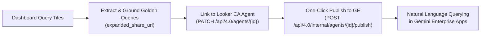

# Looker Demo Creator (`demo-create`)

> **From zero to production Looker demo in minutes.**
> Automated, deterministic orchestrator for creating end-to-end Looker demos, synthetic BigQuery datasets, 3NF Snowflake LookML semantic models, 100% test-verified dashboards, Conversational Analytics (CA) Agents published to Gemini Enterprise (GE), and Embedded Analytics portals.

---

## Overview

`demo-create` unifies the entire full-stack Looker demo creation lifecycle into a single automated pipeline:
1. **Pre-flight & Environment Audit (`pre-check`)**: Verifies active GCP/ADC accounts, installs/patches global MCP tools (`data-designer`, `bigquery`, `knowledge-catalog`), checks Looker authentication (OAuth / API keys), and organizes agent skills into intent-based subfolders.
2. **Dataset Decision & Synthesis**: Automatically checks for existing BigQuery datasets, enables data augmentation or green-field relational schema generation, and validates referential integrity.
3. **BigQuery Loading**: Creates datasets and partitioned/clustered tables in BigQuery.
4. **LookML Generation & Direct Code-Mode Deployment**: Autogenerates production-ready views, explores, and executive dashboards, provisioning and deploying them directly to the Looker instance using `lkr code-mode` without requiring an MCP server.
5. **Conversational Analytics & Gemini Enterprise**: Provisions Looker CA AI Agents, extracts dashboard queries into 1:1 Golden Queries, and publishes to Gemini Enterprise.
6. **Embedded Portal Scaffolding**: Clones and configures a clean, dedicated `looker-embed-demo` workspace for external client demos.

---

## What Gets Automated: Production Deliverables Inventory

Instead of spending days or weeks stitching together synthetic data scripts, debugging LookML joins, hand-crafting dashboard tiles, writing validation queries, and plumbing AI agent endpoints, `demo-create` produces a complete, production-grade enterprise demo in minutes:

| Production Asset | What Gets Automated | Exact Output Format |
| :--- | :--- | :--- |
| **BigQuery Data Warehouse** | 3NF relational schema synthesis, realistic engineering distributions, PK/FK referential integrity, and batch Parquet upload | Clean BigQuery dataset with partitioned/clustered tables |
| **LookML 3NF Semantic Model** | Explore Base View selection, Chasm Trap elimination with Native Derived Table (NDT) rollups joined `one_to_one`, role-playing diamond joins, and field metadata (`label:`, `description:`, `value_format_name:`, `drill_fields:`) | Complete `views/*.view.lkml`, `explores/*.explore.lkml`, and `models/*.model.lkml` |
| **Executive Tabbed Dashboard** | Executive tabbed report architecture, single-value KPI banners, dual-axis timelines, `advanced_vis_config` rounded geometry, cross-filtering, and popovers | Production `dashboards/*.dashboard.lookml` deployed via API |
| **Pre-Deployment QA Audit** | Dev branch push, LookML project validator, 100% test execution of all dashboard queries via Looker API, and bounded self-healing (max 3 iterations) | 100% HTTP 200 OK query pass certificate before production release |
| **Conversational Analytics (CA) Agent** | Auto-generated domain persona and query rules, extraction of dashboard tiles into 1:1 Looker 4.0 Golden Queries with `expanded_share_url` grounding | Live AI Agent in Looker with natural language chat UI |
| **Gemini Enterprise (GE) Integration** | Automated registration and one-click publishing to connected Gemini Enterprise apps via Looker internal API | Natural language querying across enterprise Gemini apps in minutes |
| **White-Labeled Embed Portal (Optional)** | Scaffolding of React/Vite application (`looker-embed-demo`), `.env` configuration (`VITE_CHAT_AGENT_ID`), and CSS brand design tokens | Complete web application ready to run (`npm run dev`) |

---

### ⚡ Spotlight: From Raw Data to Gemini Enterprise in Minutes

A flagship capability of `demo-create` is bridging the gap between raw data synthesis and cross-organizational enterprise AI in minutes:



1. **Deterministic Dashboard-to-Query Extraction**: Every query tile from your generated executive dashboard is inspected and translated into an active Looker query.
2. **Looker 4.0 Golden Query Grounding**: Base queries are created via `POST /api/4.0/queries` to obtain deterministic `expanded_share_url` permalinks, then registered as 1:1 Golden Queries (`POST /api/4.0/golden_queries`).
3. **Agent Linking**: Golden queries are bound to the Conversational Analytics Agent (`PATCH /api/4.0/agents/{agent_id}`), establishing high-precision semantic grounding.
4. **One-Click Gemini Enterprise Publishing**: The agent is published directly to connected Gemini Enterprise apps via `POST /api/4.0/internal/agents/{agent_id}/publish`.

> Within minutes of starting the flow, non-technical users and executives can query the entire domain dataset in natural language directly within Gemini Enterprise.

---

### 📄 Inspect a Real Deliverable

Curious what the final output looks like? Inspect a real deliverable produced by a completed run:

👉 **[View Canonical Delivery Report: IoT Trucking Fleet Analytics](examples/DELIVERY_REPORT_EXAMPLE.md)**

Key highlights from the report:
- **BigQuery Summary**: 6 relational tables, 21,675 rows across `dim_vehicles`, `fct_trips`, `fct_sensor_telemetry`, etc.
- **LookML Architecture**: 3NF ERD with Native Derived Table (`vehicle_metrics_ndt`) eliminating Chasm Traps.
- **Quality Audit**: 19 / 19 (100%) dashboard tile queries tested with HTTP 200 OK before production release.
- **Live AI Agent**: 7 pre-seeded Golden Queries and verified Gemini Enterprise publish state.

---

## Two Ways to Build

### Mode 1: AI Agent Pair-Programmer (Recommended Default)

Run with your AI coding assistant (Jetski, Claude Code, or AgentAPI) using the **[`looker-demo-orchestrator`](skills/looker-demo-orchestrator/SKILL.md)** skill.
- **Interactive Schema Co-Design**: Collaborate with the agent on ERD diagrams, dimension fields, and micro-samples before generating full volume.
- **Subagent Delegation**: The parent orchestrator maintains human gates while delegating heavy execution to specialized subagents:
  - [`data-engineer`](skills/looker-demo-orchestrator/subagents/data-engineer.md) (Batch synthesis & BQ load)
  - [`lookml-snowflake-modeler`](skills/looker-demo-orchestrator/subagents/lookml-snowflake-modeler.md) (3NF modeling, NDT rollups & dashboards)
  - [`lookml-qa-validator`](skills/looker-demo-orchestrator/subagents/lookml-qa-validator.md) (Dev push, validation & max 3 query self-healing)
  - [`ca-agent-provisioner`](skills/looker-demo-orchestrator/subagents/ca-agent-provisioner.md) (CA agent & golden queries; conditional on user confirmation)
  - [`embed-portal-engineer`](skills/looker-demo-orchestrator/subagents/embed-portal-engineer.md) (Vite embed portal; conditional on user confirmation)
- **Self-Healing QA**: Automatically fixes missing dimensions or syntax errors during query verification.

### Mode 2: Standalone CLI (Headless Engine)

Execute `demo-create` directly from your terminal or CI/CD pipeline:

```bash
demo-create run --project=retail_analytics --scope=internal
```

---

## Quickstart & Installation

### 1. Install as a Persistent CLI Tool (`uv tool` - Recommended)

To make `demo-create`, `looker-demo-cli`, AND `lkr` (`lkr-dev-cli`) globally available on your shell's `PATH` in a persistent, isolated environment:

```bash
# Install the published package globally
uv tool install looker-demo-cli

# Now all tools execute directly with zero startup latency and pre-pinned dependencies:
demo-create pre-check --fix
lkr auth list
```

To update to the latest version at any time:
```bash
uv tool upgrade looker-demo-cli
```

---

### 2. Run Ephemerally with `uvx` (Zero-Install Alternative)

You can also execute the CLI on-demand in an ephemeral cache without pre-installing:

```bash
# Run pre-flight audit and auto-fix MCP / skills
uvx looker-demo-cli pre-check --fix

# Or invoke the demo-create binary explicitly
uvx --from looker-demo-cli demo-create pre-check --fix

# Run end-to-end interactive demo creator
uvx looker-demo-cli run --project=retail_analytics --scope=internal
```

---

### 3. Workspace Virtual Environment & Script Runner

To eliminate missing dependency errors across agent scratch scripts or data synthesis pipelines:

```bash
# Initialize a local .venv with all demo packages pre-installed:
demo-create env init
source .venv/bin/activate

# Execute ad-hoc scratch scripts using the CLI's bundled Python environment:
demo-create run-script scratch/generate_data.py

# Run one-off Python commands in the demo environment:
demo-create python -c "import pandas, pyarrow, google.cloud.bigquery; print('Ready!')"
```

---

### 4. Running from Local Source or Git (Development)

If developing locally or testing from a Git repository:

#### Run directly from local source directory:
```bash
uvx --from . demo-create pre-check --fix
```

#### Run directly from Git:
```bash
uvx --from git+https://github.com/lkrdev/looker-demo-cli.git demo-create pre-check --fix
```

#### Local Editable Installation:
```bash
cd ~/looker-demo-cli
demo-create env init
source .venv/bin/activate
uv pip install -e .
```

---

## Commands & Usage

### 1. Environment & Skill Audit (`pre-check`)
```bash
# Run visual audit of GCP credentials, MCP tools, and intent skills
demo-create pre-check

# Automatically install missing MCP configs and symlink skills into intent subfolders
demo-create pre-check --fix

# Emit raw JSON report for programmatic agent consumption
demo-create pre-check --json
```

### 2. End-to-End Demo Creation (`run`)
```bash
# Interactive wizard
demo-create run --project=retail_insights --scope=internal

# Non-interactive / Agent Mode
demo-create run \
  --project=logistics_analytics \
  --scope=external \
  --gcp-project=my-analytics-project \
  --gcp-account=user@example.com \
  --agent-mode
```

---

## Intent-Based Skill Organization

When you run `demo-create pre-check --fix`, skills are automatically pulled from remote repositories and organized into `~/.gemini/config/skills/`:

```
~/.gemini/config/skills/
├── data-design/
│   ├── data-designer/
│   ├── data-designer-architect/
│   ├── data-designer-engineer/
│   ├── data-designer-evaluator/
│   └── vertex-ai/
├── lookml/
│   ├── lkr-code-mode/
│   ├── repo-lookml/
│   ├── lookml-model/
│   ├── lookml-explore/
│   ├── lookml-view/
│   ├── lookml-dashboard/
│   ├── lookml-dashboard-to-query/
│   └── embed-themes/
└── embed-portal/
    ├── looker-demo-orchestrator/
    ├── setup-embed-demo/
    ├── customize-frontend/
    ├── customize-frontend-branding/
    ├── customize-frontend-theme/
    └── sso-embed/
```

This guarantees that any Jetski agent in any directory can discover and execute Looker demo workflows.
