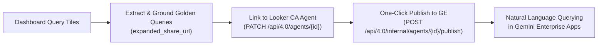

# Looker Demo Creator (`demo-create`)

> **From zero to production Looker demo in minutes.**
> Automated, deterministic orchestrator for creating end-to-end Looker demos, synthetic BigQuery datasets, 3NF Snowflake LookML semantic models, 100% test-verified dashboards, Conversational Analytics (CA) Agents published to Gemini Enterprise (GE), and Embedded Analytics portals.

---

## Overview

`demo-create` unifies the entire full-stack Looker demo creation lifecycle into a single automated pipeline:
1. **Pre-flight & Environment Audit (`pre-check`)**: Verifies active GCP/ADC accounts, installs/patches global MCP tools (`data-designer`, `bigquery`, `knowledge-catalog`), checks Looker authentication (OAuth / API keys), and organizes agent skills into intent-based subfolders.
2. **Dataset Decision & Synthesis**: Automatically checks for existing BigQuery datasets, enables data augmentation or green-field relational schema generation, and validates referential integrity.
3. **BigQuery Loading**: Creates datasets and partitioned/clustered tables in BigQuery.
4. **LookML Generation & Direct Code-Mode Deployment**: Autogenerates production-ready views, explores, and executive dashboards, provisioning and deploying them directly to the Looker instance using `lkr code-mode` without requiring an MCP server.
5. **Conversational Analytics & Gemini Enterprise**: Provisions Looker CA AI Agents, extracts dashboard queries into 1:1 Golden Queries, and publishes to Gemini Enterprise.
6. **Embedded Portal Scaffolding**: Clones and configures a clean, dedicated `looker-embed-demo` workspace for external client demos.

---

## What Gets Automated: Production Deliverables Inventory

Instead of spending days or weeks stitching together synthetic data scripts, debugging LookML joins, hand-crafting dashboard tiles, writing validation queries, and plumbing AI agent endpoints, `demo-create` produces a complete, production-grade enterprise demo in minutes:

| Production Asset | What Gets Automated | Exact Output Format |
| :--- | :--- | :--- |
| **BigQuery Data Warehouse** | 3NF relational schema synthesis, realistic engineering distributions, PK/FK referential integrity, and batch Parquet upload | Clean BigQuery dataset with partitioned/clustered tables |
| **LookML 3NF Semantic Model** | Explore Base View selection, Chasm Trap elimination with Native Derived Table (NDT) rollups joined `one_to_one`, role-playing diamond joins, and field metadata (`label:`, `description:`, `value_format_name:`, `drill_fields:`) | Complete `views/*.view.lkml`, `explores/*.explore.lkml`, and `models/*.model.lkml` |
| **Executive Tabbed Dashboard** | Executive tabbed report architecture, single-value KPI banners, dual-axis timelines, `advanced_vis_config` rounded geometry, cross-filtering, and popovers | Production `dashboards/*.dashboard.lookml` deployed via API |
| **LookML Performance Optimization** | Static `suggestions: [...]` on low-cardinality dims, `suggestable: no` on unique IDs/text, model datagroup caching, BigQuery partition pruning filters, and raw foreign key hiding | Production-hardened LookML avoiding database query spikes |
| **Pre-Deployment QA Audit** | Dev branch push, LookML project validator, 100% test execution of all dashboard queries via Looker API, and bounded self-healing (max 3 iterations) | 100% HTTP 200 OK query pass certificate before production release |
| **Conversational Analytics (CA) Agent** | Auto-generated domain persona and query rules, extraction of dashboard tiles into 1:1 Looker 4.0 Golden Queries with `expanded_share_url` grounding | Live AI Agent in Looker with natural language chat UI |
| **Gemini Enterprise (GE) Integration** | Automated registration and one-click publishing to connected Gemini Enterprise apps via Looker internal API | Natural language querying across enterprise Gemini apps in minutes |
| **White-Labeled Embed Portal (Optional)** | Scaffolding of React/Vite application (`looker-embed-demo`), `.env` configuration (`VITE_CHAT_AGENT_ID`), and CSS brand design tokens | Complete web application ready to run (`npm run dev`) |

---

### ⚡ Spotlight: From Raw Data to Gemini Enterprise in Minutes

A flagship capability of `demo-create` is bridging the gap between raw data synthesis and cross-organizational enterprise AI in minutes:



1. **Deterministic Dashboard-to-Query Extraction**: Every query tile from your generated executive dashboard is inspected and translated into an active Looker query.
2. **Looker 4.0 Golden Query Grounding**: Base queries are created via `POST /api/4.0/queries` to obtain deterministic `expanded_share_url` permalinks, then registered as 1:1 Golden Queries (`POST /api/4.0/golden_queries`).
3. **Agent Linking**: Golden queries are bound to the Conversational Analytics Agent (`PATCH /api/4.0/agents/{agent_id}`), establishing high-precision semantic grounding.
4. **One-Click Gemini Enterprise Publishing**: The agent is published directly to connected Gemini Enterprise apps via `POST /api/4.0/internal/agents/{agent_id}/publish`.

> Within minutes of starting the flow, non-technical users and executives can query the entire domain dataset in natural language directly within Gemini Enterprise.

---

### 📄 Inspect a Real Deliverable

Curious what the final output looks like? Inspect a real deliverable produced by a completed run:

👉 **[View Canonical Delivery Report: IoT Trucking Fleet Analytics](examples/DELIVERY_REPORT_EXAMPLE.md)**

Key highlights from the report:
- **BigQuery Summary**: 6 relational tables, 21,675 rows across `dim_vehicles`, `fct_trips`, `fct_sensor_telemetry`, etc.
- **LookML Architecture**: 3NF ERD with Native Derived Table (`vehicle_metrics_ndt`) eliminating Chasm Traps.
- **Quality Audit**: 19 / 19 (100%) dashboard tile queries tested with HTTP 200 OK before production release.
- **Live AI Agent**: 7 pre-seeded Golden Queries and verified Gemini Enterprise publish state.

---

---

## Getting Started: Two Ways to Build

### 🚀 Mode 1: AI Agent Pair-Programmer (Primary Hero Flow)

Run interactively with your AI coding assistant (Jetski, Claude Code, or AgentAPI) using the **[`looker-demo-orchestrator`](skills/looker-demo-orchestrator/SKILL.md)** skill.

#### Step 1: Install Persistent CLI Tools
On any fresh machine, bootstrap the environment globally in seconds using `uv`:
```bash
uv tool install looker-demo-cli
```
This installs `demo-create`, `looker-demo-cli`, and `lkr` (`lkr-dev-cli`) into an isolated, persistent environment available across all terminal sessions.

#### Step 2: Run Pre-Flight Audit & Auto-Fix
Immediately run `pre-check --fix` to configure MCP servers, check dependencies, and sync agent skills:
```bash
demo-create pre-check --fix
```
> [!IMPORTANT]
> **Strict Authentication Hard Gate**: `pre-check` fails immediately (exit code 1) if Google Cloud or Looker authentication is missing, blocking downstream synthesis before broken calls can occur.

#### Step 3: Configure Authentication (If Blocked)

1. **Google Cloud & Application Default Credentials (ADC)**:
   ```bash
   gcloud auth login
   gcloud auth application-default login
   gcloud config set project <PROJECT_ID>
   ```

2. **Looker Authentication (`lkr auth login`)**:
   Run the interactive Looker OAuth login:
   ```bash
   lkr auth login
   ```
   *(Or ephemerally: `uvx --from "lkr-dev-cli[codemode]" lkr-dev-cli auth login`)*

   > [!NOTE]
   > **First-Time Looker OAuth Client Setup (API Explorer)**:
   > If `lkr-cli` has not yet been registered on your Looker instance, an admin must register it once:
   > 1. Open the Looker API Explorer endpoint:
   >    `https://<your-looker-instance>/extensions/marketplace_extension_api_explorer::api-explorer/4.0/methods/Auth/register_oauth_client_app`
   > 2. Set **`client_id`**: `lkr-cli`
   > 3. Provide the following JSON payload in the request body:
   >    ```json
   >    {
   >      "redirect_uri": "http://localhost:8000/callback",
   >      "display_name": "LKR",
   >      "description": "lkr.dev language server, MCP and CLI",
   >      "enabled": true
   >    }
   >    ```
   > 4. Check **"I Understand"** and click **"Run"**.

   > [!TIP]
   > **Remote Hosts, Cloudtop & SSH Port Forwarding**:
   > The Looker OAuth callback redirects your browser to `http://localhost:8000/callback`.
   > If developing on a remote machine, Cloudtop, or VM, forward port 8000 through SSH:
   > ```bash
   > ssh -L 8000:localhost:8000 <remote-host>
   > ```
   > If port 8000 is occupied by an existing process, terminate it before logging in:
   > ```bash
   > lsof -ti:8000 | xargs kill -9   # (or: fuser -k 8000/tcp)
   > ```
   > **Headless / Agent Fallback**: If your browser redirects to `http://localhost:8000/callback?code=...` and displays a connection error, copy the entire URL from your browser address bar and paste it into chat. The AI agent will curl the callback URL locally on the remote host to complete authentication!

#### Step 4: Launch the AI Demo Creation Flow
Once authenticated, instruct your AI assistant in chat:
> *"Create an end-to-end Looker demo for IoT Fleet Analytics (or SaaS ARR, Retail, Fintech)."*

The AI agent orchestrates the entire workflow interactively:
- **Interactive Schema Co-Design**: Collaborate with the agent on ERD diagrams, field definitions, and micro-sample data previews before generating full scale.
- **Subagent Hub-and-Spoke Execution**: The parent orchestrator delegates execution to specialized subagents:
  - [`data-engineer`](skills/looker-demo-orchestrator/subagents/data-engineer.md) (Batch synthesis & BQ load)
  - [`lookml-modeler`](skills/looker-demo-orchestrator/subagents/lookml-modeler.md) (Front-door semantic modeling & 3NF triage)
  - [`lookml-snowflake-modeler`](skills/looker-demo-orchestrator/subagents/lookml-snowflake-modeler.md) (3NF modeling, NDT rollups & diamond joins)
  - [`lookml-dashboard-designer`](skills/looker-demo-orchestrator/subagents/lookml-dashboard-designer.md) (Pixel-perfect executive tabbed dashboards)
  - [`lookml-performance-optimizer`](skills/looker-demo-orchestrator/subagents/lookml-performance-optimizer.md) (Google Cloud Looker performance best practices)
  - [`lookml-qa-validator`](skills/looker-demo-orchestrator/subagents/lookml-qa-validator.md) (Dev push, validation & max 3 query self-healing)
  - [`ca-agent-provisioner`](skills/looker-demo-orchestrator/subagents/ca-agent-provisioner.md) (CA agent & golden queries; conditional on user confirmation)
  - [`embed-portal-engineer`](skills/looker-demo-orchestrator/subagents/embed-portal-engineer.md) (Vite embed portal; conditional on user confirmation)

---

### ⚙️ Gemini Enterprise (GE) Integration & Looker Service Account Setup

When provisioning Conversational Analytics (CA) Agents to publish into Gemini Enterprise (GE), confirm the **4 mandatory prerequisites**:

1. **Active GE Instance**: An active Gemini Enterprise instance/app exists in your Google Cloud Console.
2. **Looker Admin Configuration**: GE is configured under Looker **Admin > Gemini Settings**:
   - **Instance ID** is set.
   - **Region** (e.g. `us-central1`) is set.
   - **GCP Project Number** is set.
3. **Looker Service Account IAM Role**: The Looker Service Account has the **Discovery Engine Admin** (`roles/discoveryengine.admin`) role granted in GCP IAM.
4. **Looker Service Account GE License**: The Looker Service Account has been explicitly assigned a **Gemini Enterprise user license**.

> [!NOTE]
> **Automatic Self-Healing Re-Publishing**: If dashboard queries or LookML models are updated during QA validation, `demo-create` automatically re-extracts golden queries, synchronizes the CA Agent, and re-publishes to Gemini Enterprise with automatic verification and retry loops.

---

### 💻 Mode 2: Standalone CLI (Headless Engine)

Execute `demo-create` directly from your terminal or CI/CD pipeline:

```bash
demo-create run --project=retail_analytics --scope=internal
```

---

## Alternative Installation Methods

### Run Ephemerally with `uvx` (Zero-Install Alternative)
You can also execute the CLI on-demand in an ephemeral cache without pre-installing:
```bash
# Run pre-flight audit and auto-fix MCP / skills
uvx looker-demo-cli pre-check --fix

# Run end-to-end interactive demo creator
uvx looker-demo-cli run --project=retail_analytics --scope=internal
```

### Workspace Virtual Environment & Script Runner
To eliminate missing dependency errors across agent scratch scripts or data synthesis pipelines:
```bash
# Initialize a local .venv with all demo packages pre-installed:
demo-create env init
source .venv/bin/activate

# Execute ad-hoc scratch scripts using the CLI's bundled Python environment:
demo-create run-script scratch/generate_data.py

# Run one-off Python commands in the demo environment:
demo-create python -c "import pandas, pyarrow, google.cloud.bigquery; print('Ready!')"
```

### Running from Local Source or Git (Development)
```bash
# Run directly from local source directory:
uvx --from . demo-create pre-check --fix

# Run directly from Git:
uvx --from git+https://github.com/lkrdev/looker-demo-cli.git demo-create pre-check --fix

# Local Editable Installation:
cd ~/looker-demo-cli
demo-create env init
source .venv/bin/activate
uv pip install -e .
```

---

## Commands & Usage

### 1. Environment & Skill Audit (`pre-check`)
```bash
# Run visual audit of GCP credentials, MCP tools, and intent skills
demo-create pre-check

# Automatically install missing MCP configs and symlink skills into intent subfolders
demo-create pre-check --fix

# Emit raw JSON report for programmatic agent consumption
demo-create pre-check --json
```

### 2. End-to-End Demo Creation (`run`)
```bash
# Interactive wizard
demo-create run --project=retail_insights --scope=internal

# Non-interactive / Agent Mode
demo-create run \
  --project=logistics_analytics \
  --scope=external \
  --gcp-project=my-analytics-project \
  --gcp-account=user@example.com \
  --agent-mode
```

---

## Intent-Based Skill Organization

When you run `demo-create pre-check --fix`, skills are automatically pulled from remote repositories and organized into `~/.gemini/config/skills/`:

```
~/.gemini/config/skills/
├── data-design/
│   ├── data-designer/
│   ├── data-designer-architect/
│   ├── data-designer-engineer/
│   ├── data-designer-evaluator/
│   └── vertex-ai/
├── lookml/
│   ├── lkr-code-mode/
│   ├── repo-lookml/
│   ├── lookml-model/
│   ├── lookml-explore/
│   ├── lookml-view/
│   ├── lookml-dashboard/
│   ├── lookml-dashboard-to-query/
│   └── embed-themes/
└── embed-portal/
    ├── looker-demo-orchestrator/
    ├── setup-embed-demo/
    ├── customize-frontend/
    ├── customize-frontend-branding/
    ├── customize-frontend-theme/
    └── sso-embed/
```

This guarantees that any Jetski agent in any directory can discover and execute Looker demo workflows.
