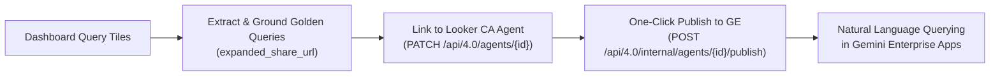

# Looker Demo Creator (`demo-create`)

> **From zero to production Looker demo in minutes.**
> Automated, deterministic orchestrator for creating end-to-end Looker demos, synthetic BigQuery datasets, 3NF Snowflake LookML semantic models, 100% test-verified dashboards, Conversational Analytics (CA) Agents published to Gemini Enterprise (GE), and Embedded Analytics portals.

---

## Overview

`demo-create` unifies the full-stack Looker demo lifecycle into a deterministic, gated pipeline:
1. **Pre-Flight & Skill Sync (`pre-check`)**: Audits GCP/Looker credentials, prunes deprecated MCP servers/skills, and installs CLI-first skills into `~/.gemini/config/skills/`.
2. **Schema Co-Design & Modular DAG Synthesis (`data generate`)**: Designs 3NF relational schemas (Mermaid ERD + sample preview) and synthesizes Parquet tables (`>7,500 rows/sec`) via [`synthetic-data-authoring`](skills/synthetic-data-authoring/SKILL.md).
3. **BigQuery Ingestion (`data upload`)**: Creates datasets and loads partitioned/clustered Parquet tables into BigQuery.
4. **LookML Modeling & QA Deployment (`lookml`)**: Introspects BigQuery/Dataplex metadata into `SPEC.md`, generates views/explores/dashboards, validates 100% of queries, and releases via `lkr-dev-cli`.
5. **Conversational Analytics & Gemini Enterprise (`agent` / `ge`)**: Grounds 1:1 Golden Queries from dashboard tiles, links them to a Looker CA Agent, and publishes to Gemini Enterprise.
6. **Embedded Portal Scaffolding (`embed`)**: Scaffolds a branded React/Vite `looker-embed-demo` application.

---

## What Gets Automated: Production Deliverables Inventory

Instead of spending days or weeks stitching together synthetic data scripts, debugging LookML joins, hand-crafting dashboard tiles, writing validation queries, and plumbing AI agent endpoints, `demo-create` produces a complete, production-grade enterprise demo in minutes:

| Production Asset | What Gets Automated | Exact Output Format |
| :--- | :--- | :--- |
| **BigQuery Data Warehouse** | 3NF relational schema synthesis (Modular DAG with Pareto/Log-Normal distributions, PK/FK referential integrity, and in-memory `TableValidator` scorecard) and batch Parquet upload | Clean BigQuery dataset with partitioned/clustered tables |
| **LookML 3NF Semantic Model** | CLI-driven BigQuery & Dataplex metadata extraction (`SPEC.md`), Explore Base View selection, Chasm Trap elimination with Native Derived Table (NDT) rollups joined `one_to_one`, role-playing diamond joins, and field metadata (`label:`, `description:`, `value_format_name:`, `drill_fields:`) | Complete `views/*.view.lkml`, `explores/*.explore.lkml`, and `models/*.model.lkml` |
| **Executive Tabbed Dashboard** | Executive tabbed report architecture, single-value KPI banners, dual-axis timelines, `advanced_vis_config` rounded geometry, cross-filtering, and popovers | Production `dashboards/*.dashboard.lookml` deployed via API |
| **LookML Performance Optimization** | Static `suggestions: [...]` on low-cardinality dims, `suggestable: no` on unique IDs/text, model datagroup caching, BigQuery partition pruning filters, and raw foreign key hiding | Production-hardened LookML avoiding database query spikes |
| **Pre-Deployment QA Audit** | Dev branch push, LookML project validator, 100% test execution of all dashboard queries via Looker API, and bounded self-healing (max 3 iterations) | 100% HTTP 200 OK query pass certificate before production release |
| **Conversational Analytics (CA) Agent** | Auto-generated domain persona and query rules, extraction of dashboard tiles into 1:1 Looker 4.0 Golden Queries with `expanded_share_url` grounding | Live AI Agent in Looker with natural language chat UI |
| **Gemini Enterprise (GE) Integration** | Automated registration and one-click publishing to connected Gemini Enterprise apps via Looker internal API | Natural language querying across enterprise Gemini apps in minutes |
| **White-Labeled Embed Portal (Optional)** | Scaffolding of React/Vite application (`looker-embed-demo`), `.env` configuration (`VITE_CHAT_AGENT_ID`), and CSS brand design tokens | Complete web application ready to run (`pnpm install && pnpm dev`) |

---

### ⚡ Spotlight: From Raw Data to Gemini Enterprise in Minutes

A flagship capability of `demo-create` is bridging the gap between raw data synthesis and cross-organizational enterprise AI in minutes:



1. **Deterministic Dashboard-to-Query Extraction**: Every query tile from your generated executive dashboard is inspected and translated into an active Looker query.
2. **Looker 4.0 Golden Query Grounding**: Base queries are created via `POST /api/4.0/queries` to obtain deterministic `expanded_share_url` permalinks, then registered as 1:1 Golden Queries (`POST /api/4.0/golden_queries`).
3. **Agent Linking**: Golden queries are bound to the Conversational Analytics Agent (`PATCH /api/4.0/agents/{agent_id}`), establishing high-precision semantic grounding.
4. **One-Click Gemini Enterprise Publishing**: The agent is published directly to connected Gemini Enterprise apps via `POST /api/4.0/internal/agents/{agent_id}/publish`.

> Within minutes of starting the flow, non-technical users and executives can query the entire domain dataset in natural language directly within Gemini Enterprise.

---

### 📄 Inspect a Real Deliverable

Curious what the final output looks like? Inspect real deliverables produced by a completed run:

👉 **[View Canonical Technical Spec (SPEC.md): IoT Trucking Fleet Analytics](examples/SPEC_EXAMPLE.md)**  
👉 **[View Canonical Delivery Report (DELIVERY_REPORT.md): IoT Trucking Fleet Analytics](examples/DELIVERY_REPORT_EXAMPLE.md)**

Key highlights from the report:
- **BigQuery Summary**: 6 relational tables, 21,675 rows across `dim_vehicles`, `fct_trips`, `fct_sensor_telemetry`, etc.
- **LookML Architecture**: 3NF ERD with Native Derived Table (`vehicle_metrics_ndt`) eliminating Chasm Traps.
- **Quality Audit**: 19 / 19 (100%) dashboard tile queries tested with HTTP 200 OK before production release.
- **Live AI Agent**: 7 pre-seeded Golden Queries and verified Gemini Enterprise publish state.

---

## Prerequisites

Before running `demo-create`, ensure the following tools, cloud roles, and Looker settings are in place. For the full **IAM Principal Matrix**, **copy-paste `gcloud` setup script**, **granular Looker role permissions**, **OAuth client registration**, and **SSH port-forwarding guide**, see **[`docs/PREREQUISITES.md`](docs/PREREQUISITES.md)**.

| Category | Required Setup |
| :--- | :--- |
| **1. Local CLI & Infrastructure** | • **Python `>= 3.11` & [`uv`](https://docs.astral.sh/uv/)** (`uv tool install looker-demo-cli` installs both `demo-create` and `lkr-dev-cli`).<br/>• **Google Cloud SDK (`gcloud` & `bq`)** authenticated via `gcloud auth login` and `gcloud auth application-default login`.<br/>• **Looker Instance** (API 4.0) with a pre-configured **BigQuery Connection**.<br/>• **Gemini Enterprise (GE) App** in GCP (`global`, `us`, or `eu`) for Gate 5 agent publishing. |
| **2. Google Cloud APIs & IAM** | • **APIs**: `bigquery`, `aiplatform` (Vertex AI / LLM), `discoveryengine` (GE), `cloudresourcemanager`, and optional `dataplex`/`datacatalog`.<br/>• **Developer / Local ADC**: `roles/bigquery.dataEditor`, `roles/bigquery.jobUser`, `roles/aiplatform.user`, `roles/serviceusage.serviceUsageConsumer`, `roles/discoveryengine.viewer`, and `roles/resourcemanager.projectIamAdmin` (to auto-bind Looker SA IAM).<br/>• **Looker BigQuery SA**: `roles/bigquery.dataEditor` + `roles/bigquery.jobUser`.<br/>• **Looker Gemini SA** (`ai_ge_service_account_email`): `roles/discoveryengine.admin` + an assigned **Gemini Enterprise License**. |
| **3. Looker Permissions** | • **Instance Settings**: `lkr-cli` OAuth app registered (`register_oauth_client_app`) and **Admin > Platform > Gemini** enabled (CA + Publish to GE).<br/>• **User Role**: Looker **`Admin`** role *(Recommended for all gates)* — or granular permissions by gate: **Developer** + `manage_project_models` (Gates 2–3 LookML dev/deploy), **CA Agent Author** (`create_agents`/`manage_agents`, `create_queries`, `explore` for Gate 4), and **Admin** (Gate 5 GE config & publish). |

👉 **[Full Setup, IAM Matrix & `gcloud` Bootstrap Script → `docs/PREREQUISITES.md`](docs/PREREQUISITES.md)**

---

## Getting Started: Two Ways to Build

### 🚀 Mode 1: AI Agent Pair-Programmer (Primary Hero Flow)

Run interactively with your AI coding assistant (Antigravity, Claude Code, or AgentAPI) using the **[`looker-demo-orchestrator`](skills/looker-demo-orchestrator/SKILL.md)** skill.

#### Step 1: Install Persistent CLI Tools
```bash
uv tool install looker-demo-cli
```
Installs `demo-create`, `looker-demo-cli`, and `lkr` (`lkr-dev-cli`) globally across terminal sessions.

#### Step 2: Run Pre-Flight Audit & Auto-Fix
```bash
demo-create pre-check --fix
```
Verifies GCP/Looker credentials, prunes deprecated MCP servers (`data-designer`, `bigquery`, `knowledge-catalog`), and syncs CLI-first skills. Fails fast (exit code `3`) if authentication is missing.

#### Step 3: Configure Authentication (If Blocked)
```bash
# 1. Google Cloud & Application Default Credentials (ADC)
gcloud auth login
gcloud auth application-default login
gcloud config set project <PROJECT_ID>

# 2. Looker OAuth Login
lkr auth login
```
> [!TIP]
> Need to register the `lkr-cli` OAuth client on Looker for the first time, or authenticating over a remote SSH host (`localhost:8000`)? See **[Looker OAuth & SSH Port Forwarding in `docs/PREREQUISITES.md`](docs/PREREQUISITES.md#3-looker-instance-configuration--user-permissions)**.

#### Step 4: Launch the AI Demo Creation Flow
Instruct your AI assistant in chat:
> *"Create an end-to-end Looker demo for IoT Fleet Analytics (or SaaS ARR, Retail, Fintech)."*

The AI agent orchestrates the gated workflow interactively:
- **Interactive Schema Co-Design & Modular DAG Synthesis**: Proposes a Mermaid ERD and 5–10 row sample preview at Gate 1 before synthesizing Parquet tables (`>7,500 rows/sec`) via [`synthetic-data-authoring`](skills/synthetic-data-authoring/SKILL.md) and loading BigQuery.
- **Fast-Path Deterministic CLI Execution**: Runs compiled CLI subcommands directly (`demo-create data`, `lookml model`, `lookml optimize`, `lookml deploy`, `agent create`, `agent publish`).
- **On-Demand Specialized Subagents**: Spawns [`data-engineer`](skills/looker-demo-orchestrator/subagents/data-engineer.md), [`lookml-snowflake-modeler`](skills/looker-demo-orchestrator/subagents/lookml-snowflake-modeler.md), [`lookml-dashboard-designer`](skills/looker-demo-orchestrator/subagents/lookml-dashboard-designer.md), [`lookml-qa-validator`](skills/looker-demo-orchestrator/subagents/lookml-qa-validator.md), and [`embed-portal-engineer`](skills/looker-demo-orchestrator/subagents/embed-portal-engineer.md) only when required by the gate.

---

### 💻 Mode 2: Standalone CLI (Headless Engine)

Execute `demo-create` directly from your terminal or CI/CD pipeline, one gate at a time:

```bash
demo-create pre-check --fix
demo-create data generate --domain retail --row-count 25000 --output-dir scratch/parquet
demo-create data upload --parquet-dir scratch/parquet --gcp-project my-gcp-project --dataset retail_analytics
demo-create lookml model --looker-project retail_analytics --dataset retail_analytics --connection my_bq_connection
demo-create lookml deploy --looker-project retail_analytics --lookml-dir lookml
```

State is persisted to `.demo-state.json` between calls, so later gates inherit earlier answers and you only pass what changes. See [`docs/COMMANDS.md`](docs/COMMANDS.md) for ephemeral `uvx`, `.venv`, and local editable installation patterns.

---

## Documentation

| Document | Purpose |
| :--- | :--- |
| **[`docs/PREREQUISITES.md`](docs/PREREQUISITES.md)** | **Prerequisites, GCP IAM & Looker Permissions** — Principal IAM matrix, copy-paste `gcloud` setup script, Looker role permissions by gate, OAuth setup, and GE provisioning. |
| **[`docs/COMMANDS.md`](docs/COMMANDS.md)** | **Full command reference** — Every command, flag, and default, generated from the implementation and enforced by a CI drift test. |
| **[`docs/ARCHITECTURE.md`](docs/ARCHITECTURE.md)** | **Architecture & Invariants** — How the CLI is layered, skill organization, and the invariants a change must preserve. |
| **[`CONTRIBUTING.md`](CONTRIBUTING.md)** | Setup, the local gate, and how to add a command. |
| **[`AGENTS.md`](AGENTS.md)** | Instructions for an AI agent orchestrating a build. |

## Commands Quick Reference

Use `demo-create status` (or `demo-create status --json`) at any point to inspect completed gates and get the literal next command to run:

```console
$ demo-create status
┏━━━┳━━━━━━┳━━━━━━━━━━━━━━━━━━━━━━━━━━━━━━━━━━━━━━━━━━┳━━━━━━━━━┳━━━━━━━━━━━━┓
┃   ┃ Gate ┃ Stage                                    ┃ Status  ┃ Human gate ┃
┡━━━╇━━━━━━╇━━━━━━━━━━━━━━━━━━━━━━━━━━━━━━━━━━━━━━━━━━╇━━━━━━━━━╇━━━━━━━━━━━━┩
│ ✓ │    0 │ Environment audit & 4-target confirmation│ done    │ confirm    │
│ ✓ │    1 │ Schema co-design, synthesis & BQ load    │ done    │ confirm    │
│ ▶ │    2 │ Semantic modeling & dashboard generation │ current │ --         │
│ · │    3 │ Optimization, validation & release       │ pending │ confirm    │
│ · │    4 │ Conversational Analytics agent grounding │ pending │ confirm    │
│ · │    5 │ Gemini Enterprise publishing             │ pending │ confirm    │
└───┴──────┴──────────────────────────────────────────┴─────────┴────────────┘
→ Gate 2: Semantic modeling & dashboard generation
    $ demo-create lookml model --looker-project retail_demo --dataset retail \
        --connection acme_bigquery --gcp-project acme-analytics
```

| Command Group | Key Subcommands | Purpose |
| :--- | :--- | :--- |
| **`status`** | `demo-create status [--json]` | Reports completed gates, current gate, `requires_human_confirmation`, and `next_command`. |
| **`pre-check`** | `demo-create pre-check [--fix] [--json]` | Audits GCP/Looker auth, prunes deprecated MCP servers/skills, and syncs skills into `~/.gemini/config/skills/` (`data-design/`, `lookml/`, `embed-portal/`). |
| **`data`** | `generate`, `upload [--verify-only]`, `inspect` | Synthesizes local Parquet files, loads BigQuery datasets with Day Partitioning & Clustering, and inspects schemas. |
| **`lookml`** | `model`, `clean-root`, `optimize`, `restore`, `deploy` | Generates LookML from BigQuery/Parquet, cleans root duplicates, applies performance optimizations (with `.backup_pre_opt` snapshots), validates queries, and deploys to production. |
| **`agent`** | `create`, `golden-queries`, `publish` | Provisions Looker CA AI Agents, extracts & links 1:1 Golden Queries (`expanded_share_url`), and publishes to Gemini Enterprise. |
| **`ge`** | `status`, `configure`, `publish` | Inspects Looker Gemini enablement, discovers GCP Discovery Engine apps, binds `roles/discoveryengine.admin` to the Looker SA, and publishes agents. |
| **`embed`** | `scaffold` | Scaffolds a branded React/Vite `looker-embed-demo` portal pre-wired with Looker, dashboard, and CA agent IDs. |
| **`env`** | `init`, `run-script`, `python` | Initializes a workspace `.venv` or executes ad-hoc Python scripts inside the CLI's bundled environment. |

👉 **[Exhaustive Command & Flag Reference → `docs/COMMANDS.md`](docs/COMMANDS.md)**  
👉 **[Architecture, Gated State & Skill Layout → `docs/ARCHITECTURE.md`](docs/ARCHITECTURE.md)**

