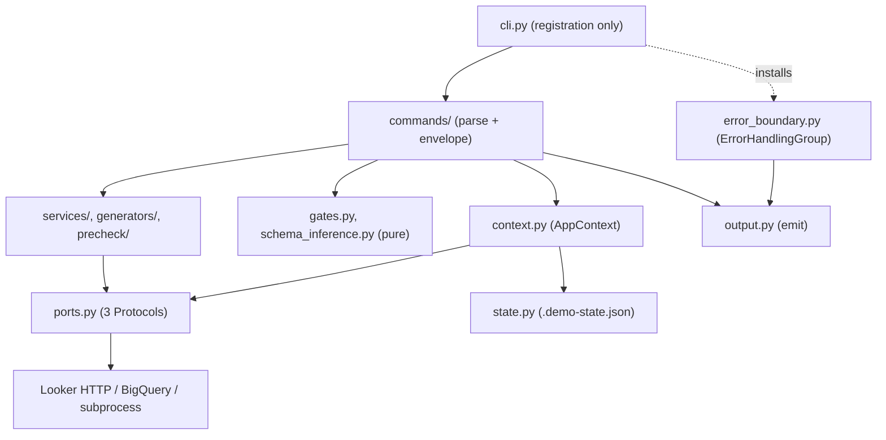

# Architecture

How `demo-create` is put together, and — more usefully — **why it is shaped this
way**. The file tree is self-evident; the constraints are not. Everything below
is a rule you can break, and a description of what breaks when you do.

For what the CLI *does*, read the [README](../README.md). This document is for
someone about to change the code.

---

## 1. The layering

Four layers, and dependencies point **downwards only**.

| Layer | Module(s) | Allowed to contain | Must not contain |
| --- | --- | --- | --- |
| Entrypoint | `cli.py` | `typer.Typer()` construction, `register()` / `add_typer()` calls | Any logic at all |
| Commands | `commands/*.py` | Option declarations, input resolution via `AppContext`, envelope construction, Rich renderers | Business logic, direct API/subprocess calls |
| Services | `services/*.py`, `generators/*.py`, `precheck/*.py` | Business logic | `typer`, option parsing, `emit()` |
| Ports | `ports.py` | `Protocol` declarations for the three external boundaries | Policy (see below) |

Plus two **pure** modules that sit outside the stack and are imported by
commands: `gates.py` and `schema_inference.py`. They take plain values and
return plain values.

**Rationale, one line each:**

- `cli.py` holds no logic so the registration block *is* the complete inventory
  of the CLI surface, readable at a glance.
- Commands hold no business logic so a service can be unit-tested without a
  Click context, and so the same service can back two commands.
- Ports describe *shape*, not *policy*. `LookerAuthPort` returns
  `(headers, base_url)` and never raises; turning an empty result into an
  `AuthError` is `AppContext.looker_auth`'s job. That is what lets one adapter
  serve a command that requires auth and one that merely prefers it.

### The three external boundaries

`ports.py` declares exactly three, because these are the boundaries that make a
test slow, flaky, or impossible:

| Port | Boundary | Real adapter |
| --- | --- | --- |
| `LookerAuthPort` | Looker credential resolution (`lkr` OAuth / API keys) | `services.ge_service.get_looker_auth_context` |
| `BigQueryPort` / `BigQueryFactory` | BigQuery datasets and tables | `utils.bigquery_client.BigQueryHelper` |
| `ShellPort` | Subprocesses (`lkr`, `gcloud`, `uv`, `git`) | `ports.SubprocessShell` |

> [!NOTE]
> Pure functions — LookML generation, schema inference, the optimizer's file
> walk — get no port. They are already testable by calling them; a port would
> buy indirection and nothing else.

They are `Protocol`s rather than base classes so the existing implementations
satisfy them **without inheriting from anything**, and so the fakes in
`tests/conftest.py` (written before the ports existed) opted in for free. They
are deliberately *narrow*: each declares only the members the CLI calls. A port
that mirrors its implementation is a second copy of that implementation's
signature, and makes the fake as expensive to write as the real thing.



---

## 2. The output contract

**This is the single most important invariant in the codebase.**

> stdout carries the JSON envelope and **nothing else**. Every byte of
> human-readable output goes to stderr.

Enforced in two places:

- `utils/console.py` — `console = Console(stderr=True)`. Every `print_success`,
  `print_info`, `print_warning`, `print_error`, banner, and `rich.Table` in the
  codebase goes through it.
- `output.py` — `emit()` is the **only** function permitted to write to stdout,
  and it uses `typer.echo`, not `print`.

Why: the CLI's primary caller is an AI agent piping stdout to a parser. Before
the split, Rich banners were interleaved with the payload and `json.loads()`
failed outright on most commands. The separation is what makes both of these
hold unconditionally:

```bash
demo-create <any command> --json | jq .        # always parses
demo-create <any command> --json > out.json    # human still sees progress
```

### `emit()` is either/or, never a tee

```python
if json_output:
    typer.echo(render_json(result))  # JSON mode: human_renderer is NEVER called
else:
    (human_renderer or _render_default)(result)
    for action in result.next_actions:
        _print_next_action(action)
```

In JSON mode the Rich renderer does not run at all. Not "runs, but to stderr" —
does not run. A command's `render()` closure is dead code under `--json`, so
never put a side effect in one.

`next_actions` is printed by `emit()` after the renderer, not inside it, so a
command with bespoke Rich output still surfaces its follow-up steps.

### Envelope

`CommandResult` (pydantic) is the value every command returns:

| Field | Purpose |
| --- | --- |
| `schema_version` | `ENVELOPE_SCHEMA_VERSION`; bumped only for a breaking change to the envelope, never to a `data` payload |
| `command` | Dotted path, e.g. `"lookml deploy"` |
| `status` | `SUCCESS` / `FAILED` / `PARTIAL` / `DRY_RUN` / `BLOCKED` |
| `data` | Command-specific payload |
| `errors[]`, `warnings[]` | Structured failures, free-text caveats |
| `next_actions[]` | Literal next command + `requires_human_confirmation` |

`FAILURE_STATUSES` includes `PARTIAL` deliberately: a command that returned
`PARTIAL` while exiting 0 let an orchestrator chaining on `&&` treat a partial
failure as a success.

---

## 3. The error contract

Every deliberate failure is a subclass of `DemoCreateError` and maps to a
distinct **process exit code**, so an agent branches on `$?` without parsing
prose.

| Code | Exception | `code` | Meaning |
| --- | --- | --- | --- |
| 0 | — | — | Success |
| 1 | — | — | Unexpected / unclassified |
| 2 | — | — | **Reserved by Click** for usage errors — never reuse |
| 3 | `AuthError` | `AUTH_ERROR` | Re-authenticate (not retry) |
| 4 | `ConfigError` | `CONFIG_ERROR` | Args parsed, config unusable |
| 5 | `RemoteApiError` | `REMOTE_API_ERROR` | Looker / BigQuery / GCP call failed |
| 6 | `ValidationError` | `VALIDATION_ERROR` | Output is not fit to promote |
| 7 | `StateError` | `STATE_ERROR` | `.demo-state.json` unusable |

Exceptions carry `remediation` — the concrete next step — as a *field*, not
embedded in the message string, so it survives into the JSON envelope.
`errors.py` also exposes canonical factories (`no_looker_instance()`,
`looker_not_authenticated()`, `missing_option()`) so a shared failure has
exactly one spelling; seven commands previously produced three different
messages for one condition.

`CommandResult.exit_code` maps the first structured error back through
`_EXIT_CODE_BY_ERROR_CODE`, so a failure that is *returned* in an envelope exits
identically to the same failure *raised* as an exception.

### `ErrorHandlingGroup` — install it on every group

`error_boundary.ErrorHandlingGroup` catches `DemoCreateError` once, in
`Group.invoke`, emits the envelope in whichever mode the command was invoked
with, and re-raises `typer.Exit(exc.exit_code)`. It re-raises `typer.Exit` — not
the original error — so an outer group never double-handles it.

> [!WARNING]
> A new sub-`Typer` added **without** `cls=ErrorHandlingGroup` still has its
> errors caught — by the root group — but `_command_path()` then reports the
> group name (`"data"`) instead of the full path (`"data inspect"`). The
> envelope is mislabelled and nothing fails. This is a quiet failure; the
> innermost group must win.

```python
data_app = typer.Typer(name="data", no_args_is_help=True, cls=ErrorHandlingGroup)
```

It is a `TyperGroup` subclass rather than a wrapper around the console
entrypoint so that `CliRunner`, which invokes the group directly, exercises the
same path the installed binary does. A wrapper would be untestable.

> Typer vendors a fork of Click. The context passed to `Group.invoke` is
> `typer._click.core.Context`, **not** `click.Context`; annotating with the
> latter is an incompatible override and mypy rejects it.

---

## 4. The gate model

The six-gate workflow is expressed as **data** in `gates.py`, not as prose in a
prompt file. Each `Gate` carries three things an agent otherwise has to guess:

1. `is_complete(state)` — decided from persisted `FlowState`, not recollection.
2. `command(state)` — the literal next command, with known values substituted
   and an `<angle-bracketed>` placeholder wherever the state does not know one.
3. `requires_human_confirmation` + `human_checkpoint` — whether to pause, and
   exactly what to ask.

`gates.py` is **pure**: no filesystem, no network, no `typer`, no `rich`. Its
only import from the package is `FlowState`. `commands/status.py` is the thin
I/O shell — load state, ask the gate model, emit the envelope.

Purity is what buys the testing:

- Every branch is reachable by constructing a `FlowState` in memory.
- `tests/test_gates_command_validity.py` takes each generated command string,
  resolves it against the **real Click command tree** (`typer.main.get_command(app)`)
  and checks every flag against the target command's declared `Parameter.opts`.
  It introspects; it never invokes. That is the only check that cannot drift:
  `test_gates.py` pins the strings against literals written in the same sitting,
  so a flag wrong in both places passes both.

Two conventions worth knowing before you edit a gate:

- Each completion predicate reads **one** field — the field its command writes
  on success. A compound condition would report incomplete forever if a later
  refactor stopped writing one signal, and the agent would loop.
- `current_gate()` returns the **first incomplete** gate even when a later one
  looks satisfied (real data dependencies). `completed_gates()` reports observed
  facts and does *not* stop at the first gap — together they make an
  inconsistent state legible rather than hiding it.

---

## 5. State

`.demo-state.json`, a pydantic `FlowState`, is how a gated command inherits the
previous one's answers without the user re-supplying every flag.

**Ownership.** `AppContext` loads and saves it. Commands do not call
`load_flow_state` / `save_flow_state` directly. It is loaded once per invocation
and cached — several commands read, mutate, and read again, and a reload would
discard the mutation.

**Discovery.** `.demo-state.json` in the CWD, else the scratch directory, else
the CWD path is where it would be created. Every command accepts
`--state-file` (`commands/options.py:StateFileOption`) so two agents building
different demos from one directory do not clobber each other.
`use_state_file()` raises `StateError` if called after the state has been read —
otherwise a command would decide from one file and write to another.

**Versioning.** `schema_version` (currently `1`). `_migrate()` rejects a file
from a *newer* CLI outright rather than partially understanding it; a missing
key means pre-0.3.0, which is a strict subset of v1 and loads as-is. Adding an
optional field does **not** require a bump — pydantic defaults absorb it. Rename
a field or change its meaning, and it does.

**Atomic writes.** `save_flow_state` writes to a `NamedTemporaryFile` **in the
same directory as the target**, `flush()`es, `os.fsync()`es, then
`os.replace()`s into position.

- Same directory is required: `os.replace` is only atomic **within one
  filesystem**, and a temp file in `/tmp` frequently is not on the same one.
- Without the `fsync`, a crash after `replace` can leave an empty file where
  valid JSON is expected.

**Loud failure.** Unreadable, non-JSON, non-object, schema-mismatched, or
future-versioned all raise `StateError` (exit 7). This used to be a bare
`except: pass` returning a default `FlowState`, which made a corrupt file
indistinguishable from a fresh start — the run continued against default values
nobody chose.

Relatedly, identity fields (`bq_dataset_id`, `looker_project_name`,
`lookml_model_name`, `looker_connection_name`) default to `None`, **not** to a
placeholder string. Three of them once defaulted to the literal
`"logistics_analytics"`, which silently targeted a project nobody named and made
the last arm of every `flag or state.field or ...` chain unreachable.

---

## 6. Testing seams

The three ports are injected via `AppContext`, which defaults them to the real
adapters. A test replaces them wholesale:

```python
ctx.obj = AppContext(looker_auth_port=fake.auth_context, bigquery=FakeHelper)
```

`conftest.py` supplies the in-memory fakes — `FakeLookerApi`,
`FakeBigQueryHelper`, `FakeShellRunner` — as **real classes, not `MagicMock`**,
so a signature change fails loudly instead of being absorbed. The whole suite is
hermetic: no network, no subprocess, no host dependency.

`AppContext` is created **lazily** by `get_context()` on first use, not in the
root callback. Constructing a BigQuery client authenticates against GCP, so an
eager context would make `demo-create --help` require credentials — and would
overwrite a context a test had injected into `ctx.obj`.

### Two hazards you will otherwise hit

**1. Dataclass defaults capture the function object at class-definition time.**

```python
# WRONG — captures `get_looker_auth_context` when the class body executes,
# i.e. at import. A later monkeypatch of the module global has no effect and
# the "hermetic" test silently hits the network.
looker_auth_port: LookerAuthPort = get_looker_auth_context

# RIGHT — the global is looked up at instance creation, i.e. after patching.
looker_auth_port: LookerAuthPort = field(default_factory=lambda: get_looker_auth_context)
```

Use `field(default_factory=...)` for anything a test patches.

**2. Import-by-value means a symbol lives in every module that imported it.**

Command modules do `from ... import foo` at import time, so patching the
*defining* module has no effect — the name the command body resolves is its own
local one. Hence `conftest.py`'s `patch_cli` fixture, which walks
`_COMMAND_MODULES` and patches **every** module holding the name, raising
`AttributeError` if none does:

```python
def test_x(patch_cli):
    patch_cli("run_precheck", fake)  # not "looker_demo_cli.commands.precheck.run_precheck"
```

Tests therefore never encode *which file* a command currently lives in — the
exact coupling that broke every test when commands moved out of `cli.py`. The
same reasoning drives `install_looker_auth` and `fake_bigquery`, both of which
raise rather than patch nothing when a target goes stale.

One knock-on: `config.py` freezes constants from the environment at **import**
time (`DEFAULT_GCP_PROJECT = os.getenv("GOOGLE_CLOUD_PROJECT", "")`), and those
are baked into Typer option defaults at decoration time. `conftest.py` therefore
strips credential env vars at *collection* time, before the first
`looker_demo_cli` import — a function-scoped fixture is already too late.
