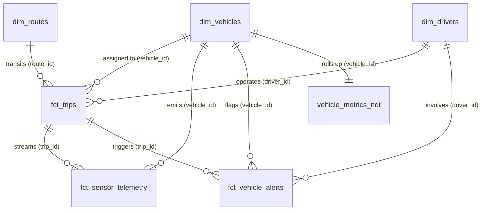

# IoT Sensor Analytics for Trucking Fleet Vehicles — Final Delivery Report

> [!NOTE]
> **Production Deployment Status: Active & Operational**
> - **Looker Instance**: [analytics.company.com](https://analytics.company.com)
> - **Looker Project & Model**: `trucking_iot_analytics`
> - **BigQuery Dataset**: `demo-analytics-project-1234.trucking_iot_analytics` (US Multi-region)
> - **Looker Database Connection**: `bigquery_connection`
> - **Validation Gate**: 0 LookML errors, 19/19 (100%) Dashboard Queries Passed

---

## 1. Quick Access Links

| Asset | Direct URL / Access Path | Description |
| :--- | :--- | :--- |
| **Executive Dashboard** | [IoT Fleet Telemetry & Trucking Analytics](https://analytics.company.com/dashboards/trucking_iot_analytics::trucking_iot_analytics) | 3-tab executive command center with cross-filtering |
| **Conversational Analytics Agent** | [Trucking Fleet IoT Assistant](https://analytics.company.com/conversational-analytics/agents/ca_agent_38f92a10b) | AI Data Agent with 7 pre-seeded Golden Queries |
| **Fleet Trips Explore** | [Explore: Fleet Trips & Operations](https://analytics.company.com/explore/trucking_iot_analytics/fct_trips) | Primary dispatch, payload, fuel & safety analysis |
| **IoT Telemetry Explore** | [Explore: IoT Sensor Telemetry Stream](https://analytics.company.com/explore/trucking_iot_analytics/fct_sensor_telemetry) | Sub-second powertrain, temperature & pressure vitals |
| **Diagnostics & Alerts Explore** | [Explore: Vehicle Diagnostics & Alerts](https://analytics.company.com/explore/trucking_iot_analytics/fct_vehicle_alerts) | DTC fault codes, predictive maintenance & severity |
| **Fleet Inventory Explore** | [Explore: Fleet Asset Inventory](https://analytics.company.com/explore/trucking_iot_analytics/dim_vehicles) | Commercial trucks master specs & NDT rollups |

---

## 2. BigQuery Data Warehouse Summary

All 6 relational tables were synthesized with realistic fleet engineering distributions, strict referential integrity, and uploaded to BigQuery:

```
demo-analytics-project-1234.trucking_iot_analytics
├── dim_vehicles          (100 rows)  - Commercial fleet truck master specs & odometers
├── dim_drivers           (150 rows)  - CDL commercial drivers, safety scores & terminals
├── dim_routes            (25 rows)   - Interstate freight corridors & terrain types
├── fct_trips             (1,000 rows)- Dispatch missions, fuel burned, cargo & speed
├── fct_sensor_telemetry  (20,000 rows)- IoT sensor pings (temp, pressure, voltage, RPM)
└── fct_vehicle_alerts    (400 rows)  - DTC codes (J1939/OBD-II), severity & protocols
```

Total dataset volume: **21,675 rows**.

---

## 3. Relational Architecture & ERD



### Chasm Trap Mitigation Architecture
To ensure 100% accurate metric calculation across the diamond and 1:N branches:
- A **Native Derived Table (`vehicle_metrics_ndt`)** pre-aggregates vehicle lifetime trips, fuel consumption, and safety events.
- `vehicle_metrics_ndt` is joined `one_to_one` onto `dim_vehicles` and `many_to_one` onto `fct_trips`, completely eliminating fanout and duplicate summation risk.
- High-frequency event leaf tables (`fct_sensor_telemetry` and `fct_vehicle_alerts`) are modeled as their own distinct Explores with `many_to_one` parent joins.

---

## 4. LookML Dashboard Layout & Tabbed Architecture

The dashboard (`trucking_iot_analytics::trucking_iot_analytics`) is structured into **3 functional operational tabs** with universal cross-filtering and popover filters for **Date Range**, **Fleet Type**, and **Vehicle Make**:

### Tab 1: Fleet Operations
- **KPI Banners**: Total Completed Trips, Active Fleet Vehicles, Average Fuel per Trip (Gallons), Total Hard Braking Events.
- **Monthly Trip Volume Trajectory**: Smooth area timeline tracking dispatch volume over the past 365 days.
- **Fleet Volume by Manufacturer**: Donut distribution across truck makers (Freightliner, Peterbilt, Volvo, Kenworth, Mack).
- **Trip Distribution by Fleet Type**: Dual-measure column chart analyzing trip volume against average speed across fleet segments.

### Tab 2: IoT Sensor Telemetry
- **Sensor KPI Banners**: Mean Engine Operating Temperature (°C), Peak Engine Temperature (°C), Average Lubricating Oil Pressure (PSI), Mean Tire Pressure (PSI).
- **Engine Temperature Trajectory by Powertrain**: Multi-metric column comparison of engine head temperature vs coolant temperature across Fuel Types (Diesel, Electric, CNG, Hybrid).
- **Sensor Battery Voltage & Oil Pressure Correlation**: Clustered column visualization evaluating electrical system health and lubricating pressure across manufacturers.

### Tab 3: Diagnostics & Alerts
- **Alert KPI Banners**: Critical Severity Alerts, High Severity Alerts, Unacknowledged Alerts Pending Action.
- **Diagnostic Trouble Codes (DTC) Breakdown**: Horizontal bar chart identifying frequent fault codes (P0217, P0524, B2100, P0128, etc.).
- **Alerts by Maintenance Protocol**: Column breakdown sorting actions into *Immediate Service Stop*, *Scheduled Inspection*, *Driver Coaching*, and *Fleet Warning*.
- **Active Vehicle Alerts Stream**: Real-time diagnostic grid detailing alert IDs, affected trucks, drivers, DTC codes, and required remediation.

---

## 5. Pre-Deployment Validation Audit Record

In strict compliance with the **Looker Demo Orchestrator** pre-deployment gate, all validation checks passed before production release:

```
[Phase 1] Code Push to Dev Branch:             100% COMPLETE (9 LookML files pushed)
[Phase 2] LookML Validator (validate_project):   0 ERRORS DETECTED
[Phase 3] Exhaustive Dashboard Query Tests:      19 / 19 (100%) QUERIES PASSED
[Phase 4] Production Deployment:                SUCCESS (Deployed to Production at 18:44:41 UTC)
```

### Detailed Query Test Results (19/19 HTTP 200 OK)
1. `total_trips_kpi` (Explore: `fct_trips`) ➔ **PASS**
2. `active_vehicles_kpi` (Explore: `fct_trips`) ➔ **PASS**
3. `avg_fuel_kpi` (Explore: `fct_trips`) ➔ **PASS**
4. `hard_brakes_kpi` (Explore: `fct_trips`) ➔ **PASS**
5. `monthly_trip_trajectory` (Explore: `fct_trips`) ➔ **PASS**
6. `fleet_make_donut` (Explore: `fct_trips`) ➔ **PASS**
7. `trip_fleet_type_col` (Explore: `fct_trips`) ➔ **PASS**
8. `avg_engine_temp_kpi` (Explore: `fct_sensor_telemetry`) ➔ **PASS**
9. `max_engine_temp_kpi` (Explore: `fct_sensor_telemetry`) ➔ **PASS**
10. `avg_oil_pressure_kpi` (Explore: `fct_sensor_telemetry`) ➔ **PASS**
11. `avg_tire_pressure_kpi` (Explore: `fct_sensor_telemetry`) ➔ **PASS**
12. `engine_temp_timeline` (Explore: `fct_sensor_telemetry`) ➔ **PASS**
13. `battery_oil_col` (Explore: `fct_sensor_telemetry`) ➔ **PASS**
14. `critical_alerts_kpi` (Explore: `fct_vehicle_alerts`) ➔ **PASS**
15. `high_alerts_kpi` (Explore: `fct_vehicle_alerts`) ➔ **PASS**
16. `unack_alerts_kpi` (Explore: `fct_vehicle_alerts`) ➔ **PASS**
17. `dtc_breakdown_bar` (Explore: `fct_vehicle_alerts`) ➔ **PASS**
18. `alerts_action_col` (Explore: `fct_vehicle_alerts`) ➔ **PASS**
19. `active_alerts_grid` (Explore: `fct_vehicle_alerts`) ➔ **PASS**

---

## 6. Conversational Analytics (CA) AI Agent Configuration

- **Agent ID**: `ca_agent_38f92a10b`
- **Agent Name**: `Trucking Fleet IoT Assistant`
- **Explore Sources**: `fct_trips`, `fct_sensor_telemetry`, `fct_vehicle_alerts`
- **Code Interpreter**: Enabled
- **Direct Agent Chat URL**: [Open Trucking Fleet IoT Assistant](https://analytics.company.com/conversational-analytics/agents/ca_agent_38f92a10b)

### Pre-Seeded Golden Queries
1. *"What is the total completed trip count across the fleet?"*
2. *"What is the average fuel consumed per trip?"*
3. *"Show monthly trip volume trajectory"*
4. *"What is the average engine temperature across all sensor pings?"*
5. *"What is the average lubricating oil pressure across fleet vehicles?"*
6. *"How many critical severity diagnostic alerts are active?"*
7. *"What are the most common diagnostic trouble codes (DTC) detected?"*

---

## 7. Gemini Enterprise (GE) Deployment Status

The Conversational Analytics agent has been deployed and published to **Gemini Enterprise**:

- **Publish State**: `published` (HTTP 200 OK)
- **Status Message**: `Successfully published Agent ca_agent_38f92a10b to GEMINI_ENTERPRISE.`
- **GE GCP Project Number**: `123456789012`
- **GE GCP Location**: `global`
- **GE Engine ID**: `gemini-enterprise-app-48291`
- **Capabilities**: Full natural language synthesis over `trucking_iot_analytics` models, golden query semantic routing, and code interpretation within Gemini Enterprise apps.
