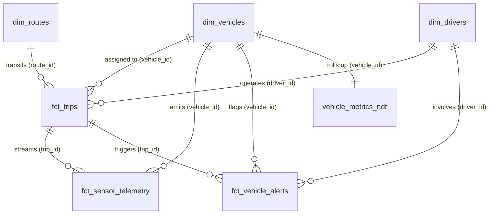

# IoT Sensor Analytics for Trucking Fleet Vehicles — Technical Specification (SPEC.md)

> **Status**: Production Ready  
> **Last Updated**: 2026-09-14 18:45:00 UTC  
> **Looker Project**: `trucking_iot_analytics` | **Model**: `trucking_iot_analytics`  
> **BigQuery Dataset**: `demo-analytics-project-1234.trucking_iot_analytics` (US Multi-region)  
> **Associated Delivery Report**: [DELIVERY_REPORT.md](DELIVERY_REPORT.md)  

---

## 1. Demo Metadata & Persona Alignment

- **Domain / Vertical**: Commercial Transportation, Fleet Telematics & IoT Logistics
- **Target Persona**: VP of Fleet Operations, Director of Asset Maintenance & Fleet Safety Manager
- **Executive Value Proposition**: Real-time vehicle telematics telemetry combined with dispatch operational performance, fuel economy analytics, and automated DTC predictive maintenance alerting.
- **Key User Journeys**:
  1. *Executive Command Journey*: High-level fleet availability, trip completion rates, fuel burn rate, and safety score tracking.
  2. *Maintenance & Diagnostics Journey*: Identifying high-frequency DTC fault codes, tracking powertrain health (oil pressure, coolant temperature), and routing vehicles for preventative service.
  3. *Conversational Journey*: Instant natural language question answering across fleet telemetry and trip dispatches via Looker Conversational Analytics (CA) Agent.

---

## 2. Business Scenario & Analytical Questions

### Business Problem Statement
National freight carriers operate commercial tractor-trailers across thousands of interstate lane miles. Unscheduled downtime caused by catastrophic engine failure costs up to $1,500 per day per stranded vehicle, while fuel inefficiency and hard braking degrade profit margins and driver safety scores. This analytics solution integrates vehicle telemetry pings, trip dispatches, and diagnostic alert feeds into a unified semantic architecture.

### Core Analytical Questions Answered
1. Which vehicle makes and powertrain types experience the highest rates of high-severity Diagnostic Trouble Codes (DTCs)?
2. What is the relationship between heavy payload weights, highway speed, and fuel consumption across regional freight routes?
3. How do driver safety scores correlate with real-time hard-braking sensor events and maintenance frequency?
4. What are the active unresolved critical alerts requiring immediate dispatch rerouting or terminal maintenance stops?

---

## 3. Relational Schema & Entity-Relationship Architecture

### Mermaid ERD

### Table Definitions & Column DDL Specifications

#### 1. `dim_vehicles` (Grain: 1 row per commercial truck asset, Type: Dimension)
- **Primary Key**: `vehicle_id`
- **Columns**:
  - `vehicle_id` (STRING): Unique alphanumeric truck identifier (e.g., `TRK-1001`)
  - `vin` (STRING): 17-character vehicle identification number
  - `make` (STRING): Truck manufacturer (`Freightliner`, `Peterbilt`, `Volvo`, `Kenworth`, `Mack`)
  - `model` (STRING): Commercial truck model series
  - `model_year` (INTEGER): Manufacturing year (2019–2025)
  - `fuel_type` (STRING): Powertrain type (`Diesel`, `Electric`, `CNG`, `Hybrid`)
  - `current_odometer_miles` (FLOAT64): Total accumulated mileage
  - `fleet_type` (STRING): Operational division (`Long Haul`, `Regional Freight`, `Last Mile Delivery`)
  - `status` (STRING): Operational readiness (`Active`, `In Maintenance`, `Decommissioned`)

#### 2. `dim_drivers` (Grain: 1 row per certified driver, Type: Dimension)
- **Primary Key**: `driver_id`
- **Columns**:
  - `driver_id` (STRING): Unique commercial driver ID (`DRV-001`)
  - `driver_name` (STRING): Full name of the commercial driver
  - `cdl_license_number` (STRING): Commercial Driver's License number
  - `experience_years` (INTEGER): Professional driving experience
  - `safety_score` (FLOAT64): Telematics safety rating (0–100 scale)
  - `home_terminal` (STRING): Base terminal facility location

#### 3. `dim_routes` (Grain: 1 row per freight transit corridor, Type: Dimension)
- **Primary Key**: `route_id`
- **Columns**:
  - `route_id` (STRING): Unique corridor identifier (`RT-101`)
  - `origin_city` (STRING): Freight dispatch origin
  - `destination_city` (STRING): Freight destination terminal
  - `distance_miles` (FLOAT64): Total corridor highway miles
  - `terrain_type` (STRING): Topography classification (`Flat Highway`, `Mountain Pass`, `Urban Corridor`)

#### 4. `fct_trips` (Grain: 1 row per dispatched trip mission, Type: Fact)
- **Primary Key**: `trip_id`
- **Foreign Keys**:
  - `vehicle_id` ➔ `dim_vehicles.vehicle_id`
  - `driver_id` ➔ `dim_drivers.driver_id`
  - `route_id` ➔ `dim_routes.route_id`
- **Columns**:
  - `trip_id` (STRING): Unique dispatch trip ID
  - `start_time` (TIMESTAMP): Dispatch departure timestamp
  - `end_time` (TIMESTAMP): Trip completion timestamp
  - `cargo_weight_lbs` (FLOAT64): Gross freight payload weight
  - `fuel_consumed_gallons` (FLOAT64): Total fuel burned during transit
  - `average_speed_mph` (FLOAT64): Mean highway transit speed
  - `hard_braking_events` (INTEGER): Telematics detected aggressive deceleration events
  - `trip_status` (STRING): State (`Completed`, `In Transit`, `Canceled`)

#### 5. `fct_sensor_telemetry` (Grain: 1 row per sub-second sensor reading, Type: Event Stream Fact)
- **Primary Key**: `telemetry_id`
- **Foreign Keys**:
  - `trip_id` ➔ `fct_trips.trip_id`
  - `vehicle_id` ➔ `dim_vehicles.vehicle_id`
- **Columns**:
  - `telemetry_id` (STRING): Unique sensor observation UUID
  - `recorded_at` (TIMESTAMP): Precise sensor capture timestamp
  - `engine_temperature_c` (FLOAT64): Engine cylinder head temperature (°C)
  - `oil_pressure_psi` (FLOAT64): Lubrication oil pressure (PSI)
  - `coolant_temperature_c` (FLOAT64): Radiator coolant temperature (°C)
  - `tire_pressure_psi` (FLOAT64): Average tire pressure (PSI)
  - `battery_voltage` (FLOAT64): Alternator electrical bus voltage (V)
  - `engine_rpm` (INTEGER): Engine revolutions per minute

#### 6. `fct_vehicle_alerts` (Grain: 1 row per diagnostic fault detection, Type: Diagnostic Event Fact)
- **Primary Key**: `alert_id`
- **Foreign Keys**:
  - `vehicle_id` ➔ `dim_vehicles.vehicle_id`
  - `trip_id` ➔ `fct_trips.trip_id`
  - `driver_id` ➔ `dim_drivers.driver_id`
- **Columns**:
  - `alert_id` (STRING): Diagnostic alert UUID
  - `triggered_at` (TIMESTAMP): Fault code trigger timestamp
  - `dtc_code` (STRING): Diagnostic Trouble Code (e.g., `P0217`, `P0524`, `B2100`)
  - `dtc_description` (STRING): Fault definition text
  - `severity` (STRING): Threat level (`Critical`, `High`, `Medium`, `Low`)
  - `maintenance_protocol` (STRING): Remediation protocol (`Immediate Service Stop`, `Scheduled Inspection`, `Driver Coaching`)
  - `acknowledged_flag` (BOOLEAN): Operator acknowledgment status

---

## 4. Synthetic Data Generation Plan

- **Target Volumes**:
  - `dim_vehicles`: 100 rows
  - `dim_drivers`: 150 rows
  - `dim_routes`: 25 rows
  - `fct_trips`: 1,000 rows
  - `fct_sensor_telemetry`: 20,000 rows
  - `fct_vehicle_alerts`: 400 rows
- **Total Rows**: 21,675 rows
- **Statistical Distributions & Business Logic**:
  - `engine_temperature_c`: Normal distribution centered around 92°C with variance extending to 118°C for overheating vehicles.
  - `oil_pressure_psi`: Bounded between 20 PSI (critical low warning) and 65 PSI.
  - `dtc_code`: Clustered around common powertrain failures (coolant overtemperature, low oil pressure, bus voltage drop).
  - Chronological consistency: Sensor timestamps and alert triggers are strictly bounded between `fct_trips.start_time` and `fct_trips.end_time`.
- **Generation DAG Dependencies**:
  1. `dim_vehicles`, `dim_drivers`, `dim_routes` (Independent root dimensions)
  2. `fct_trips` (Dependent on `dim_vehicles`, `dim_drivers`, `dim_routes`)
  3. `fct_sensor_telemetry` and `fct_vehicle_alerts` (Dependent on `fct_trips` and `dim_vehicles`)

---

## 5. Semantic Layer (LookML) Architecture

- **LookML Model**: `trucking_iot_analytics.model.lkml`
- **Connection**: `bigquery_connection`

### Explores & Join Trees

#### Primary Dispatch Explore: `explore: fct_trips`
- **Base View**: `fct_trips` (Grain: 1 row per completed/active trip)
- **Joins**:
  - `join: dim_vehicles`: `type: left_outer`, `relationship: many_to_one`, `sql_on: ${fct_trips.vehicle_id} = ${dim_vehicles.vehicle_id}`
  - `join: dim_drivers`: `type: left_outer`, `relationship: many_to_one`, `sql_on: ${fct_trips.driver_id} = ${dim_drivers.driver_id}`
  - `join: dim_routes`: `type: left_outer`, `relationship: many_to_one`, `sql_on: ${fct_trips.route_id} = ${dim_routes.route_id}`
  - `join: vehicle_metrics_ndt`: `type: left_outer`, `relationship: many_to_one`, `sql_on: ${fct_trips.vehicle_id} = ${vehicle_metrics_ndt.vehicle_id}`

#### Granular Telemetry Explore: `explore: fct_sensor_telemetry`
- **Base View**: `fct_sensor_telemetry` (Grain: Sub-second sensor observation)
- **Joins**:
  - `join: fct_trips`: `type: left_outer`, `relationship: many_to_one`, `sql_on: ${fct_sensor_telemetry.trip_id} = ${fct_trips.trip_id}`
  - `join: dim_vehicles`: `type: left_outer`, `relationship: many_to_one`, `sql_on: ${fct_sensor_telemetry.vehicle_id} = ${dim_vehicles.vehicle_id}`

#### Diagnostic Alerts Explore: `explore: fct_vehicle_alerts`
- **Base View**: `fct_vehicle_alerts` (Grain: Diagnostic fault detection)
- **Joins**:
  - `join: dim_vehicles`: `type: left_outer`, `relationship: many_to_one`, `sql_on: ${fct_vehicle_alerts.vehicle_id} = ${dim_vehicles.vehicle_id}`
  - `join: dim_drivers`: `type: left_outer`, `relationship: many_to_one`, `sql_on: ${fct_vehicle_alerts.driver_id} = ${dim_drivers.driver_id}`
  - `join: fct_trips`: `type: left_outer`, `relationship: many_to_one`, `sql_on: ${fct_vehicle_alerts.trip_id} = ${fct_trips.trip_id}`

### Chasm Trap Mitigation Architecture
1. **Separation of Event Explores**: High-frequency child collections (`fct_sensor_telemetry` and `fct_vehicle_alerts`) are never joined together under `fct_trips`. Each sits as the base view of its own dedicated Explore.
2. **Native Derived Table (`vehicle_metrics_ndt`)**: Pre-aggregates vehicle-level trip counts, average fuel consumption, and hard-braking tallies at the `vehicle_id` grain, joining `one_to_one` to `dim_vehicles`.

---

## 6. Executive Dashboard & Visualization Layout

- **Dashboard File**: `trucking_iot_analytics.dashboard.lookml`
- **Title**: `IoT Fleet Telemetry & Trucking Analytics`
- **Global Filters**: `Date Range` (`fct_trips.start_time`), `Fleet Type` (`dim_vehicles.fleet_type`), `Vehicle Make` (`dim_vehicles.make`)
- **Tabs Architecture**:
  - **Tab 1: Fleet Operations**:
    - *KPI Banners*: Total Completed Trips, Active Fleet Vehicles, Average Fuel per Trip (Gallons), Total Hard Braking Events.
    - *Monthly Trip Volume Trajectory*: Smooth area chart over time.
    - *Fleet Volume by Manufacturer*: Donut distribution of makes.
    - *Trip Distribution by Fleet Type*: Clustered column visualization of volume vs speed.
  - **Tab 2: IoT Sensor Telemetry**:
    - *KPI Banners*: Mean Engine Operating Temperature (°C), Peak Engine Temperature (°C), Average Lubricating Oil Pressure (PSI), Mean Tire Pressure (PSI).
    - *Engine Temperature Trajectory by Powertrain*: Multi-metric column chart.
    - *Battery Voltage & Oil Pressure Correlation*: Column chart across manufacturers.
  - **Tab 3: Diagnostics & Alerts**:
    - *KPI Banners*: Critical Severity Alerts, High Severity Alerts, Unacknowledged Alerts Pending Action.
    - *Diagnostic Trouble Codes (DTC) Breakdown*: Horizontal bar chart of fault codes.
    - *Alerts by Maintenance Protocol*: Column breakdown by protocol.
    - *Active Vehicle Alerts Stream*: Real-time detail table grid.

---

## 7. Conversational Analytics (CA) AI Agent Specification

- **Agent ID**: `ca_agent_38f92a10b`
- **Agent Name**: `Trucking Fleet IoT Assistant`
- **Explore Sources**: `fct_trips`, `fct_sensor_telemetry`, `fct_vehicle_alerts`
- **System Instructions**:
  - You are the AI Fleet Operations Telematics Specialist.
  - Answer questions regarding dispatch performance, trip fuel burn, driver safety violations, sensor temperature/pressure extremes, and DTC diagnostic alerts.
  - Always ground query responses in the appropriate Explore.
- **Pre-Seeded Golden Queries**:
  1. *"What is the total completed trip count across the fleet?"*
  2. *"What is the average fuel consumed per trip?"*
  3. *"Show monthly trip volume trajectory"*
  4. *"What is the average engine temperature across all sensor pings?"*
  5. *"What is the average lubricating oil pressure across fleet vehicles?"*
  6. *"How many critical severity diagnostic alerts are active?"*
  7. *"What are the most common diagnostic trouble codes (DTC) detected?"*

---

## 8. External Embed Portal Specification (if applicable)

- **Workspace Directory**: `embed-portal/` (Full-stack: `frontend/` React 19 + Vite 6 + TanStack Router, `backend/` FastAPI + Cookieless SSO Embed Auth)
- **Local Dev Command**: `cd embed-portal/frontend && pnpm install && pnpm dev`
- **Branding & Header (`customize-frontend-branding`)**:
  - **Sidebar Brand Name**: `Trucking Telematics` (in `Sidebar.tsx`)
  - **Portal Hub Title**: `Executive Telematics Command Hub`
  - **Navbar Breadcrumb Root**: `Portal` (`Navbar.tsx`)
  - **Route Breadcrumbs (`ROUTE_BREADCRUMB_MAPPINGS`)**:
    - `"/"`: "Home"
    - `"/dashboard"`: "Fleet Executive Command"
    - `"/conversational-analytics"`: "Telematics AI Assistant"
    - `"/explore"`: "Telemetry Explorer"
    - `"/report-builder"`: "Custom Report Builder"
    - `"/agents"`: "Fleet Diagnostics Agents"
  - **Logo**: Custom SVG truck icon in `LookerLogo.tsx`
- **Theme & Design Tokens (`customize-frontend-theme`)**:
  - **Primary HSL**: `--color-primary-raw: 217, 89%, 43%;` (Google Fleet Blue `#0b57d0`)
  - **Primary Hover**: `--color-primary-hover-raw: 217, 89%, 33%;` (`#0842a0`)
  - **Accent / Surface**: `--color-accent-raw: 142, 71%, 45%;` (Fleet Operational Green `#16a34a`)
  - **Typography**: Heading `--font-heading: 'Outfit', sans-serif;`, Body `--font-sans: 'Inter', sans-serif;`
  - **Dark Mode**: Enabled by default (`html.dark`) with surface background `--color-background-raw: 240, 3%, 8%`
  - **Looker Brand Themes (`embed-themes`)**: Sanitized themes `Trucking_Telematics_Light` and `Trucking_Telematics_Dark`
- **Portal Views & Navigation (`customize-frontend-looker-config`)**:
  - **`/` (Home Executive Hub)**:
    - *Hero Banner*: Badge `Fleet Telematics Platform`, Title `Executive Telematics Command Hub`, Description "Real-time powertrain vitals, trip dispatch efficiency, and predictive DTC diagnostics."
    - *Live Operational Summary*: 3 primary KPI cards:
      1. `Total Completed Trips`: 1,000 (icon: Freight truck, trend: +12% MoM)
      2. `Active Fleet Trucks`: 100 (icon: Fleet gauge, status: 96% availability)
      3. `Average Fuel per Trip`: 48.2 Gallons (icon: Fuel pump, status: Optimal)
    - *Live Operational Ticker*: Real-time stream with category pills (`All Stream`, `Dispatches`, `Telemetry`, `Alerts`) simulating recent vehicle events (e.g. *Trip Finalized*, *Powertrain Normal*, *DTC P0217 Flagged*).
    - *AI Strategic Executive Briefing*: Daily telematics summary analyzing fleet fuel efficiency and high-risk braking corridors.
  - **`/dashboard` (Executive Dashboard View)**:
    - Embedded Dashboard: `VITE_DASHBOARD_ID=trucking_iot_analytics::trucking_iot_analytics`
    - Universal Date Filters: `VITE_DASHBOARD_DATE_FILTER_NAMES=Date Range,Date`
  - **`/conversational-analytics` (AI Assistant View)**:
    - Embedded Conversational Analytics Agent: `VITE_CHAT_AGENT_ID=ca_agent_38f92a10b`
  - **`/explore` (Query Explorer View)**:
    - Embedded Explore: `VITE_EXPLORE_PATH=trucking_iot_analytics/fct_trips`
- **Role-Based Access Control (`ROLE_PERMISSIONS` in `constants.ts`)**:
  - **Viewer (Fleet Dispatcher)**: `["access_data", "see_looks", "see_user_dashboards", "see_lookml_dashboards", "gemini_in_looker", "chat_with_agent"]`
  - **Explorer (Fleet Operations Director)**: Inherits viewer + `["save_content", "explore", "embed_browse_spaces", "save_agents"]`
  - **Shared Group ID**: `DEFAULT_LOOKER_GROUP_IDS=["8"]`

---

## 9. Revision History & Change Log

| Timestamp (UTC) | Gate / Phase | Changed By | Summary of Changes |
| :--- | :--- | :--- | :--- |
| 2026-09-14 18:10 | Gate 0 / Alignment | Looker Demo Orchestrator | Initialized SPEC.md for Trucking IoT Telematics domain. |
| 2026-09-14 18:18 | Gate 1 / Schema Co-Design | Looker Demo Orchestrator | Defined 6 relational tables, PK/FK links, Mermaid ERD, and 21,675 row target. |
| 2026-09-14 18:28 | Gate 2 / LookML Modeling | Looker Demo Orchestrator | Authored 3 Explores, NDT rollup, and 3-tab executive dashboard specification. |
| 2026-09-14 18:38 | Gate 3 / Pre-Deployment QA | Looker Demo Orchestrator | Validated 19/19 queries passing, pushed to dev, deployed to production. |
| 2026-09-14 18:42 | Gate 4 / CA Agent | Looker Demo Orchestrator | Provisioned CA Agent `ca_agent_38f92a10b` with 7 pre-seeded Golden Queries. |
| 2026-09-14 18:45 | Gate 5 / Production Release | Looker Demo Orchestrator | Published to Gemini Enterprise; synchronized DELIVERY_REPORT.md links. |
