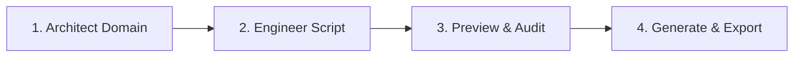

# DataDesigner: Master Autonomous Data Generation Skill

Use this skill when you need to design, sample, test, or generate synthetic datasets.

## Zero-Install CLI Execution Model

DataDesigner runs directly via `uvx` without requiring local installation or MCP server daemons:

```bash
uvx --from git+https://github.com/lkrdev/synthetic-data-generator.git data-designer <subcommand>
```

*(Note: If working inside a local clone of `synthetic-data-generator`, you can also run `data-designer <subcommand>` directly).*

### Core CLI Commands

1. **Introspect Types & Catalog**:
   Discover available samplers, column types, and validators:
   ```bash
   uvx --from git+https://github.com/lkrdev/synthetic-data-generator.git data-designer agent types [samplers|validators|processors]
   ```
2. **Validate Builder Script**:
   Run static analysis and schema validation on a PEP 723 Python script or YAML config:
   ```bash
   uvx --from git+https://github.com/lkrdev/synthetic-data-generator.git data-designer validate <script.py>
   ```
3. **Preview Sample Records**:
   Generate sample records in non-interactive mode with column statistics for rapid quality iteration:
   ```bash
   uvx --from git+https://github.com/lkrdev/synthetic-data-generator.git data-designer preview <script.py> -n 5 --non-interactive
   ```
4. **Batch Generation**:
   Perform full batch generation and export to Parquet, JSONL, or CSV:
   ```bash
   uvx --from git+https://github.com/lkrdev/synthetic-data-generator.git data-designer create <script.py> -n <NUM_RECORDS> -o ./artifacts
   ```
5. **BigQuery Export**:
   Load generated Parquet files directly into BigQuery using the standard `bq` CLI:
   ```bash
   bq load --source_format=PARQUET "${PROJECT_ID}:${DATASET}.${TABLE}" "./artifacts/${DATASET_NAME}/data.parquet"
   ```

---

## Autonomous 4-Stage Workflow

Follow these 4 stages in sequence:



### 1. Architectural Modeling (`data-designer-architect`)
- Break down the request into entities: Dimensions (e.g. Customers, Merchants) and Facts (e.g. Accounts, Cards, Transactions).
- Establish cardinality ratios and foreign key dependencies.
- Select realistic statistical distributions (Category weights, Uniform bounds, Faker personas) using `data-designer agent types samplers`.

### 2. Script Authoring (`data-designer-engineer`)
- Author a Python script with PEP 723 metadata and a `load_config_builder() -> dd.DataDesignerConfigBuilder` entry point.
- Validate the script:
  ```bash
  uvx --from git+https://github.com/lkrdev/synthetic-data-generator.git data-designer validate <script.py>
  ```

### 3. Preview & Quality Audit (`data-designer-evaluator`)
- Run a 5-record sample preview:
  ```bash
  uvx --from git+https://github.com/lkrdev/synthetic-data-generator.git data-designer preview <script.py> -n 5 --non-interactive
  ```
- Review the returned output table and column stats:
  - Are null rates zero where expected?
  - Are primary keys 100% unique?
  - Are values realistic for the domain?
- If issues exist, edit the script and re-run the preview.

### 4. Generation & Database Export
- Generate the full dataset:
  ```bash
  uvx --from git+https://github.com/lkrdev/synthetic-data-generator.git data-designer create <script.py> -n <NUM_RECORDS> -o ./artifacts
  ```
- If exporting to BigQuery, load via `bq`:
  ```bash
  bq load --source_format=PARQUET "${PROJECT_ID}:${DATASET}.${TABLE}" "./artifacts/${DATASET_NAME}/data.parquet"
  ```
- Confirm record counts via `bq query`:
  ```bash
  bq query --use_legacy_sql=false "SELECT count(*) AS total_rows FROM \`${PROJECT_ID}.${DATASET}.${TABLE}\`"
  ```

---

## Common Pitfalls & Rules
- **Category Sampler**: Takes `values=["A", "B"]` and optional `weights=[0.8, 0.2]`.
- **Uniform Sampler**: Takes `low=0.0` and `high=100.0`.
- **Person Faker**: Use `sampler_type="person_from_faker"` with `drop=True` for intermediate extraction.
- **Jinja2 Referencing**: Use `{{ column_name }}`. For objects, use `{{ person.first_name }}`. For judge scores, use `{{ judge_col.metric.score }}`.
- **Always use `--non-interactive`**: When invoking `data-designer preview` from an agent terminal, always pass `--non-interactive` to prevent interactive TUI prompts from pausing execution.
