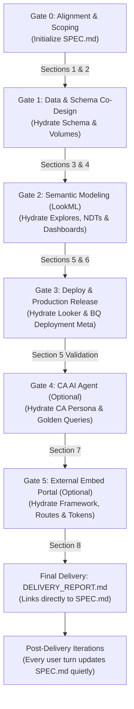

# Demo Technical Specification Standard (`SPEC.md`)

This skill defines the mandatory protocol for asynchronously authoring, continuously updating, and linking the living technical specification (`SPEC.md`) across every conversation and gate in a Looker demo project.

---

## 1. Purpose & Guiding Principles

`SPEC.md` is the **single source of truth** documenting the end-to-end technical architecture, business requirements, relational schemas, synthetic data distributions, LookML semantic models, executive dashboard layouts, Conversational Analytics (CA) agent instructions, and embedded analytics portal configurations.

### The 4 Cardinal Rules of `SPEC.md` Maintenance

> [!IMPORTANT]
> **Rule 1: Asynchronous & Silent Disk Updates (Zero Chat Clutter)**
> During conversational turns, the agent **MUST** update `SPEC.md` directly in the project root (`./SPEC.md`) quietly using file tools as architectural decisions and schema refinements are agreed upon. **DO NOT dump or reprint the full `SPEC.md` into the visible chat on routine turns.** Keep conversational chat output focused, fast, and actionable.

> [!CAUTION]
> **Rule 2: Surface Only Significant Structural Changes**
> Do not alert the user to minor field additions or routine metadata updates. **ONLY** notify the user or display diffs/excerpts in visible chat when a **significant structural change** has occurred (e.g., pivoting the business domain, major schema redesign with new entities, switching join topologies or NDT aggregation strategies, or when explicitly requested by the user).

> [!TIP]
> **Rule 3: Incremental Hydration Across Every Gate & Conversation**
> `SPEC.md` is never created in one giant batch at the end. It is initialized at Gate 0 and progressively hydrated and updated during each gate and each subsequent user conversation. Every modification is recorded in the Revision History table.

> [!IMPORTANT]
> **Rule 4: `DELIVERY_REPORT.md` Must Always Link to `SPEC.md`**
> When the final delivery report is generated at the conclusion of deployment (or refreshed during post-deployment iterations), both the chat delivery report and the persisted `DELIVERY_REPORT.md` **MUST prominently link to `[SPEC.md](SPEC.md)`** in the Quick Access Links table.

---

## 2. Gate-by-Gate Hydration Lifecycle

The agent maintains `SPEC.md` along the following lifecycle:



| Lifecycle Phase | What to Hydrate / Update in `SPEC.md` | Chat Output Behavior |
| :--- | :--- | :--- |
| **Gate 0: Alignment & Scoping** | Initialize `SPEC.md` with: Header, Section 1 (Demo Metadata, Target Personas, Objectives) and Section 2 (Business Scenario, Analytical Questions), and initial entry in Section 9 (Revision History). | **Silent.** Confirm 4 targets with user via `ask_question`. Do NOT dump `SPEC.md`. |
| **Gate 1: Schema Co-Design & Micro-Sampling** | Hydrate Section 3 (Relational Schema: tables, grain, columns, data types, PK/FK relationships, Mermaid ERD) and Section 4 (Data Volume Plan: row counts, statistical distributions, generation DAG). | Output proposed schema and micro-sample directly in chat for user confirmation. Quietly write/update `SPEC.md`. |
| **Gate 2: Semantic Modeling (LookML)** | Hydrate Section 5 (LookML Architecture: explores, join trees, chasm/fan-trap mitigation, NDT rollups, measures, dimensions) and Section 6 (Dashboard Specification: tabs, KPI cards, chart types, filters). | **Silent.** Inform user model & dashboard files are staged. |
| **Gate 3: Pre-Deploy & Production Release** | Update Section 5 with deployment confirmation: Looker instance URL, project, model, connection, and query validation audit scores. | **Silent.** Report deploy/validation progress directly in chat. |
| **Gate 4: CA AI Agent Provisioning** | Hydrate Section 7 (CA Agent ID, name, persona instructions, pre-seeded golden queries). | **Silent.** |
| **Gate 5: External Embed Portal** | Hydrate Section 8 (Scaffolded directory, framework, routes, Looker Embed SDK/components, CSS design tokens, branding). | **Silent.** |
| **Post-Delivery Iterations** | Whenever the user requests additions or adjustments (new explore, modified KPI, additional table, updated portal styling), update the relevant section in `SPEC.md` and append a row to Section 9 (Revision History). | **Silent unless significant.** Acknowledge the user's specific request directly; only highlight `SPEC.md` if a major architectural pivot occurred. |

---

## 3. Canonical `SPEC.md` Template Structure

When initializing or updating `SPEC.md`, follow this canonical structure:

```markdown
# {Demo Title} — Technical Specification (SPEC.md)

> **Status**: {Draft | In Review | Provisioned | Production Ready}
> **Last Updated**: {YYYY-MM-DD HH:MM:SS UTC}
> **Looker Project**: `{looker_project_name}` | **Model**: `{lookml_model_name}`
> **BigQuery Dataset**: `{gcp_project_id}.{bq_dataset_id}` ({gcp_location})
> **Associated Delivery Report**: [DELIVERY_REPORT.md](DELIVERY_REPORT.md)

---

## 1. Demo Metadata & Persona Alignment

- **Domain / Vertical**: {e.g., Fleet Logistics & IoT, FinTech Anti-Money Laundering, Healthcare Operations}
- **Target Persona**: {e.g., VP of Fleet Telematics, Head of Fraud Strategy, Chief Medical Officer}
- **Executive Value Proposition**: {Concise statement of what business value this demo proves}
- **Key User Journeys**:
  1. *Executive Journey*: High-level KPI visibility, cross-filtering, and anomaly detection.
  2. *Operational Journey*: Deep-dive granular exploration and root-cause diagnostics.
  3. *Conversational Journey*: Natural language ad-hoc question answering via CA AI Agent.

---

## 2. Business Scenario & Analytical Questions

### Business Problem Statement
{Clear narrative of the operational or strategic challenge the organization faces and how this analytics solution solves it.}

### Core Analytical Questions Answered
1. {Business question 1, e.g., "Which vehicle models experience the highest frequency of severe engine DTC alerts?"}
2. {Business question 2, e.g., "What is the correlation between average payload weight and fuel burn rate across regional corridors?"}
3. {Business question 3, e.g., "Which driver shifts exceed safety thresholds for continuous operation?"}

---

## 3. Relational Schema & Entity-Relationship Architecture

### Mermaid ERD
```mermaid
erDiagram
    {table_a} ||--o{ {table_b} : "{relationship_label} ({foreign_key})"
    {table_b} ||--o{ {table_c} : "{relationship_label} ({foreign_key})"
```

### Table Definitions & Column DDL Specifications
#### 1. `{table_name_1}` ({Table Grain}, Type: {Dimension | Fact | Event Stream})
- **Primary Key**: `{pk_column}`
- **Foreign Keys**: `{fk_column}` ➔ `{referenced_table}.{referenced_pk}`
- **Columns**:
  - `{col_1}` (`{DATA_TYPE}`): {Column description and domain constraints}
  - `{col_2}` (`{DATA_TYPE}`): {Column description}

#### 2. `{table_name_2}` ({Table Grain}, Type: {Dimension | Fact | Event Stream})
- ...

---

## 4. Synthetic Data Generation Plan

- **Target Volumes**:
  - `{table_1}`: {row_count} rows
  - `{table_2}`: {row_count} rows
- **Statistical Distributions & Business Logic**:
  - {Entity 1}: {e.g., Normal distribution mean=X, stddev=Y; Zipf distribution for categorical skews}
  - {Entity 2}: {e.g., State transition probabilities, realistic chronological sequencing}
- **Generation DAG Order**:
  1. `{root_dim_1}` (independent)
  2. `{intermediate_dim_2}` (depends on `{root_dim_1}`)
  3. `{fct_table}` (depends on `{root_dim_1}`, `{intermediate_dim_2}`)

---

## 5. Semantic Layer (LookML) Architecture

- **LookML Model**: `{lookml_model_name}.model.lkml`
- **Database Connection**: `{looker_connection_name}`

### Explores & Join Graph
- **`explore: {primary_explore}`**:
  - **Base View**: `{base_view_name}` (Grain: {Base View Grain})
  - **Joins**:
    - `join: {joined_view_1}`: `type: left_outer`, `relationship: many_to_one`, `sql_on: ...`
    - `join: {ndt_rollup_view}`: `type: left_outer`, `relationship: one_to_one`, `sql_on: ...`

### Chasm Trap & Fan Trap Mitigation Architecture
{Detailed documentation of how 1:N fan-outs are handled: NDT rollups pre-aggregating child collections to parent grain, dedicated event-stream explores, and symmetric aggregate safeguards.}

### Core Measures & Dimensions
- `{view_name}`:
  - Measures: `{measure_1}` (type: sum/average/count, value_format_name: ...), `{measure_2}`...
  - Dimensions: `{dim_1}` (type: string/number/date_time), drill paths...

---

## 6. Executive Dashboard & Visualization Layout

- **Dashboard File**: `{dashboard_name}.dashboard.lookml`
- **Tabs Architecture**:
  - **Tab 1: {Tab 1 Name}**:
    - *KPI Cards*: {List single value metrics}
    - *Tiles*: {Tile Title} ({chart_type}), {Tile Title} ({chart_type})
  - **Tab 2: {Tab 2 Name}**:
    - *KPI Cards*: ...
    - *Tiles*: ...
- **Global Filters & Cross-Filtering**:
  - Filters: `{Filter 1 Name}` (type: field_filter, explore: ..., field: ...), `{Filter 2 Name}`...
  - Cross-filtering: `crossfilter_enabled: true`

---

## 7. Conversational Analytics (CA) AI Agent Specification

- **Agent ID**: `{ca_agent_id}`
- **Agent Name**: `{ca_agent_name}`
- **Explore Sources**: `[{explore_list}]`
- **Agent Instructions / Persona**: {Grounding instructions and conversational persona}
- **Pre-Seeded Golden Queries**:
  1. *"{Golden Query 1 natural language question}"*
     - Model: `{lookml_model_name}`, Explore: `{explore_name}`
     - Fields: `[{field_list}]`, Sorts: `[{sort_list}]`
  2. *"{Golden Query 2 natural language question}"*
     ...

---

## 8. External Embed Portal Specification (if applicable)

- **Workspace Directory**: `embed-portal/` (Full-stack: `frontend/` React 19 + TypeScript + Vite 6 + TanStack Router, `backend/` FastAPI + Cookieless SSO Embed Auth)
- **Local Dev Command**: `cd embed-portal/frontend && pnpm install && pnpm dev` (or `./start.sh` from portal root)
- **Branding & Layout Configuration (`customize-frontend-branding`)**:
  - **Sidebar Brand Name**: `{brand_name}` (in `Sidebar.tsx` and `DEFAULT_BRAND` in `constants.ts`)
  - **Portal Hub Title**: `{portal_hub_title}` (e.g., `Executive eCommerce Hub`, `Fleet Telematics Hub`)
  - **Navbar Breadcrumb Root**: `Portal` (in `Navbar.tsx`)
  - **Route Breadcrumbs (`ROUTE_BREADCRUMB_MAPPINGS`)**:
    - `"/"`: "Home"
    - `"/dashboard"`: "Executive Overview"
    - `"/conversational-analytics"`: "AI Assistant"
    - `"/agents"`: "Custom Agents"
    - `"/explore"`: "Data Explorer"
    - `"/report-builder"`: "Report Builder"
  - **Brand Logo Asset**: `{brand_logo_type}` (`LookerLogo.tsx` custom SVG path or `/brand-logo.png`)
- **Theme & Design Tokens (`customize-frontend-theme`)**:
  - **Color Palette (HSL)**:
    - Primary: `--color-primary-raw: {primary_hsl_raw};` (e.g. `217, 89%, 43%`)
    - Primary Hover: `--color-primary-hover-raw: {hover_hsl_raw};`
    - Accent / Surface: `--color-accent-raw: {accent_hsl_raw};`
  - **Typography**: Heading `--font-heading: 'Outfit', sans-serif;`, Body `--font-sans: 'Inter', sans-serif;`
  - **Dark Mode**: High-contrast dark theme enabled via `html.dark` with `--color-background-raw: 240, 3%, 8%`
  - **Looker Instance Themes (`embed-themes`)**: Sanitized themes `<Brand>_Light` & `<Brand>_Dark` (e.g., `Levis_Light` / `Levis_Dark`)
- **Portal Views & Navigation (`customize-frontend-looker-config`)**:
  - **`/` (Home Executive Hub)**:
    - *Hero Banner*: Brand badge (`{brand_name} Analytics Platform`), hub headline, operational subhead.
    - *Live Financial / Operational Summary*: 3–4 primary KPI summary cards with query metrics and status badges.
    - *Live Operational Ticker*: Real-time event feed with stream category filters (`All Stream`, `Revenue`, `Ops & Logistics`, `Alerts`).
    - *AI Strategic Executive Briefing*: Executive strategic briefing card scoped to active brand focus.
  - **`/dashboard` (Executive Dashboard View)**:
    - Embedded Dashboard: `VITE_DASHBOARD_ID={lookml_model_name}::{dashboard_name}`
    - Date Filters: `VITE_DASHBOARD_DATE_FILTER_NAMES={date_filter_names}`
  - **`/conversational-analytics` (AI Assistant View)**:
    - Embedded Conversational Analytics Agent: `VITE_CHAT_AGENT_ID={ca_agent_id}`
  - **`/explore` (Query Explorer View)**:
    - Embedded Explore: `VITE_EXPLORE_PATH={lookml_model_name}/{primary_explore}`
  - **`/agents` & `/report-builder`**:
    - Custom AI agents catalog & self-service Looker report authoring.
- **Role-Based Access Control (`ROLE_PERMISSIONS` in `constants.ts`)**:
  - **Viewer (Simple User)**: `["access_data", "see_looks", "see_user_dashboards", "see_lookml_dashboards", "gemini_in_looker", "chat_with_agent"]`
  - **Explorer (Advanced User)**: Inherits viewer + `["save_content", "explore", "embed_browse_spaces", "save_agents"]`
  - **Embed Shared Group**: `DEFAULT_LOOKER_GROUP_IDS=["{group_id}"]`
- **Verification Gate**:
  - Run `cd embed-portal/frontend && pnpm run build` to verify 0 TypeScript or JSX errors.

---

## 9. Revision History & Change Log

| Timestamp (UTC) | Gate / Phase | Changed By | Summary of Changes |
| :--- | :--- | :--- | :--- |
| {YYYY-MM-DD HH:MM} | Gate 0 / Initial Alignment | Looker Demo Orchestrator | Initialized SPEC.md with domain, persona, and core business questions. |
| {YYYY-MM-DD HH:MM} | Gate 1 / Schema Co-Design | Looker Demo Orchestrator | Hydrated relational schema, column definitions, Mermaid ERD, and volume plan. |
| {YYYY-MM-DD HH:MM} | Gate 2 / Semantic Modeling | Looker Demo Orchestrator | Added LookML explores, NDT rollups, measures, and dashboard layout specs. |
| {YYYY-MM-DD HH:MM} | Gate 3 / Production Release | Looker Demo Orchestrator | Recorded Looker deployment metadata, project name, and validation results. |
```

---

## 4. Subagent Collaboration & Handoffs

When specialized subagents are invoked:
1. **`data-engineer`**: Reads Sections 3 & 4 of `SPEC.md` to know the exact schemas and volume constraints. Updates Section 4 with actual row counts or data generation scripts.
2. **`lookml-snowflake-modeler`**: Reads Section 3 & 5. Formulates NDT rollups and records the Chasm Trap Mitigation Architecture into Section 5.
3. **`lookml-dashboard-designer`**: Reads Section 5 & 6. Translates the KPI cards and chart specifications into LookML dashboard tiles.
4. **`embed-portal-engineer`**: Reads Section 8 to construct the external portal with the correct routes, embedded dashboard IDs, and theme tokens.

All subagents update `SPEC.md` directly and quietly on disk, appending an entry to Section 9 (Revision History).
