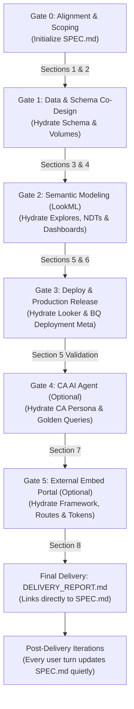

# Demo Technical Specification Standard (`SPEC.md`)

This skill defines the mandatory protocol for asynchronously authoring, continuously updating, and linking the living technical specification (`SPEC.md`) across every conversation and gate in a Looker demo project.

---

## 1. Purpose & Guiding Principles

`SPEC.md` is the **single source of truth** documenting the end-to-end technical architecture, business requirements, relational schemas, synthetic data distributions, LookML semantic models, executive dashboard layouts, Conversational Analytics (CA) agent instructions, and embedded analytics portal configurations.

### The 4 Cardinal Rules of `SPEC.md` Maintenance

> [!IMPORTANT]
> **Rule 1: Asynchronous & Silent Disk Updates (Zero Chat Clutter)**
> During conversational turns, the agent **MUST** update `SPEC.md` directly in the project root (`./SPEC.md`) quietly using file tools as architectural decisions and schema refinements are agreed upon. **DO NOT dump or reprint the full `SPEC.md` into the visible chat on routine turns.** Keep conversational chat output focused, fast, and actionable.

> [!CAUTION]
> **Rule 2: Surface Only Significant Structural Changes**
> Do not alert the user to minor field additions or routine metadata updates. **ONLY** notify the user or display diffs/excerpts in visible chat when a **significant structural change** has occurred (e.g., pivoting the business domain, major schema redesign with new entities, switching join topologies or NDT aggregation strategies, or when explicitly requested by the user).

> [!TIP]
> **Rule 3: Incremental Hydration Across Every Gate & Conversation**
> `SPEC.md` is never created in one giant batch at the end. It is initialized at Gate 0 and progressively hydrated and updated during each gate and each subsequent user conversation. Every modification is recorded in the Revision History table.

> [!IMPORTANT]
> **Rule 4: `DELIVERY_REPORT.md` Must Always Link to `SPEC.md`**
> When the final delivery report is generated at the conclusion of deployment (or refreshed during post-deployment iterations), both the chat delivery report and the persisted `DELIVERY_REPORT.md` **MUST prominently link to `[SPEC.md](SPEC.md)`** in the Quick Access Links table.

---

## 2. Gate-by-Gate Hydration Lifecycle

The agent maintains `SPEC.md` along the following lifecycle:

| Lifecycle Phase | What to Hydrate / Update in `SPEC.md` | Chat Output Behavior |
| :--- | :--- | :--- |
| **Gate 0: Alignment & Scoping** | Initialize `SPEC.md` with: Header, Section 1 (Demo Metadata, Target Personas, Objectives) and Section 2 (Business Scenario, Analytical Questions), and initial entry in Section 9 (Revision History). | **Silent.** Confirm 4 targets with user via `ask_question`. Do NOT dump `SPEC.md`. |
| **Gate 1: Schema Co-Design & Micro-Sampling** | Hydrate Section 3 (Relational Schema: tables, grain, columns, data types, PK/FK relationships, Mermaid ERD) and Section 4 (Data Volume Plan: row counts, statistical distributions, generation DAG). | Output proposed schema and micro-sample directly in chat for user confirmation. Quietly write/update `SPEC.md`. |
| **Gate 2: Semantic Modeling (LookML)** | Hydrate Section 5 (LookML Architecture: explores, join trees, chasm/fan-trap mitigation, NDT rollups, measures, dimensions) and Section 6 (Dashboard Specification: tabs, KPI cards, chart types, filters). | **Silent.** Inform user model & dashboard files are staged. |
| **Gate 3: Pre-Deploy & Production Release** | Update Section 5 with deployment confirmation: Looker instance URL, project, model, connection, and query validation audit scores. | **Silent.** Report deploy/validation progress directly in chat. |
| **Gate 4: CA AI Agent Provisioning** | Hydrate Section 7 (CA Agent ID, name, persona instructions, pre-seeded golden queries). | **Silent.** |
| **Gate 5: External Embed Portal** | Hydrate Section 8 (Scaffolded directory, framework, routes, Looker Embed SDK/components, CSS design tokens, branding). | **Silent.** |
| **Post-Delivery Iterations** | Whenever the user requests additions or adjustments (new explore, modified KPI, additional table, updated portal styling), update the relevant section in `SPEC.md` and append a row to Section 9 (Revision History). | **Silent unless significant.** Acknowledge the user's specific request directly; only highlight `SPEC.md` if a major architectural pivot occurred. |

---

## 3. Canonical `SPEC.md` & `DELIVERY_REPORT.md` Templates

When initializing or updating `./SPEC.md` or `./DELIVERY_REPORT.md`, import and follow the shared templates in [`skills/resources/`](../resources/README.md):

- **[`spec-and-data-dictionary-template.md`](../resources/spec-and-data-dictionary-template.md)**:
  - **Section 1**: Demo Metadata & Persona Alignment
  - **Section 2**: Business Scenario & Analytical Questions
  - **Section 3**: Relational Schema, Mermaid ERD, & `## Data Dictionary & Semantic Context` (populated by `bigquery-metadata` and `knowledge-catalog-metadata`)
  - **Section 4**: Synthetic Data Generation Plan (volumes, distributions, DAG order)
  - **Section 5**: Semantic Layer (LookML) Architecture (explores, joins, NDT chasm-trap rollups)
  - **Section 6**: Executive Dashboard & Visualization Layout (3-tab architecture & filters)
  - **Section 7**: Conversational Analytics (CA) AI Agent Specification & Golden Queries
  - **Section 8**: External Embed Portal Specification (routes, HSL tokens, RBAC)
  - **Section 9**: Revision History & Change Log
- **[`delivery-report-template.md`](../resources/delivery-report-template.md)**:
  - Canonical 7-section `DELIVERY_REPORT.md` structure with mandatory `[SPEC.md](SPEC.md)` link in the Quick Access Links table.

---

## 4. Subagent Collaboration & Handoffs

When specialized subagents are invoked:
1. **`data-engineer`**: Reads Sections 3 & 4 of `SPEC.md` to know the exact schemas and volume constraints. Updates Section 4 with actual row counts or data generation scripts.
2. **`lookml-snowflake-modeler`**: Reads Section 3 & 5. Formulates NDT rollups and records the Chasm Trap Mitigation Architecture into Section 5.
3. **`lookml-dashboard-designer`**: Reads Section 5 & 6. Translates the KPI cards and chart specifications into LookML dashboard tiles.
4. **`embed-portal-engineer`**: Reads Section 8 to construct the external portal with the correct routes, embedded dashboard IDs, and theme tokens.

All subagents update `SPEC.md` directly and quietly on disk, appending an entry to Section 9 (Revision History).
