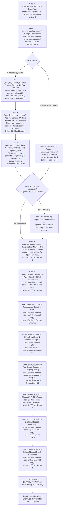

# Demo Technical Specification Standard (`SPEC.md`)

This skill defines the mandatory protocol for asynchronously authoring, continuously updating, and linking the living technical specification (`SPEC.md`) across every conversation and gate in a Looker demo project.

---

## 1. Purpose & Guiding Principles

`SPEC.md` is the **single source of truth** documenting the end-to-end technical architecture, business requirements, relational schemas, synthetic data distributions, LookML semantic models, executive dashboard layouts, Conversational Analytics (CA) agent instructions, and embedded analytics portal configurations.

### The 4 Cardinal Rules of `SPEC.md` Maintenance

> [!IMPORTANT]
> **Rule 1: Asynchronous & Silent Disk Updates (Zero Chat Clutter)**
> During conversational turns, the agent **MUST** update `SPEC.md` directly in the project root (`./SPEC.md`) quietly using file tools as architectural decisions and schema refinements are agreed upon. **DO NOT dump or reprint the full `SPEC.md` into the visible chat on routine turns.** Keep conversational chat output focused, fast, and actionable.

> [!CAUTION]
> **Rule 2: Surface Only Significant Structural Changes**
> Do not alert the user to minor field additions or routine metadata updates. **ONLY** notify the user or display diffs/excerpts in visible chat when a **significant structural change** has occurred (e.g., pivoting the business domain, major schema redesign with new entities, switching join topologies or NDT aggregation strategies, or when explicitly requested by the user).

> [!TIP]
> **Rule 3: Incremental Hydration Across Every Gate (`0..12`) & Conversation**
> `SPEC.md` is never created in one giant batch at the end. It is initialized at Gate 0/1 (`gate_0a_precheck` / `gate_0b_confirm_targets`) and progressively hydrated and updated across all 13 granular gates (`0..12`) and each subsequent user conversation. Every modification is recorded in the Revision History table.

> [!IMPORTANT]
> **Rule 4: `DELIVERY_REPORT.md` Must Always Link to `SPEC.md`**
> When the final delivery report is generated at the conclusion of deployment (or refreshed during post-deployment iterations), both the chat delivery report and the persisted `DELIVERY_REPORT.md` **MUST prominently link to `[SPEC.md](SPEC.md)`** in the Quick Access Links table.

---

## 2. 13-Gate Hydration Lifecycle (`0..12`)

The agent maintains `SPEC.md` along the 13-stage `demo-create` state machine:

```mermaid
graph TD
    Gate0["Gate 0 (gate_0a_precheck): Pre-Check Audit<br/>(demo-create pre-check --fix --gcp-project &lt;gcp-project&gt;)"] --> Gate1["Gate 1 (gate_0b_confirm_targets): 4-Target Confirmation<br/>(ask_question + demo-create confirm-targets)<br/>Initialize SPEC.md Sections 1 & 2"]
    Gate1 --> DataChoice{Data Source}
    DataChoice -->|Greenfield Synthesis| Gate2["Gate 2 (gate_1a_propose_schema): Propose Schema & 5-Row Preview<br/>(demo-create data propose-schema --schema-file &lt;schema-file&gt; --preview)<br/>Hydrate SPEC.md Section 3"]
    Gate2 --> Gate3["Gate 3 (gate_1b_approve_schema): Approve Schema & Volume<br/>(Render ERD & Samples in Chat -> ask_question -> demo-create data approve-schema)<br/>Hydrate SPEC.md Section 4"]
    Gate3 --> Gate4["Gate 4 (gate_1c_generate_data): Modular DAG Synthesis & BigQuery Load<br/>(demo-create data generate ... --upload --json-scorecard)<br/>Update Section 4 Scorecard & Row Counts"]
    DataChoice -->|Adopt Existing Dataset| AdoptData["Adopt Existing BigQuery Dataset<br/>(demo-create data adopt --dataset &lt;dataset-id&gt;)<br/>Hydrate Sections 3 & 4 (Satisfies Gates 2-4)"]
    Gate4 --> PreGate5{"Dataplex Catalog Inspection?<br/>(Optional Secondary Action)"}
    AdoptData --> PreGate5
    PreGate5 -->|Inspect Catalog| CatInspect["demo-create catalog inspect --dataset &lt;dataset-id&gt;<br/>Hydrate Section 3 Data Dictionary & Semantic Context"]
    PreGate5 -->|Direct Modeling| Gate5["Gate 5 (gate_2a_lookml_model): Semantic LookML Modeling<br/>(demo-create lookml model [--catalog &lt;path&gt;] [--profile rich|hybrid|minimal])<br/>Hydrate SPEC.md Section 5"]
    CatInspect --> Gate5
    Gate5 --> Gate6["Gate 6 (gate_2b_certify_polish): 3-Pass Polish & Filtered Measure Audit<br/>(demo-create lookml certify-polish --lookml-dir &lt;lookml-dir&gt;)<br/>Hydrate SPEC.md Section 6"]
    Gate6 --> Gate7["Gate 7 (gate_3a_optimize): Performance Optimizer Gate<br/>(ask_question + demo-create lookml optimize [--skip])<br/>Update Section 5 Caching & Pruning"]
    Gate7 --> Gate8["Gate 8 (gate_3b_deploy): LookML Validation & Production Deploy<br/>(demo-create lookml deploy)<br/>Update Section 5 Deployment & Validation Audit"]
    Gate8 --> Gate9["Gate 9 (gate_3c_critique): Post-Deploy Screenshot Critique (Pass 3)<br/>(ask_question + demo-create lookml approve-critique)<br/>Update Section 6 Visual Critique Sign-Off"]
    Gate9 --> Gate10["Gate 10 (gate_4_agent): CA Agent & Golden Queries<br/>(ask_question + demo-create agent create [--skip])<br/>Hydrate SPEC.md Section 7"]
    Gate10 --> Gate11["Gate 11 (gate_5_publish): Gemini Enterprise Publishing<br/>(ask_question + demo-create agent publish [--skip])<br/>Update Section 7 GE Status"]
    Gate11 --> Gate12["Gate 12 (gate_6_embed): External Embed Portal Scaffolding<br/>(ask_question + demo-create embed scaffold [--skip])<br/>Hydrate SPEC.md Section 8"]
    Gate12 --> Report["Final Delivery: DELIVERY_REPORT.md<br/>(Links directly to SPEC.md)"]
    Report --> Iterations["Post-Delivery Iterations<br/>(Every user turn updates SPEC.md quietly)"]
```

| Gate `#` & ID | CLI Command | What to Hydrate / Update in `SPEC.md` | Chat Output Behavior |
| :--- | :--- | :--- | :--- |
| **Gate 0 (`gate_0a_precheck`) & Gate 1 (`gate_0b_confirm_targets`)** | `demo-create pre-check --fix --gcp-project <gcp-project>` `demo-create confirm-targets --gcp-account <gcp-account> --gcp-project <gcp-project> --looker-account <looker-account> --connection <connection-name> [--dataset <dataset-id>]` | Initialize `SPEC.md` with: Header, Section 1 (Demo Metadata, Confirmed 4 Targets, Target Personas, Objectives), Section 2 (Business Scenario, Analytical Questions), and initial entry in Section 9 (Revision History). | **Silent.** Confirm targets with user via `ask_question` and run `confirm-targets`. Do NOT dump `SPEC.md`. |
| **Gate 2 (`gate_1a_propose_schema`) & Gate 3 (`gate_1b_approve_schema`)** | `demo-create data propose-schema --schema-file <schema-file> --preview` `demo-create data approve-schema --row-count <row-count> --dataset <dataset-id>` *(Or for existing datasets: `demo-create data adopt --dataset <dataset-id>`)* | Hydrate Section 3 (Relational Schema: tables, grain, columns, data types, PK/FK relationships, Mermaid ERD) and Section 4 (Approved target row volume, statistical distributions, generation DAG, or adopted dataset inventory). | **Mandatory Visible Chat Output First:** Render proposed schema, `data.mermaid_erd`, and 5-row `data.samples` in chat BEFORE calling `ask_question` and running `data approve-schema` (or render discovered tables on `data adopt`). Quietly update `SPEC.md`. |
| **Gate 4 (`gate_1c_generate_data`)** | `demo-create data generate --schema-file <schema-file> --row-count <row-count> --gcp-project <gcp-project> --dataset <dataset-id> --upload --json-scorecard` | Update Section 4 with actual synthesized row counts, `TableValidator` scorecard (`pk_uniqueness`, `orphan_fks`, `records_per_second`), and BigQuery Day Partitioning / Clustering metadata. *(Skipped if dataset was adopted via `data adopt`)*. | Render verification scorecard and 5-row sample preview in chat. Quietly update `SPEC.md`. |
| **Gate 5 (`gate_2a_lookml_model`)** | `demo-create lookml model --looker-project <looker-project> --dataset <dataset-id> --connection <connection-name> --gcp-project <gcp-project> [--catalog <snapshot>] [--profile rich\|hybrid\|minimal]` | Hydrate Section 3 (`## Data Dictionary & Semantic Context` via `bigquery-metadata` and optional `demo-create catalog inspect`) and Section 5 (LookML Architecture: explores, join trees, chasm/fan-trap mitigation, NDT rollups, measures, dimensions). | **Silent.** Inform user LookML model & draft dashboard files are generated. |
| **Gate 6 (`gate_2b_certify_polish`)** | `demo-create lookml certify-polish --lookml-dir <lookml-dir>` | Hydrate Section 6 (Dashboard Specification: 3-tab layout, KPI scorecards, Highcharts `advanced_vis_config` geometry tokens, donut palettes, `table_theme: transparent`, and `SELECT DISTINCT`-grounded filtered measures). | **Silent.** Inform user 3-Pass Executive Dashboard Polish is certified. |
| **Gate 7 (`gate_3a_optimize`)** | `demo-create lookml optimize --lookml-dir <lookml-dir>` *(or `--skip`)* | Update Section 5 with LookML Server Performance Optimizer status (`applied` or `skipped`: datagroup caching, partition pruning filters, static suggestions, foreign key hiding). | Prompt user via `ask_question` first, then run `lookml optimize` (or `--skip`). Quietly update `SPEC.md`. |
| **Gate 8 (`gate_3b_deploy`) & Gate 9 (`gate_3c_critique`)** | `demo-create lookml deploy --looker-project <looker-project> --lookml-dir <lookml-dir>` `demo-create lookml approve-critique --looker-project <looker-project>` | Update Section 5 & Section 6 with deployment confirmation: Looker instance URL, deployed dashboard URL, `validate_project` (`0` errors), per-tile `HTTP 200 OK` audit scores, and Pass 3 screenshot critique sign-off (`critique_approved: true`). | Present `deployed_dashboard_url` in chat, invite user via `ask_question` for Pass 3 screenshot critique or approval, and run `lookml approve-critique`. Quietly update `SPEC.md`. |
| **Gate 10 (`gate_4_agent`) & Gate 11 (`gate_5_publish`)** | `demo-create agent create --model <model-name> --explore <explore-name>` *(or `--skip`)* `demo-create agent publish --agent-id <agent-id>` *(or `--skip`)* | Hydrate Section 7 (CA Agent ID, name, persona instructions, pre-seeded golden queries, and Gemini Enterprise publication status `published` or `skipped`). | **Silent** after each sequential `ask_question` confirmation. |
| **Gate 12 (`gate_6_embed`)** | `demo-create embed scaffold --looker-project <looker-project>` *(or `--skip`)* | Hydrate Section 8 (Scaffolded directory, React/Vite framework, routes, Looker Embed SDK/components, CSS design tokens, branding, or `skipped` status). | **Silent** after `ask_question` confirmation. |
| **Post-Delivery Iterations** | Any modular `demo-create` subcommand | Whenever the user requests additions or adjustments (new explore, modified KPI, additional table, updated portal styling), update the relevant section in `SPEC.md` and append a row to Section 9 (Revision History). | **Silent unless significant.** Acknowledge the user's specific request directly; only highlight `SPEC.md` if a major architectural pivot occurred. |

---

## 3. Canonical `SPEC.md` & `DELIVERY_REPORT.md` Templates

When initializing or updating `./SPEC.md` or `./DELIVERY_REPORT.md`, import and follow the shared templates in [`skills/resources/`](../resources/README.md):

- **[`spec-and-data-dictionary-template.md`](../resources/spec-and-data-dictionary-template.md)**:
  - **Section 1**: Demo Metadata & Persona Alignment
  - **Section 2**: Business Scenario & Analytical Questions
  - **Section 3**: Relational Schema, Mermaid ERD, & `## Data Dictionary & Semantic Context` (populated by `bigquery-metadata` and `knowledge-catalog-metadata`)
  - **Section 4**: Synthetic Data Generation Plan (volumes, distributions, DAG order)
  - **Section 5**: Semantic Layer (LookML) Architecture (explores, joins, NDT chasm-trap rollups)
  - **Section 6**: Executive Dashboard & Visualization Layout (3-tab architecture & filters)
  - **Section 7**: Conversational Analytics (CA) AI Agent Specification & Golden Queries
  - **Section 8**: External Embed Portal Specification (routes, HSL tokens, RBAC)
  - **Section 9**: Revision History & Change Log
- **[`delivery-report-template.md`](../resources/delivery-report-template.md)**:
  - Canonical 7-section `DELIVERY_REPORT.md` structure with mandatory `[SPEC.md](SPEC.md)` link in the Quick Access Links table.

---

## 4. Subagent Collaboration & Handoffs

When specialized subagents are invoked:
1. **`data-engineer`** (Gate 4 `gate_1c_generate_data`): Reads Sections 3 & 4 of `SPEC.md` for approved schemas and volume constraints. Updates Section 4 with actual row counts, `TableValidator` metrics, and BigQuery partitioning/clustering details.
2. **`lookml-snowflake-modeler`** (Gate 5 `gate_2a_lookml_model`): Reads Sections 3 & 5. Formulates NDT rollups and records the Chasm Trap Mitigation Architecture into Section 5.
3. **`lookml-dashboard-designer`** (Gate 6 `gate_2b_certify_polish` & Gate 9 `gate_3c_critique`): Reads Sections 5 & 6. Translates the KPI cards and chart specifications into polished LookML dashboard tiles and updates Section 6 prior to `demo-create lookml certify-polish`.
4. **`embed-portal-engineer`** (Gate 12 `gate_6_embed`): Reads Section 8 to construct the external portal with the correct routes, embedded dashboard IDs, and theme tokens.

All subagents update `SPEC.md` directly and quietly on disk, appending an entry to Section 9 (Revision History).
