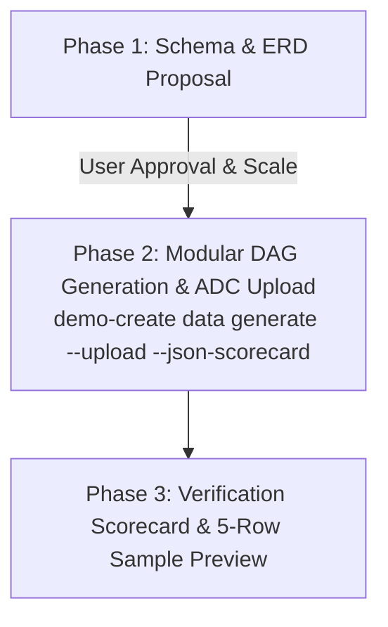
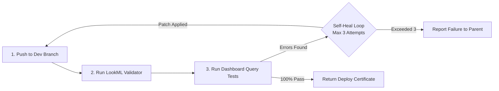

# Looker Demo Orchestrator (`demo-create`)

This skill defines the mandatory operational procedure for an AI agent or engineer creating full-stack data demos on Google Cloud BigQuery and Looker.

> [!CAUTION]
> **CRITICAL RULE: THE GATES ARE MANDATORY AND MUST NOT BE BATCHED.**
> There is deliberately no single command that builds a demo end to end -- the monolithic `demo-create run` was removed in 0.3.0 precisely because it bypassed iterative schema co-design and volume validation. The agent **MUST** orchestrate the gated subcommands interactively stage-by-stage as detailed below, pausing for human confirmation where required.

---

## Core Execution Architecture: CLI-First with On-Demand Subagents

To eliminate subagent initialization drag, serialization latency, and background file-write race conditions, the workflow follows a **CLI-First Architecture with On-Demand Subagents**:

```mermaid
graph TD
    Start([User Request]) --> PreCheck["Orchestrator: Turn-1 Pre-Check<br/>(demo-create pre-check --json)"]
    PreCheck --> Gate0{"Human Gate 0: Instant 4-Target Alignment<br/>(ask_question - NO plan before this!)"}
    Gate0 -->|Co-Design Phase 1| Phase1["Orchestrator: Schema & ERD Proposal<br/>(Mermaid ERD in Chat)"]
    Phase1 -->|Co-Design Phase 2| Phase2["Orchestrator: Micro-Sample Preview<br/>(5-10 Sample Rows in Chat)"]
    Phase2 --> Gate1{"Human Gate 1: Scale & Volume Confirmation<br/>(ask_question)"}
    Gate1 -->|Fast-Path CLI| GenBQ["Orchestrator: Batch Synthesis & BQ Upload<br/>(demo-create data generate + upload)"]
    GenBQ --> ModelCLI["Gate 2A: Semantic Modeling & SELECT DISTINCT Grounding<br/>(demo-create lookml model + lookml-filtered-measures)"]
    ModelCLI --> SnowflakeBranch{"Is Schema 3NF Snowflake<br/>with Chasm Traps?"}
    SnowflakeBranch -->|Yes: Spawn Subagent| S_Snowflake["Subagent: lookml-snowflake-modeler<br/>(NDT Rollups & Chasm Trap Elimination)"]
    SnowflakeBranch -->|No: Standard Star Schema| DashDesign["Gate 2B: Mandatory Dashboard Polish<br/>(lookml-dashboard-designer 3-Pass Protocol)"]
    S_Snowflake --> DashDesign
    DashDesign --> CleanRoot["Gate 3A: Clean Root Orphan Duplicates<br/>(demo-create lookml clean-root)"]
    CleanRoot --> GateOpt{"Gate 3B: Run Performance Optimizer?<br/>(Guarded ask_question)"}
    GateOpt -->|Yes: Confirmed| OptCLI["Orchestrator: Performance Optimizer<br/>(demo-create lookml optimize --backup)"]
    GateOpt -->|No: Skipped| DeployCLI["Gate 3C: Pre-Deployment QA & Release<br/>(demo-create lookml deploy + Filtered Measure Auditor)"]
    OptCLI --> DeployCLI
    DeployCLI --> QAStatus{"LookML & Query Validation<br/>Passed 100%?"}
    QAStatus -->|Fail: Spawn Subagent| S_QA["Subagent: lookml-qa-validator<br/>(Max 3 Self-Healing Loops)"]
    S_QA -->|Certified Ready| DeployProd["Orchestrator: Production Release<br/>(lkr tools lookml deploy)"]
    QAStatus -->|Pass 100%| DeployProd
    DeployProd --> GateCritique{"Gate 3D: Post-Deploy Screenshot Critique<br/>(ask_question: Approve or Share Screenshot)"}
    GateCritique -->|User Shares Screenshot| Pass3Refine["Pass 3 Visual Critique & Refinement<br/>(view_file -> Refine LookML -> Redeploy)"]
    Pass3Refine --> GateCritique
    GateCritique -->|Approved| GateCA{"Human Gate 4: Provision CA Agent?<br/>(ask_question)"}
    GateCA -->|Yes| CA_CLI["Orchestrator: CA Agent & Golden Queries<br/>(demo-create agent create)"]
    GateCA -->|No| DeliveryReport["Orchestrator: Final Delivery Report<br/>(DELIVERY_REPORT.md)"]
    CA_CLI --> GateGE{"Human Gate 5: Publish to Gemini Enterprise?<br/>(ask_question)"}
    GateGE -->|Yes| GE_CLI["Orchestrator: Publish to GE<br/>(demo-create agent publish)"]
    GateGE -->|No| DeliveryReport
    GE_CLI --> DeliveryReport
```



| Component | Execution Mode | Responsibility & Scope |
|---|---|---|
| **Parent Orchestrator** | Direct Parent Turn | Interactive co-design gates (`ask_question`), fast CLI subcommands (`demo-create data`, `lookml model`, `lookml optimize`, `lookml deploy`, `agent create`), Modular DAG verification scorecard review, post-deploy screenshot critique loop, and final delivery report. |
| [`synthetic-data-authoring`](../synthetic-data-authoring/SKILL.md) | **Companion Core Skill** | Guides realistic synthetic dataset design across 4 pillars: non-uniform distributions (Pareto/Log-Normal), cross-column tier coupling, temporal growth/seasonality curves, and Looker Explore optimization. |
| [`demo-spec`](../demo-spec/SKILL.md) | **Companion Core Skill** | Asynchronously creates and maintains `SPEC.md` as the living technical architecture document across all gates, updating quietly on disk without chat dumping. |
| [`bigquery-metadata`](../bigquery-metadata/SKILL.md) | **Companion Core Skill** | Extracts BigQuery schemas, PK/FK constraints, and partition info via native `bq` CLI into `SPEC.md` without custom Python scripts or MCP servers. |
| [`knowledge-catalog-metadata`](../knowledge-catalog-metadata/SKILL.md) | **Companion Core Skill** | Extracts Dataplex Universal Catalog glossaries, data profiling stats, null/distinct ratios, and PII tags via `gcloud dataplex` CLI into `SPEC.md`. |
| [`lookml-filtered-measures`](../lookml-filtered-measures/SKILL.md) | **Companion Core Skill** | Enforces mandatory `SELECT DISTINCT` grounding before writing any `filters: [...]` in LookML measures, preventing `0`/`NULL` ratios. |
| [`data-engineer`](subagents/data-engineer.md) | **On-Demand Subagent** | Synthesizes high-throughput relational Parquet datasets (`>7,500 rows/sec`), validates invariants via in-memory `TableValidator`, and uploads to BigQuery via ADC with automatic Day Partitioning & Clustering (`demo-create data generate --upload --json-scorecard`). |
| [`lookml-snowflake-modeler`](subagents/lookml-snowflake-modeler.md) | **On-Demand Subagent** | Spawned ONLY when schemas contain complex 3NF snowflake structures with Chasm Traps (multiple 1:N children), diamond joins, or require Native Derived Table (NDT) rollups. |
| [`lookml-dashboard-designer`](subagents/lookml-dashboard-designer.md) | **Mandatory Gate 2 Subagent** | Executes the 3-Pass Executive Dashboard Polish protocol (theme-inheriting `type: text` headers, centered legends, independent dual-axis formatting, transparent grids, and screenshot critique). |
| [`lookml-qa-validator`](subagents/lookml-qa-validator.md) | **On-Demand Subagent** | Spawned ONLY when `demo-create lookml deploy` encounters validation errors or failing queries; runs up to 3 self-healing loops via `lookml-dashboard-to-query`. |
| [`embed-portal-engineer`](subagents/embed-portal-engineer.md) | **On-Demand Subagent** | Spawned ONLY if external embed demo portal is requested by user. |

> [!IMPORTANT]
> ### Subagent Lifecycle Kill-Fence & Headless Rollback Protocol
> 1. **Subagent Kill-Fence**: Before any file revert, rollback, or manual code restoration, the orchestrator **MUST kill all running subagents** via `manage_subagents(Action='kill_all')` (or `manage_subagents(Action='kill', ConversationIds=[...])`) to prevent background tasks from overwriting restored files.
> 2. **Headless Directory Snapshots**: In headless environments without Git tracking, `demo-create lookml optimize` automatically snapshots pre-optimization files to `lookml/.backup_pre_opt`. If the user rejects optimization or requests a rollback, execute `demo-create lookml restore --lookml-dir <dir>` to cleanly restore files in 1 command.
> 3. **Artifact Boundaries**: `ArtifactMetadata` in `write_to_file` is strictly for files inside `<appDataDir>/brain/<conversation-id>/`. For workspace files, never supply `ArtifactMetadata`.
> 4. **Living `SPEC.md` Quiet Maintenance**: Throughout every conversation and across all gates, the orchestrator quietly maintains `SPEC.md` in the workspace root following [`demo-spec`](../demo-spec/SKILL.md). Never dump `SPEC.md` into chat unless a significant structural change was made. `DELIVERY_REPORT.md` must always link to `SPEC.md`.
> 5. **Mandatory `.gitignore` Verification for `.env` Files**: Whenever creating or modifying a `.env` file (e.g., Looker API credentials, GCP settings, or Embed Portal environment), confirm that `.gitignore` exists in the working directory and includes `.env` (and `**/.env`) before writing credentials to disk.

---

## Orientation: `demo-create status` Is the Source of Truth

Before deciding what to do next -- at the start of a session, after any
interruption, and between every gate -- run:

```bash
demo-create status --json
```

The envelope reports:

| Field | Use |
| :--- | :--- |
| `completed_gates` | Which stages are already done; never redo one. |
| `current_gate` | Where the build actually is. |
| `next_command` | The literal command to run, with every known value substituted and `<placeholder>` where a value is still needed. |
| `requires_human_confirmation` | **Branch on this.** When `true`, call `ask_question` with the gate's `human_checkpoint` *before* running `next_command`. |
| `is_complete` | When `true`, the build is finished and `next_actions` is empty. |

The gate sections below explain *why* each gate exists and precisely what to
confirm with the user. `demo-create status` tells you *where you are*. Prefer the
command for state and this document for intent -- the command is generated from
the implementation and cannot drift from it.

Every command also accepts `--state-file` to target an explicit
`.demo-state.json`, and `--json` to emit the machine-readable envelope. All
failures carry a distinct exit code (`AuthError`=3, `ConfigError`=4,
`RemoteApiError`=5, `ValidationError`=6, `StateError`=7), so branch on the exit
code rather than parsing prose.

## 0. Bootstrap on Fresh Machines (Mandatory Step 0)

If `demo-create` is not available on `PATH`, the agent **MUST immediately run**:
```bash
uv tool install looker-demo-cli
```
Immediately after installation, the agent **MUST run**:
```bash
demo-create pre-check --fix
```
This guarantees all pinned dependencies, global agent CLI skills (`synthetic-data-authoring`, `bigquery-metadata`, `knowledge-catalog-metadata`), active pruning of deprecated skills (`data-designer*`, `vertex-ai`), and pruning of deprecated MCP servers (`data-designer`, `bigquery`, `knowledge-catalog`) from `~/.gemini/config/mcp_config.json` are completed before executing any other commands.

---

## 1. Pre-Flight Environment Inspection & Interactive Confirmation Gate

Always execute the pre-check inspection first to inspect GCP credentials, available projects, Looker OAuth sessions, and MCP tools:

```bash
demo-create pre-check --json
lkr auth list
```

> [!CAUTION]
> ### 🛑 Mandatory Pre-Flight Hard Stop & Immediate Auth Fail Gate
> 1. **Immediate Fail on Missing Auth**: If `demo-create pre-check` exits with code **3** (`AUTH_ERROR`) or reports `data.is_blocked: true`, **STOP immediately** and follow **[`auth-and-guardrails.md`](../resources/auth-and-guardrails.md)** to guide the user through `gcloud auth login` / `gcloud auth application-default login` or `lkr auth login` (including first-time `lkr-cli` OAuth client registration, SSH port `8000` forwarding, and headless callback `curl` recovery).
> 2. **DO NOT proceed** or execute any further tool calls until authentication is verified via `demo-create pre-check --fix`.
> 3. **IMMEDIATELY invoke `ask_question`** in the very next step to prompt the user to confirm all 4 targets below.
> 4. If `available_connections` is empty in `pre-check`, provide standard recommendations (e.g. `looker_demo_bigquery`, `default_bigquery_connection`) along with a write-in option rather than trying to query Looker first.

### Mandatory Interactive Confirmation Checklist:
Before designing schemas, creating BigQuery datasets, or touching Looker, the agent **MUST explicitly prompt the user** (via `ask_question` or interactive prompt) to confirm all four environment targets:

1. **GCP User Account**: (e.g. `admin@example.com` vs `analyst@company.com`)
2. **Target Google Cloud Project ID**: (e.g. `my-analytics-gcp-project`, `demo-data-warehouse`)
3. **Target Looker Instance / OAuth Account**: (e.g. `my-company.looker.com` vs `demo-instance` from `lkr auth list` or `available_oauth_instances`)
4. **Target Looker Database Connection**: (e.g. `looker_demo_bigquery` or `default_bigquery_connection`)

> [!IMPORTANT]
> **NEVER assume or default the Looker instance or GCP project** without explicit user confirmation, even if an active session exists in `pre-check`.
>
> ### 🛑 Strict Anti-Planning Rule (NO `implementation_plan.md` Before Gate 0)
> The agent **MUST NEVER** generate an `implementation_plan.md` artifact or start drafting detailed plans before Gate 0 has completed and the user has confirmed all 4 environment targets via `ask_question`. Writing a planning artifact at Turn 1 buries the mandatory Gate 0 questions and forces premature assumptions about GCP projects and Looker instances.
>
> ### 🛑 Strict Pre-Flight GCP Account Activation & Validation
> Immediately upon user selection of the GCP User Account in Step 1:
> 1. Set the active gcloud CLI account: `gcloud config set account <selected_account>`
> 2. Verify token validity: `gcloud auth print-access-token --account=<selected_account>`
> 3. If token check fails, exits non-zero, or prompts for re-authentication, **STOP IMMEDIATELY**. Prompt the user to run:
>    ```bash
>    gcloud auth login <selected_account>
>    gcloud auth application-default login
>    ```
>    DO NOT fall back silently to another account or ambient ADC. Confirm credentials before proceeding.

## 2. Iterative Schema Co-Design & Modular DAG Synthesis Gate (Gate 1)

When creating demo datasets, the agent **MUST co-iterate with the user** across three deterministic phases, using the [`synthetic-data-authoring`](../synthetic-data-authoring/SKILL.md) skill, `ModularDAGSynthesizer`, in-memory `TableValidator` quality gates, and resilient BigQuery ADC ingestion:



> [!CAUTION]
> ### 🛑 Strict 2-Step Sequential Visible Presentation Rule (Anti-Zero-Length Turn)
> **NEVER call `ask_question` in an empty or content-free message turn.**
> 1. **Phase 1 Must Render ERD & Schema in Chat First**: In the exact same response turn, the agent MUST write the full Markdown ERD diagram (`mermaid`), dimension/fact tables, column datatypes, primary/foreign keys, and target domain metrics in visible chat BEFORE calling `ask_question` to approve the schema and target volume scale.
> 2. **Phase 3 Must Render Verification Scorecard & Sample Tables in Chat**: Once `demo-create data generate --upload --json-scorecard` completes, output the verification scorecard (`pk_uniqueness: 1.0`, `orphan_fks: 0`, `records_per_second`, `partitioned_tables`, `clustered_tables`) and a 5-row Markdown sample preview in visible chat before moving to Gate 2.
> 3. Bypassing visible rendering in chat blinds the user and is strictly forbidden.

### Phase 1 — Schema Proposal & Scale Selection (Human-in-the-Loop)
**MANDATORY Single-Turn Message Structure**:
Your response turn in this phase MUST contain visible Markdown content before calling `ask_question`:
1. **Domain Overview**: 2–3 sentences explaining the scenario, key operational and analytical entities, and business goals.
2. **Mermaid ERD Diagram**: A full `mermaid` diagram showing entities, primary/foreign keys, and cardinality (e.g. `||--o{`).
3. **Relational Schema Specification**: Markdown tables listing each table, its columns, data types, key constraints (PK, FK), and business definitions.
4. **Key Metrics Highlight**: List the primary business and analytics metrics enabled by this schema (e.g., MRR/ARR, churn, latency, conversion).
5. **Approval & Scale Question**: Only after rendering steps 1–4 in visible chat, call `ask_question` asking the user to approve the schema and choose the target row volume (**Small** ~1k–5k rows, **Medium** ~10k–50k rows, **Large** ~100k+ rows).

### Phase 2 — High-Throughput Modular DAG Synthesis & Resilient ADC Upload
Once the schema and scale are approved, follow [`synthetic-data-authoring`](../synthetic-data-authoring/SKILL.md) to author either a declarative `DomainBlueprint` JSON (`--schema-file`) or a vectorized Python generator script (`--script`), then execute `demo-create data generate --upload --json-scorecard` (either directly or via the `data-engineer` subagent):
- **Vectorized DAG Synthesis**: Generates parent dimensions first, samples child fact foreign keys using Pareto (80/20) weights for realistic join fanouts, and enforces cross-column tier coupling and chronological timestamps (`>7,500 records/sec`).
- **In-Memory `TableValidator` Gates**: Enforces `100%` primary key uniqueness, `0` orphan foreign keys, and strict temporal monotonicity (`<50ms` overhead) before disk serialization.
- **Resilient BigQuery ADC Ingestion**: Uploads Snappy-compressed Parquet tables directly via `google-cloud-bigquery` Application Default Credentials (ADC) without interactive `bq` CLI password prompts, while `BigQueryOptimizationAdvisor` automatically applies **Day Partitioning** (`DATE(timestamp)`) and up to **4 Clustering Columns** (`_id`, `_type`, `_status`).

```bash
demo-create data generate \
  --domain "${DATASET}" \
  --schema-file ./artifacts/generated_data/schema.json \
  --row-count "${ROW_COUNT}" \
  --output-dir ./artifacts/generated_data \
  --gcp-project "${PROJECT_ID}" \
  --dataset "${DATASET}" \
  --engine modular-dag \
  --upload \
  --json-scorecard
```

### Phase 3 — Verification Scorecard & Sample Preview
Render the JSON scorecard results (`execution_time_seconds`, `records_per_second`, `pk_uniqueness`, `orphan_fks`, `partitioned_tables`, `clustered_tables`) along with a 5-row sample table preview in visible chat text, then proceed to Gate 2 (`demo-create lookml model`).

> [!CAUTION]
> ### 🛑 Strict Target Project Integrity & ADC Refresh Gate
> 1. **NEVER silently fall back or divert to an alternate Google Cloud Project or dataset** if permissions errors (e.g. `403 Access Denied`, `bigquery.datasets.create`, or expired ADC tokens) occur during dataset creation or table loading.
> 2. If `bq` CLI or `demo-create data upload` fails with permission errors on the confirmed project, **the pipeline MUST BLOCK IMMEDIATELY and prompt the user** to refresh their ADC credentials (`gcloud auth application-default login`) or grant the necessary BigQuery IAM roles on the confirmed project.
> 3. Under no circumstances should the agent create or load tables into a different project than the one explicitly confirmed by the user in Step 1.

---

## 3. Looker Project & Model Provisioning (`lkr-dev-cli`)

Looker authentication is managed directly via `lkr-dev-cli` using the confirmed OAuth account:

### A. Project & Bare Git Initialization
Ensure the project exists on the target Looker instance with a bare Git repository:

```bash
lkr --oauth-account=<oauth_account> code-mode sandbox --code="
if session().get('workspace_id') != 'dev':
    update_session(body={'workspace_id': 'dev'})

project_name = '<project_name>'
connection_name = '<connection_name>'

create_project(body={'name': project_name})
update_project(project_id=project_name, body={'git_remote_url': None, 'git_service_name': 'bare'})
create_lookml_model(body={
    'name': project_name,
    'project_name': project_name,
    'allowed_db_connection_names': [connection_name],
    'unlimited_db_connections': False,
})
"
```

---

## 4. LookML Quality Standards & 4-Stage Semantic Pipeline

### A. Semantic Modeling, Triage & Filtered Measure Grounding (CLI-First + On-Demand `lookml-snowflake-modeler`)

1. **Fast-Path CLI Scaffolding & Metadata Introspection (Parent Orchestrator)**:
   - At the start of Gate 2 (`gate_2_model`), execute `bigquery-metadata` (`bq query` on `INFORMATION_SCHEMA` / `bq show`) and `knowledge-catalog-metadata` (`gcloud dataplex`) via CLI to populate `SPEC.md` under `## Data Dictionary & Semantic Context` (including primary/foreign keys, null/distinct ratios, low-cardinality `suggestions`, and PII `access_grant` directives). Never invoke MCP servers.
   - Run `demo-create lookml model` directly in the parent session:
     ```bash
     demo-create lookml model \
       --looker-project "${LOOKER_PROJECT}" \
       --dataset "${DATASET}" \
       --connection "${CONNECTION}" \
       --gcp-project "${PROJECT_ID}"
     ```
   - **Mandatory `SELECT DISTINCT` Grounding ([`lookml-filtered-measures`](../lookml-filtered-measures/SKILL.md))**: Never guess categorical filter strings (e.g., `"2xx"`, `"active"`). Before writing any `filters: [...]` block inside a measure, inspect the actual distinct values in the local Parquet file or run `SELECT DISTINCT` against BigQuery so filtered measures and derived ratios (`SAFE_DIVIDE(${num}, NULLIF(${den}, 0))`) never evaluate to `0` or `NULL`.
   - **Mandatory Field Standards**: Explicit `label:` and `description:` parameters on EVERY dimension, dimension group, and measure (Title Case, e.g. `label: "Monthly Recurring Revenue"`).

2. **Conditional Subagent Delegation (`lookml-snowflake-modeler` — Spawned ONLY for 3NF / Chasm Traps)**:
   - If the schema is a standard Star schema ($D_1 \to F \leftarrow D_2$ with no `1:N` child fanout traps), proceed directly to **Gate 2B (Mandatory Executive Dashboard Polish)** without spawning a modeling subagent.
   - If the schema contains normalized **3NF / Snowflake structures with Chasm Traps** (multiple `1:N` child collections hanging off a parent entity) or **diamond role-playing joins**, spawn the **[`lookml-snowflake-modeler`](subagents/lookml-snowflake-modeler.md)** subagent:

```yaml
subagent:
  type: "skills/looker-demo-orchestrator/subagents/lookml-snowflake-modeler.md"
  prompt: "Eliminate Chasm Traps and model 3NF snowflake relationships for {project_name}. Run schema_graph_analyzer.py, set Explore Base Views on leaf event facts, pre-aggregate child 1:N collections into Native Derived Tables (NDTs) joined one_to_one onto the parent Explore, and resolve diamond joins with role-playing aliases."
  inputs:
    project_name: "{looker_project_name}"
    connection_name: "{looker_connection_name}"
    lookml_dir: "lookml/"
    table_specs: "{extracted_table_specs}"
    domain_metrics: "{domain_metrics_list}"
```

---

### B. Mandatory Executive Dashboard Polish (Always Trigger `looker-visualizations` Skills Before Gate 3)

> [!CAUTION]
> ### 🛑 Why You Must NEVER Skip Dashboard Polish Between Gate 2 and Gate 3
> Guard against three classic failure modes whenever generating or iterating on a LookML dashboard:
> 1. **Never Over-Rely on the CLI's Built-In Templates (`demo-create lookml model`)**: The CLI generator only synthesizes a **raw scaffolding draft** (`.dashboard.lookml`), NOT a finished product. Never deploy the raw CLI draft without first opening the dashboard file and applying domain-specific visual polish using the `looker-visualizations` skill suite.
> 2. **Never Mistake `HTTP 200 OK` Query Validation for Frontend Highcharts Validity**: Looker's `validate_project` and `run_inline_query` (`HTTP 200 OK`) only check LookML and SQL syntax — they do **NOT** validate client-side JavaScript/Highcharts configurations! For example, `series_types: { ...: looker_column }` is syntactically valid YAML/LookML and passes query validation, but **crashes Highcharts in the browser** because Highcharts expects bare `'column'`, `'line'`, `'area'`, `'bar'`, or `'scatter'` inside `series_types`, not Looker's internal `looker_column` wrapper.
> 3. **Never Rush Past the 3-Pass Executive Polish Protocol**: Between Gate 2 (`lookml model`) and Gate 3 (`lookml deploy`), you **MUST** pause to open the generated `.dashboard.lookml` file, consult the visualization skills ([`looker-visualizations`](../looker-visualizations/SKILL.md), [`looker-vis-advanced-config`](../looker-visualizations/looker-vis-advanced-config/SKILL.md), [`looker-vis-cartesian`](../looker-visualizations/looker-vis-cartesian/SKILL.md), [`looker-vis-tabular-kpi`](../looker-visualizations/looker-vis-tabular-kpi/SKILL.md), [`looker-vis-specialty-maps`](../looker-visualizations/looker-vis-specialty-maps/SKILL.md)), and rewrite the tiles with modern tokens before deployment.

#### Mandatory 3-Pass Dashboard Polish Protocol ([`dashboard-polish-standards.md`](../resources/dashboard-polish-standards.md)):
After `demo-create lookml model` scaffolds the baseline LookML project, **always consult [`dashboard-polish-standards.md`](../resources/dashboard-polish-standards.md) and the `looker-visualizations` skill suite** (either directly or via the **[`lookml-dashboard-designer`](subagents/lookml-dashboard-designer.md)** subagent) to enforce:
1. **Highcharts `series_types` Audit**: Root `type:` uses `looker_*` wrappers; `series_types:` uses **bare Highcharts names ONLY** (`column`, `bar`, `line`, `area`, `scatter`) — never `looker_column`.
2. **Modern Geometry Tokens via `advanced_vis_config`**: Rounded bars (`borderRadius: 4`), transparent chart surfaces (`"backgroundColor": "transparent", "borderRadius": 8`), shadow tooltips, and centered legends (`legend_position: center`).
3. **Donut Charts with Curated Palettes**: `type: looker_pie`, `show_donut: true`, `inner_radius: 50`, and `SELECT DISTINCT`-grounded `series_colors:`.
4. **Transparent Data Grids & Section Headers**: `looker_grid` with `table_theme: transparent` and `series_cell_visualizations` data bars, plus native `type: text` headers at `row: 0` (no hardcoded HTML gradient banners) and independent dual-axis ranges (`y_axis_combined: false`, `y_axis_unpinned: true`).

```yaml
subagent:
  type: "skills/looker-demo-orchestrator/subagents/lookml-dashboard-designer.md"
  prompt: "Execute the 3-Pass Executive Dashboard Polish protocol for {project_name} following skills/resources/dashboard-polish-standards.md and looker-visualizations."
  inputs:
    project_name: "{looker_project_name}"
    model_name: "{looker_model_name}"
    primary_explore: "{primary_explore_name}"
    lookml_dir: "lookml/"
    domain_theme: "{domain_theme}"
```

---

### C. LookML Server Performance Optimization Gate (Strictly Guarded Interactive Gate)

> [!CAUTION]
> ### 🛑 STRICT CONDITIONAL BRANCH FENCE: NEVER AUTO-RUN OPTIMIZER
> Spawning the optimizer subagent or running `demo-create lookml optimize` without prior user confirmation violates the co-design contract. The orchestrator **MUST pause and prompt the user via `ask_question`**:
> - **Question**: "Would you like to run the LookML Performance Optimizer to audit and apply Google Cloud Looker Server Optimization best practices?"
> - **Options**:
>   - `(Recommended) Yes: Apply Google Cloud performance optimizations (datagroup caching, partition pruning filters, static suggestions, foreign key hiding)`
>   - `No: Skip performance optimization and proceed directly to QA validation`
>
> **Execution Branches**:
> - **If user selects "Yes"**: Execute directly in the parent session via fast-path CLI:
>   ```bash
>   demo-create lookml optimize --lookml-dir <lookml_dir>
>   ```
>   The CLI automatically snapshots current LookML files into `<lookml_dir>/.backup_pre_opt` before modifying any files.
> - **If user selects "No"**: Advance immediately to Phase D without touching LookML files.
> - **If user requests a Rollback**:
>   1. Enforce the **Kill-Fence**: Immediately terminate any active subagents: `manage_subagents(Action='kill_all')`.
>   2. Atomically restore the pre-optimization snapshot with 1 command (headless, zero git requirement):
>      ```bash
>      demo-create lookml restore --lookml-dir <lookml_dir>
>      ```

- **Optimizations Applied by the CLI Engine**:
  - **Static Suggestions on Low-Cardinality Dims**: Injects `suggestions: ["val1", "val2", ...]` on categorical fields with $\le 15$ distinct values to eliminate database roundtrips when filters open.
  - **Disable Suggestions on Unique Keys**: Injects `suggestable: no` on primary keys, foreign key UUIDs, timestamps, and free text.
  - **Model Datagroup Caching**: Configures production datagroups (`max_cache_age: "4 hours"`) and applies `persist_with: default_caching_policy`.
  - **Partition Pruning**: Enforces `always_filter` or `conditionally_filter` on BigQuery partitioned date columns.
  - **Field Pruning**: Sets `hidden: yes` on raw foreign key IDs and asserts `primary_key: yes` on unique grains.

---

### D. Mandatory Pre-Deployment Validation Gate (CLI Fast-Path with On-Demand QA Healing)

1. **Direct Fast-Path Deploy & Query Test**:
   Execute pre-flight filtered measure audit, dev push, project validator, and dashboard query verification directly in the parent session:
   ```bash
   demo-create lookml deploy --looker-project <looker_project_name> --lookml-dir <lookml_dir> --looker-account <oauth_account>
   ```
   If all LookML checks, filtered measure distinct-value checks, and dashboard query tests return 100% HTTP 200 OK, the CLI automatically deploys to production and outputs the live dashboard URL.

2. **On-Demand QA Healing Subagent (Triggered ONLY on Validation / Query Failure)**:
   If validation fails or any dashboard query encounters an error, spawn the **[`lookml-qa-validator`](subagents/lookml-qa-validator.md)** subagent:

```yaml
subagent:
  type: "skills/looker-demo-orchestrator/subagents/lookml-qa-validator.md"
  prompt: "Investigate LookML validator errors or query failures, run bounded self-healing (max 3 attempts) using lookml-dashboard-to-query, and certify deploy readiness."
  inputs:
    project_name: "{looker_project_name}"
    oauth_account: "{oauth_account}"
    lookml_dir: "lookml/"
    dashboard_files: ["dashboards/*.dashboard.lookml"]
```

The `lookml-qa-validator` subagent executes bounded self-healing:



> [!CAUTION]
> **Production Deployment Authority Remains with Parent Orchestrator**:
> The `lookml-qa-validator` subagent is strictly an auditing/healing worker and cannot release to production. Once it returns `{ready_to_deploy: true}`, the **Parent Orchestrator** executes production release:
> ```bash
> lkr --oauth-account=<oauth_account> tools lookml deploy --project=<project_name>
> ```

---

### E. Interactive Post-Deploy Screenshot Critique Checkpoint (Pass 3 Visual Critique)

Immediately after `demo-create lookml deploy` succeeds and outputs the live Looker dashboard URL, the orchestrator **MUST present the URL in chat and pause with `ask_question`** before advancing to Gate 4 (`gate_4_agent`):

- **Question**: "The dashboard is live at `{deployed_dashboard_url}`. Would you like to share a screenshot of the rendered dashboard for visual layout critique & Pass 3 refinement, or approve as-is?"
- **Options**:
  - `(Recommended) Approve dashboard layout as-is and proceed to Gate 4 (Conversational Analytics Agent)`
  - `I will share/upload a screenshot in chat for visual critique and refinement`

**If the user shares a screenshot path or image**:
1. Inspect the rendered image via `view_file`.
2. Audit typography hierarchy, axis label spacing, legend alignment, dual-axis balance, and color contrast.
3. Apply targeted LookML adjustments to `dashboards/*.dashboard.lookml` (via direct edit or `lookml-dashboard-designer`).
4. Re-deploy via `demo-create lookml deploy` and confirm visual satisfaction before advancing to Gate 4.

---

## 5. Provision Conversational Analytics Data Agent & Gemini Enterprise (GE) Publishing (CLI Fast-Path)

> [!IMPORTANT]
> **CLI-First Execution (`demo-create agent`)**:
> Once the user confirms Gate 4 (`gate_4_agent`) and Gate 5 (`gate_5_publish`), the **Parent Orchestrator** executes `demo-create agent create` and `demo-create agent publish` directly via the CLI fast-path.

> [!CAUTION]
> ### 🛑 Strict Sequential Gate Isolation: NEVER Bundle CA, GE, and Embed Gates
> The orchestrator **MUST present each post-deployment gate sequentially in its own discrete step**:
> 1. **Phase 1: LookML Model & Dashboard Deployed to Production (+ Pass 3 Screenshot Critique)**
> 2. **Phase 2: CA Agent Confirmation Gate** (`ask_question`)
> 3. **Phase 3: GE Verification & Publishing Gate** (`ask_question`, if CA Agent created)
> 4. **Phase 4: External Embed Portal Gate** (`ask_question`, ONLY after Looker assets, CA Agent, and GE status are completely finished)
> Under NO circumstances may the agent bundle these questions into a single multi-question modal.

### A. Interactive CA Agent Confirmation Gate (Gate 4 — Parent Orchestrator)
Prompt the user via `ask_question`:
- **Question**: "Would you like to provision a Looker Conversational Analytics (CA) Agent for the `{model_name}` model?"
- **Options**:
  - `(Recommended) Provision CA Agent with default domain instructions and dashboard golden queries`
  - `Provide custom system instructions before provisioning`
  - `Skip Conversational Analytics Agent creation`

If confirmed, execute the Gate 4 command directly in the parent session:
```bash
demo-create agent create \
  --model "${LOOKER_PROJECT}" \
  --explore "${PRIMARY_EXPLORE}" \
  --dashboards-dir "${LOOKML_DIR}/dashboards"
```

### B. Interactive Gemini Enterprise (GE) Verification & Publishing Gate (Gate 5 — Parent Orchestrator)
If CA Agent creation is completed, check Looker GE settings (`demo-create ge status` or `GET /api/4.0/gemini_enablement`):

- **Case 1: GE is already configured** (`ai_ge_project_id`, `ai_ge_instance_id`, `ai_ge_location` populated):
  - Displays the active GE app ID, location, and GCP project.
  - Prompts user: "Gemini Enterprise is configured for app `{ge_instance_id}`. Publish CA Agent to this GE app?"
  - Options:
    - `(Recommended) Yes, publish agent to existing Gemini Enterprise app`
    - `Reconfigure Looker with a different Gemini Enterprise app`
    - `Skip Gemini Enterprise publishing (internal Looker only)`

- **Case 2: GE is not configured** (or user requested reconfigure):
  - Run `demo-create ge configure --gcp-project <PROJECT_ID>` to discover available GE apps, update Looker settings via `PATCH /api/4.0/gemini_enablement`, and grant `roles/discoveryengine.admin` to the Looker Service Account.

Once confirmed, publish the agent directly via the Gate 5 command:
```bash
demo-create agent publish --agent-id "${CA_AGENT_ID}"
```

### C. Looker 4.0 Golden Query & Re-Publishing Guarantees
`demo-create agent create` and `demo-create agent publish` enforce the strict Looker 4.0 Golden Query rules:
1. `create_agent(body={...})` with persona, query patterns, and domain rules.
2. For each dashboard tile: `create_query` $\to$ get `expanded_share_url` $\to$ `create_golden_query` with exactly **ONE question** $\to$ `update_agent` linking all IDs.
3. If `publish_ge: true`: executes `POST /api/4.0/internal/agents/{agent_id}/publish` with body `{}` and verifies publication state via `GET /api/4.0/internal/agents/{agent_id}` with automatic retries (up to 3 attempts).
4. **Re-Publishing Guarantee**: If any LookML self-healing or dashboard corrections occurred during QA validation, the orchestrator **MUST re-run `demo-create agent create` and `demo-create agent publish`** so that the agent is guaranteed to be operational in Gemini Enterprise.

---

## 6. External Embedded Portal Scaffolding (Delegate to Subagent)

> [!IMPORTANT]
> **Conditional Subagent Trigger**:
> The **[`embed-portal-engineer`](subagents/embed-portal-engineer.md)** subagent is **ONLY spawned if the user explicitly confirms external embed portal creation** in the interactive gate below.

### A. Interactive External Embed Confirmation Gate (Parent Orchestrator)
Prompt the user via `ask_question`:
- **Question**: "Would you like to scaffold an external branded embedded analytics portal (`looker-embed-demo`)?"
- **Options**:
  - `(Recommended) Scaffold external embed portal with custom brand theme and embedded chat`
  - `Skip external portal scaffolding (internal Looker only)`

### B. Procedural Delegation: `embed-portal-engineer` Subagent
If confirmed, delegate frontend scaffolding, environment configuration, brand tokens, and build verification to **[`embed-portal-engineer`](subagents/embed-portal-engineer.md)**:

```yaml
subagent:
  type: "skills/looker-demo-orchestrator/subagents/embed-portal-engineer.md"
  prompt: "Scaffold external embed demo for {project_name}, configure .env (VITE_CHAT_AGENT_ID={ca_agent_id}, dashboard ID={dashboard_id}), customize brand styling in styles.css, and verify build."
  inputs:
    project_name: "{looker_project_name}"
    looker_instance_url: "{looker_instance_url}"
    dashboard_id: "{deployed_dashboard_id}"
    ca_agent_id: "{ca_agent_id}"
    brand_name: "{brand_name}"
    theme_colors: "{brand_theme_colors}"
    target_dir: "embed-portal/"
```

The subagent:
1. Clones/scaffolds `looker-embed-demo`.
2. Configures `.env` with `VITE_LOOKER_HOST`, `VITE_DEFAULT_DASHBOARD_ID`, and `VITE_CHAT_AGENT_ID`.
3. Customizes `src/constants.ts` and CSS variables in `src/styles.css`.
4. Installs dependencies (`pnpm install` or `npm install`) in `frontend/` and runs `pnpm build` (or `npm run build`) to verify clean compilation.

---

## 7. Mandatory Final Delivery Report Protocol

Upon completing the demo creation pipeline (production deployment, plus optional CA Agent or Embed Portal steps), the Parent Orchestrator **MUST synthesize all subagent outputs and emit a comprehensive Executive Delivery Report**.

The report must be emitted directly in chat as the final deliverable and saved to the project directory as `DELIVERY_REPORT.md` (or artifact).

> [!IMPORTANT]
> **Mandatory Link to `SPEC.md`**: The delivery report **MUST** prominently link to `[SPEC.md](SPEC.md)` in its Quick Access Links table. `SPEC.md` serves as the project's living architectural and technical specification, continuously updated in the background across all turns and conversations via [`demo-spec`](../demo-spec/SKILL.md).

### Mandatory Report Structure & Template:

Import and populate the canonical 7-section delivery report structure defined in **[`delivery-report-template.md`](../resources/delivery-report-template.md)**:
1. **Header & Deployment Status Banner**: Looker instance URL, LookML project/model, BigQuery dataset, connection, and 100% query validation score.
2. **Section 1 — Quick Access Links**: Direct clickable links to `[SPEC.md](SPEC.md)`, the Executive Dashboard (`{model}::{dashboard}`), the Conversational Analytics Agent (`{ca_agent_id}`), the Primary & Event Stream Explores, and the External Embed Portal.
3. **Section 2 — BigQuery Data Warehouse Summary**: Table inventory, row counts, and Day Partitioning / Clustering summary.
4. **Section 3 — Relational Architecture & ERD**: Mermaid `erDiagram` and optional `Chasm Trap Mitigation Architecture` (when NDT rollups were generated).
5. **Section 4 — LookML Dashboard Layout & Tabbed Architecture**: Summary of the 3 operational tabs, KPI scorecards, and chart tiles.
6. **Section 5 — Pre-Deployment Validation Audit Record**: Dev push, `validate_project` (`0` errors), and per-tile `HTTP 200 OK` query execution record.
7. **Section 6 & 7 — Conversational Analytics (CA) Agent, Gemini Enterprise & Embed Portal Status**: Agent ID, pre-seeded Golden Queries, GE publish state, and `embed-portal/` build verification.

---

## 8. Modular CLI Execution & State Persistence

When performing isolated operations or delegating granular tasks to specialized subagents, use the modular CLI subcommands. Execution state is persisted across invocations in `.demo-state.json` (auto-loaded and updated with CLI option overrides):

| Command Group | Subcommand | Purpose | Key Flags |
|---|---|---|---|
| **`demo-create data`** | `generate` | Synthesizes local Parquet dataset tables | `--domain`, `--row-count`, `--output-dir` |
| | `upload` | Creates dataset and uploads Parquet tables to BigQuery | `--parquet-dir`, `--gcp-project`, `--dataset`, `--location` |
| | `inspect` | Introspects tables and schema in existing BigQuery dataset | `--gcp-project`, `--dataset` |
| **`demo-create lookml`** | `model` | Generates LookML views, explores, and models from BigQuery (with Knowledge Catalog & PK/FK constraints) or Parquet | `--looker-project`, `--dataset`, `--parquet-dir`, `--connection`, `--output-dir` |
| | `deploy` | Pushes staged LookML to dev workspace, validates, runs query tests, and deploys to production | `--looker-project`, `--lookml-dir`, `--looker-account` |
| **`demo-create agent`** | `create` | Creates CA Agent, grounds golden queries, and optionally publishes to GE | `--model`, `--explore`, `--dashboard-id`, `--publish-ge` |
| | `golden-queries` | Extracts queries from dashboard files/IDs and links as Golden Queries | `--agent-id`, `--dashboard-id`, `--dashboards-dir` |
| | `publish` | Verifies GE config and publishes agent to connected GE apps | `--agent-id`, `--looker-account` |
| **`demo-create embed`** | `scaffold` | Scaffolds React/Vite embed portal workspace with `.env` and theme tokens | `--looker-project`, `--dashboard-id`, `--agent-id`, `--brand-name`, `--target-dir` |
| **`demo-create ge`** | `status` | Displays current Looker Gemini enablement and GE config | `--looker-account` |
| | `configure` | Discovers GE apps on GCP, configures Looker GE settings, and grants IAM roles | `--instance-id`, `--location`, `--gcp-project` |


