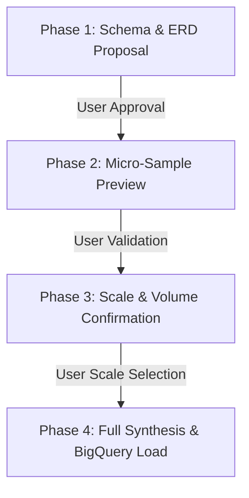
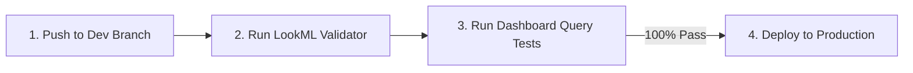
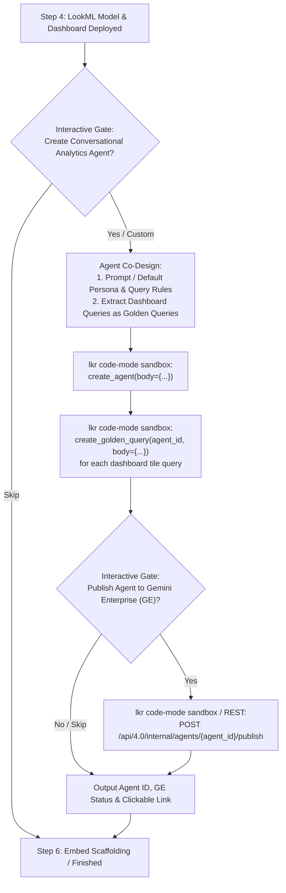

# Looker Demo Orchestrator (`demo-create`)

This skill defines the mandatory operational procedure for an AI agent or engineer creating full-stack data demos on Google Cloud BigQuery and Looker.

> [!CAUTION]
> **CRITICAL RULE: DO NOT USE `demo-create run` MONOLITHICALLY TO BYPASS CO-DESIGN.**
> Running `demo-create run` autonomously without human interaction bypasses iterative schema co-design and volume validation. The agent **MUST** orchestrate the workflow interactively stage-by-stage as detailed below.

---

## 1. Pre-Flight Environment Inspection & Interactive Confirmation Gate

Always execute the pre-check inspection first to inspect GCP credentials, available projects, Looker OAuth sessions, and MCP tools:

```bash
demo-create pre-check --json
uvx --from lkr-dev-cli lkr auth list
```

> [!CAUTION]
> ### 🛑 Mandatory Pre-Flight Hard Stop Protocol
> Immediately after running `demo-create pre-check`:
> 1. **DO NOT execute any further tool calls** (e.g. do not probe database connections, inspect models, or test SDK commands).
> 2. **IMMEDIATELY invoke `ask_question`** in the very next step to prompt the user to confirm all 4 targets below.
> 3. If `available_connections` is empty in `pre-check`, provide standard recommendations (e.g. `looker_demo_bigquery`, `default_bigquery_connection`) along with a write-in option rather than trying to query Looker first.
> 4. Only proceed to Phase 1 (Schema Proposal) after the user has explicitly submitted their answers.

### Mandatory Interactive Confirmation Checklist:
Before designing schemas, creating BigQuery datasets, or touching Looker, the agent **MUST explicitly prompt the user** (via `ask_question` or interactive prompt) to confirm all four environment targets:

1. **GCP User Account**: (e.g. `admin@maluka.altostrat.com` vs `user@google.com`)
2. **Target Google Cloud Project ID**: (e.g. `looker-demo-392616`, `data-cloud-interactive-demo`)
3. **Target Looker Instance / OAuth Account**: (e.g. `dev-looker.lukapuka.co` vs `dev-googledemo2` from `lkr auth list` or `available_oauth_instances`)
4. **Target Looker Database Connection**: (e.g. `looker_demo_bigquery` or `default_bigquery_connection`)

> [!IMPORTANT]
> **NEVER assume or default the Looker instance or GCP project** without explicit user confirmation, even if an active session exists in `pre-check`.

---

## 2. Iterative Schema Co-Design & Micro-Sample Validation Gate

When creating demo datasets, the agent **MUST co-iterate with the user** across four deterministic phases. Do not write full tables or load BigQuery until all phases are complete:



### Phase 1 — Schema Proposal & Review (Human-in-the-Loop)
- Present the relational model (ERD diagram, dimension vs. fact tables, field names, data types, primary keys, and foreign key relationships).
- Highlight key business metrics (e.g., MRR/ARR, churn rates, NPS, telemetry).
- **PAUSE and prompt the user** for feedback on fields, custom dimensions, or adjustments before generating any data rows.

### Phase 2 — Micro-Sample Synthesis & Preview (Human-in-the-Loop)
- Synthesize a micro-sample dataset (5–10 realistic sample rows per table).
- Display Markdown preview tables in chat demonstrating:
  - Referential integrity across parent/child IDs.
  - Realistic domain-specific values and categorical distributions.
- **PAUSE and prompt the user** to inspect and validate the sample records.

### Phase 3 — Volume & Scale Confirmation (Human-in-the-Loop)
- Prompt the user to select the target scale:
  - **Small** (~1,000–5,000 rows across tables) — Quick testing
  - **Medium** (~10,000–50,000 rows) — Standard demo
  - **Large** (~100,000–500,000+ rows) — High-volume enterprise demo
  - **Custom** table-specific sizing

### Phase 4 — Batch Synthesis & BigQuery Load
- Only after Phases 1–3 are explicitly acknowledged, generate the full dataset (Parquet) and upload tables into the confirmed BigQuery project and dataset.

> [!CAUTION]
> ### 🛑 Strict Target Project Integrity & ADC Refresh Gate
> 1. **NEVER silently fall back or divert to an alternate Google Cloud Project or dataset** if permissions errors (e.g. `403 Access Denied`, `bigquery.datasets.create`, or expired ADC tokens) occur during dataset creation or table loading.
> 2. **IMMEDIATELY BLOCK AND PROMPT THE USER**: If credentials lack permissions or fail on the confirmed project, **the pipeline MUST BLOCK IMMEDIATELY** and explicitly prompt the user to refresh their ADC credentials (e.g. `gcloud auth application-default login`) or grant the necessary BigQuery IAM roles on the confirmed project.
> 3. Under no circumstances should the agent create or load tables into a different project than the one explicitly confirmed by the user in Step 1.

> [!CAUTION]
> ### 🛑 Strict Target Project Integrity & ADC Refresh Gate
> 1. **NEVER silently fall back or divert to an alternate Google Cloud Project or dataset** if permissions errors (e.g. `403 Access Denied`, `bigquery.datasets.create`, or expired ADC tokens) occur during dataset creation or table loading.
> 2. **IMMEDIATELY BLOCK AND PROMPT THE USER**: If credentials lack permissions or fail on the confirmed project, **the pipeline MUST BLOCK IMMEDIATELY** and explicitly prompt the user to refresh their ADC credentials (e.g. `gcloud auth application-default login`) or grant the necessary BigQuery IAM roles on the confirmed project.
> 3. Under no circumstances should the agent create or load tables into a different project than the one explicitly confirmed by the user in Step 1.

---

## 3. Looker Project & Model Provisioning (`lkr-dev-cli`)

Looker authentication is managed directly via `lkr-dev-cli` using the confirmed OAuth account:

### A. Project & Bare Git Initialization
Ensure the project exists on the target Looker instance with a bare Git repository:

```bash
uvx --with "mcp<2" --from "lkr-dev-cli[all]" lkr --oauth-account=<oauth_account> code-mode sandbox --code="
if session().get('workspace_id') != 'dev':
    update_session(body={'workspace_id': 'dev'})

project_name = '<project_name>'
connection_name = '<connection_name>'

create_project(body={'name': project_name})
update_project(project_id=project_name, body={'git_remote_url': None, 'git_service_name': 'bare'})
create_lookml_model(body={
    'name': project_name,
    'project_name': project_name,
    'allowed_db_connection_names': [connection_name],
    'unlimited_db_connections': False,
})
"
```

---

## 4. LookML Quality Standards & Mandatory Pre-Deployment Validation Gate

### A. Field Documentation & Mandatory Snowflake 3NF Architecture
- **Mandatory Snowflake & 3NF Modeling Gate (`skills/lookml-snowflake-modeler`)**:
  Whenever the schema contains normalized 3NF structures, multiple 1:N child collections (e.g. comments, attachments, history logs), bridge tables, or diamond joins (e.g. users referenced as assignee/creator/lead):
  - The agent **MUST explicitly apply the `lookml-snowflake-modeler` skill** (`schema_graph_analyzer.py`).
  - **Never join multiple 1:N child tables directly to a parent Explore** (eliminates Chasm Traps).
  - Pre-aggregate child metrics into **Native Derived Tables (NDTs) / rollup views** and join them **`one_to_one`** onto the parent Explore.
  - Create dedicated **Event Stream Explores** for atomic activity/audit leaves where the event table is the **Base View** and parent dimensions are joined `many_to_one`.
  - Resolve diamond joins with role-playing aliases (`from: users`) and explicit `view_label:` headers.
- **Explicit `label:` and `description:`** parameters on every dimension, dimension group, and measure.
- Human-friendly Title Case labels (e.g. `label: "Monthly Recurring Revenue"`).
- Explicit `type:`, `sql:`, and `value_format_name:` (e.g. `usd_0`, `percent_2`, `decimal_1`).
- Primary keys (`primary_key: yes`) on all dimension tables.
- Drill fields (`drill_fields: [...]`) on key primary measures.
- **Executive Polish & Tabbed Dashboard Architecture (`skills/lookml-dashboard`)**: Dashboards must follow modern, executive-grade design patterns (tabbed report consolidation, single-value KPI banners, dual Y-axis charts, `advanced_vis_config` rounded geometry, cross-filtering, and popover filters) tailored to domain specs (e.g. Linear Insights, Stripe Financials, Salesforce CRM).

### B. Mandatory Pre-Deployment Validation Gate

The agent **MUST follow this 4-step sequence** without skipping:



```bash
# Step 1: Push local LookML files to the Looker dev branch (using single-file push -f for reliability)
for file in views/*.view.lkml models/*.model.lkml dashboards/*.dashboard.lookml; do
  uvx --with "mcp<2" --from "lkr-dev-cli[all]" lkr --oauth-account=<oauth_account> tools lookml push <lookml_dir> --project=<project_name> -f "$file"
done

# Step 2: Run LookML Validator (via Looker API or Code Mode)
# Assert that len(validation.errors) == 0 before proceeding.
# If errors exist, fix them locally, re-push, and re-validate.

# Step 3: Exhaustive Dashboard Query Verification Gate
# Execute every query tile in *.dashboard.lookml files via /api/4.0/queries/run/json or run_inline_query.
# Confirm 100% of dashboard queries execute with HTTP 200 OK.

# Step 4: Deploy to Production (ONLY AFTER Step 2 and Step 3 pass completely)
uvx --with "mcp<2" --from "lkr-dev-cli[all]" lkr --oauth-account=<oauth_account> tools lookml deploy --project=<project_name>
```

> [!CAUTION]
> **NEVER call `deploy` or pass `--deploy` before verifying Step 2 (LookML Validator) and Step 3 (Query Verification).**

---

## 5. Provision Conversational Analytics Data Agent & Gemini Enterprise (GE) Publishing (Looker Native API via Code Mode)

After deploying the LookML model and dashboards to production in Step 4, the agent **MUST orchestrate Conversational Analytics (CA) agent creation** for both internal Looker and external embed scopes.



### A. Interactive CA Agent Confirmation Gate
Prompt the user via `ask_question`:
- **Question**: "Would you like to provision a Looker Conversational Analytics (CA) Agent for the `{model_name}` model?"
- **Options**:
  - `(Recommended) Provision CA Agent with default domain instructions and dashboard golden queries`
  - `Provide custom system instructions before provisioning`
  - `Skip Conversational Analytics Agent creation`

### B. System Instruction Template (Persona, Query Patterns & Tone)
> [!NOTE]
> Entity metadata, table schemas, dimension types, and join relationships are **automatically inferred from the LookML model**. System instructions should focus strictly on **persona, deterministic query patterns, business rules, and formatting/style**.

*Example Template*:
```markdown
You are an expert Senior Data Analyst specializing in {domain_name}.
Your job is to answer questions by querying the `{model_name}` LookML model on the `{primary_explore}` explore.

Business Rules & Query Patterns:
- When users ask about revenue, financial performance, or core volume, use `{primary_explore}.total_{primary_metric}`.
- For timeline questions, default to `{primary_explore}.created_date` grouped by month or week.
- Exclude cancelled, deleted, or test records unless specifically requested.

Styling & Response Guidelines:
- Provide direct, executive-ready answers without conversational filler.
- Always lead with the top-line takeaway number before providing supporting data tables or breakdowns.
- Format currency, percentages, and metrics cleanly.
```

### C. Automatic Dashboard Query Extraction (Golden Queries)
Inspect all query tiles in the generated `*.dashboard.lookml` files (single-value KPI cards, timeline area charts, categorical donuts, breakdown bar charts). For each tile:
1. Synthesize a natural language business question (`prompt`) from the tile's title and metrics (e.g. *"What is the total revenue over the last 365 days?"*, *"Show monthly trajectory of orders"*).
2. Extract the exact LookML query configuration (`model`, `view` / `explore`, `fields`, `filters`, `sorts`, `limit`).

### D. Agent & Golden Query Provisioning via `lkr-dev-cli` Code Mode / SDK
Execute the agent creation, golden query registration, and linking using Looker's 3-step native API flow:

> [!IMPORTANT]
> **Looker 4.0 Golden Query Requirements:**
> 1. `create_golden_query` requires an `answer` (the `expanded_share_url` or `share_url` generated by `create_query`).
> 2. Looker strictly enforces **exactly one question per Golden Query** (`questions: [prompt]`). Do not pass multiple questions in a single array.
> 3. Golden queries are linked to the Agent via `update_agent(agent_id=agent_id, body={'golden_query_ids': [str(gq_id), ...]})`.

```python
# 1. Create Conversational Analytics Agent
agent = create_agent(body={
    'name': f'{PROJECT_NAME} Assistant',
    'description': f'AI Conversational Analytics Assistant for {PROJECT_NAME}',
    'sources': [{'model': MODEL_NAME, 'explore': PRIMARY_EXPLORE}],
    'context': {'instructions': SYSTEM_INSTRUCTIONS},
    'code_interpreter': True
})
agent_id = agent.get('id')
print(f'Created CA Agent ID: {agent_id}')

# 2. Register Dashboard Golden Queries (3-Step Flow)
created_gq_ids = []
for gq in golden_queries:
    try:
        # Step 2a: Create base Looker query to obtain expanded share URL
        q = create_query(body=gq['query'])
        answer_url = q.get('expanded_share_url') or q.get('share_url')
        
        # Step 2b: Create Golden Query resource
        created_gq = create_golden_query(body={
            'questions': [gq['prompt']],
            'answer': answer_url,
            'is_active': True
        })
        created_gq_ids.append(str(created_gq.get('id')))
    except Exception as e:
        print(f'Notice registering golden query: {e}')

# Step 2c: Link all Golden Query IDs to the CA Agent
update_agent(agent_id=agent_id, body={'golden_query_ids': created_gq_ids})
print(f'Linked {len(created_gq_ids)} Golden Queries to Agent: {agent_id}')
```

### E. Interactive Gemini Enterprise (GE) Publishing Gate
After the CA agent and golden queries are created, prompt the user via `ask_question`:
- **Question**: "Would you like to publish this Conversational Analytics Agent to Gemini Enterprise (GE)?"
- **Guidance / Prerequisite**:
  > [!IMPORTANT]
  > Before publishing, ensure that Gemini Enterprise publishing is enabled on your Looker instance (under **Admin > Gemini Settings**) and a Gemini Enterprise (GE) App has been connected.
- **Options**:
  - `(Recommended) Yes, publish agent to Gemini Enterprise`
  - `Skip publishing to Gemini Enterprise`

If confirmed, execute a `POST` with an empty body `{}` against the internal agent publish endpoint using `lkr code-mode sandbox`:

```bash
uvx --with "mcp<2" --from "lkr-dev-cli[all]" lkr --oauth-account=<oauth_account> code-mode sandbox --code="
agent_id = '${AGENT_ID}'

# Publish CA Agent to Gemini Enterprise
res = request(
    method='POST',
    path=f'/api/4.0/internal/agents/{agent_id}/publish',
    body={}
)
print(f'Gemini Enterprise Publish Result: {res}')
"
```

---

## 6. External Embedded Portal Scaffolding (Optional)

When an external embedded analytics portal is requested:

```bash
demo-create run --project=<project_name> --scope=external
```

This clones `looker-embed-demo`, configures `.env` (including `VITE_CHAT_AGENT_ID=<agent_id>`), `src/constants.ts`, and applies custom brand styling.

