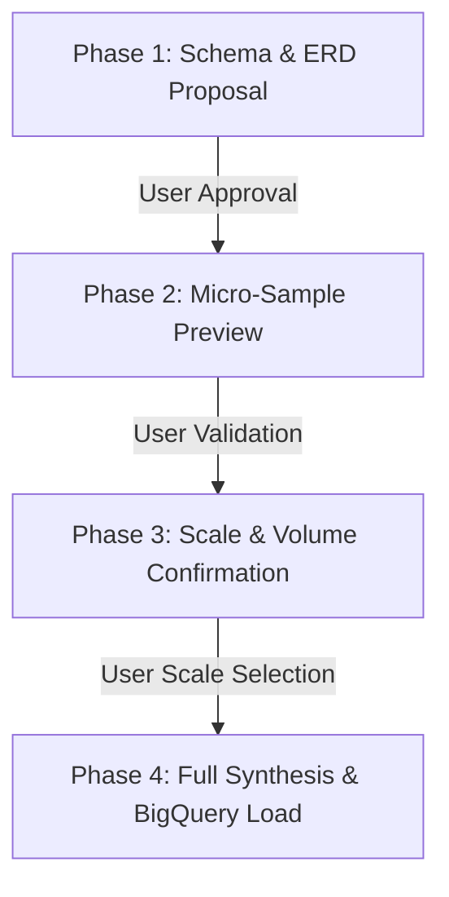
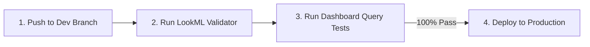

# Looker Demo Orchestrator (`demo-create`)

This skill defines the mandatory operational procedure for an AI agent or engineer creating full-stack data demos on Google Cloud BigQuery and Looker.

> [!CAUTION]
> **CRITICAL RULE: DO NOT USE `demo-create run` MONOLITHICALLY TO BYPASS CO-DESIGN.**
> Running `demo-create run` autonomously without human interaction bypasses iterative schema co-design and volume validation. The agent **MUST** orchestrate the workflow interactively stage-by-stage as detailed below.

---

## 1. Pre-Flight Environment Inspection & Interactive Confirmation Gate

Always execute the pre-check inspection first to inspect GCP credentials, available projects, Looker OAuth sessions, and MCP tools:

```bash
demo-create pre-check --json
uvx --from lkr-dev-cli lkr auth list
```

> [!CAUTION]
> ### 🛑 Mandatory Pre-Flight Hard Stop Protocol
> Immediately after running `demo-create pre-check`:
> 1. **DO NOT execute any further tool calls** (e.g. do not probe database connections, inspect models, or test SDK commands).
> 2. **IMMEDIATELY invoke `ask_question`** in the very next step to prompt the user to confirm all 4 targets below.
> 3. If `available_connections` is empty in `pre-check`, provide standard recommendations (e.g. `looker_demo_bigquery`, `default_bigquery_connection`) along with a write-in option rather than trying to query Looker first.
> 4. Only proceed to Phase 1 (Schema Proposal) after the user has explicitly submitted their answers.

### Mandatory Interactive Confirmation Checklist:
Before designing schemas, creating BigQuery datasets, or touching Looker, the agent **MUST explicitly prompt the user** (via `ask_question` or interactive prompt) to confirm all four environment targets:

1. **GCP User Account**: (e.g. `admin@maluka.altostrat.com` vs `user@google.com`)
2. **Target Google Cloud Project ID**: (e.g. `looker-demo-392616`, `data-cloud-interactive-demo`)
3. **Target Looker Instance / OAuth Account**: (e.g. `dev-looker.lukapuka.co` vs `dev-googledemo2` from `lkr auth list` or `available_oauth_instances`)
4. **Target Looker Database Connection**: (e.g. `looker_demo_bigquery` or `default_bigquery_connection`)

> [!IMPORTANT]
> **NEVER assume or default the Looker instance or GCP project** without explicit user confirmation, even if an active session exists in `pre-check`.

---

## 2. Iterative Schema Co-Design & Micro-Sample Validation Gate

When creating demo datasets, the agent **MUST co-iterate with the user** across four deterministic phases. Do not write full tables or load BigQuery until all phases are complete:



### Phase 1 — Schema Proposal & Review (Human-in-the-Loop)
- Present the relational model (ERD diagram, dimension vs. fact tables, field names, data types, primary keys, and foreign key relationships).
- Highlight key business metrics (e.g., MRR/ARR, churn rates, NPS, telemetry).
- **PAUSE and prompt the user** for feedback on fields, custom dimensions, or adjustments before generating any data rows.

### Phase 2 — Micro-Sample Synthesis & Preview (Human-in-the-Loop)
- Synthesize a micro-sample dataset (5–10 realistic sample rows per table).
- Display Markdown preview tables in chat demonstrating:
  - Referential integrity across parent/child IDs.
  - Realistic domain-specific values and categorical distributions.
- **PAUSE and prompt the user** to inspect and validate the sample records.

### Phase 3 — Volume & Scale Confirmation (Human-in-the-Loop)
- Prompt the user to select the target scale:
  - **Small** (~1,000–5,000 rows across tables) — Quick testing
  - **Medium** (~10,000–50,000 rows) — Standard demo
  - **Large** (~100,000–500,000+ rows) — High-volume enterprise demo
  - **Custom** table-specific sizing

### Phase 4 — Batch Synthesis & BigQuery Load
- Only after Phases 1–3 are explicitly acknowledged, generate the full dataset (Parquet) and upload tables into the confirmed BigQuery project and dataset.

---

## 3. Looker Project & Model Provisioning (`lkr-dev-cli`)

Looker authentication is managed directly via `lkr-dev-cli` using the confirmed OAuth account:

### A. Project & Bare Git Initialization
Ensure the project exists on the target Looker instance with a bare Git repository:

```bash
uvx --with "mcp<2" --from "lkr-dev-cli[all]" lkr --oauth-account=<oauth_account> code-mode sandbox --code="
if session().get('workspace_id') != 'dev':
    update_session(body={'workspace_id': 'dev'})

project_name = '<project_name>'
connection_name = '<connection_name>'

create_project(body={'name': project_name})
update_project(project_id=project_name, body={'git_remote_url': None, 'git_service_name': 'bare'})
create_lookml_model(body={
    'name': project_name,
    'project_name': project_name,
    'allowed_db_connection_names': [connection_name],
    'unlimited_db_connections': False,
})
"
```

---

## 4. LookML Quality Standards & Mandatory Pre-Deployment Validation Gate

### A. Field Documentation & Formatting Standards
Every view file (`views/*.view.lkml`) must follow LookML best practices:
- **Explicit `label:` and `description:`** parameters on every dimension, dimension group, and measure.
- Human-friendly Title Case labels (e.g. `label: "Monthly Recurring Revenue"`).
- Explicit `type:`, `sql:`, and `value_format_name:` (e.g. `usd_0`, `percent_2`, `decimal_1`).
- Primary keys (`primary_key: yes`) on all dimension tables.
- Drill fields (`drill_fields: [...]`) on key primary measures.
- Proper join relationships (`many_to_one`, `one_to_one`) in models.
- **Complex Snowflake / 3NF Schemas**: Use `skills/lookml-snowflake-modeler/` (`schema_graph_analyzer.py`) to systematically determine Explore base views, eliminate fan/chasm traps via NDT rollups, and resolve diamond joins with role-playing aliases.

### B. Mandatory Pre-Deployment Validation Gate

The agent **MUST follow this 4-step sequence** without skipping:



```bash
# Step 1: Push local LookML files to the Looker dev branch (using single-file push -f for reliability)
for file in views/*.view.lkml models/*.model.lkml dashboards/*.dashboard.lookml; do
  uvx --with "mcp<2" --from "lkr-dev-cli[all]" lkr --oauth-account=<oauth_account> tools lookml push <lookml_dir> --project=<project_name> -f "$file"
done

# Step 2: Run LookML Validator (via Looker API or Code Mode)
# Assert that len(validation.errors) == 0 before proceeding.
# If errors exist, fix them locally, re-push, and re-validate.

# Step 3: Exhaustive Dashboard Query Verification Gate
# Execute every query tile in *.dashboard.lookml files via /api/4.0/queries/run/json or run_inline_query.
# Confirm 100% of dashboard queries execute with HTTP 200 OK.

# Step 4: Deploy to Production (ONLY AFTER Step 2 and Step 3 pass completely)
uvx --with "mcp<2" --from "lkr-dev-cli[all]" lkr --oauth-account=<oauth_account> tools lookml deploy --project=<project_name>
```

> [!CAUTION]
> **NEVER call `deploy` or pass `--deploy` before verifying Step 2 (LookML Validator) and Step 3 (Query Verification).**

---

## 5. External Embedded Portal Scaffolding (Optional)

When an external embedded analytics portal is requested:

```bash
demo-create run --project=<project_name> --scope=external
```

This clones `looker-embed-demo`, configures `.env`, `src/constants.ts`, and applies custom brand styling.
