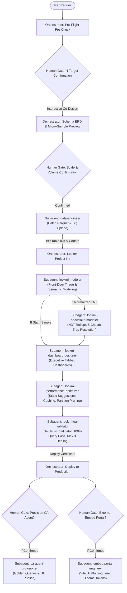
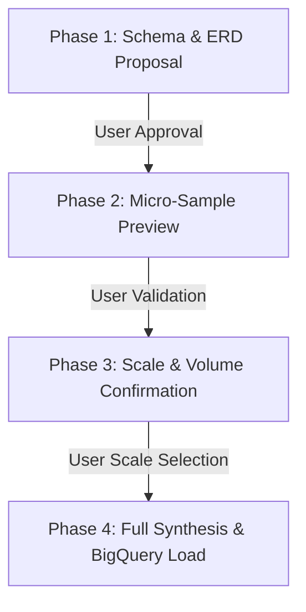
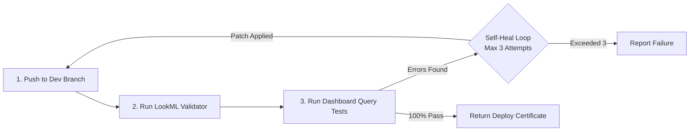
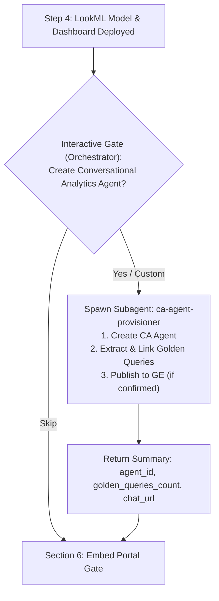

# Looker Demo Orchestrator (`demo-create`)

This skill defines the mandatory operational procedure for an AI agent or engineer creating full-stack data demos on Google Cloud BigQuery and Looker.

> [!CAUTION]
> **CRITICAL RULE: DO NOT USE `demo-create run` MONOLITHICALLY TO BYPASS CO-DESIGN.**
> Running `demo-create run` autonomously without human interaction bypasses iterative schema co-design and volume validation. The agent **MUST** orchestrate the workflow interactively stage-by-stage as detailed below.

---

## Multi-Agent Hub-and-Spoke Architecture

To prevent context saturation, instruction drift, and self-confirmation bias across this multi-stage pipeline, the orchestrator utilizes a **Hub-and-Spoke Multi-Agent Model**:



| Component | Responsibility | Tool Access & Scope |
|---|---|---|
| **Parent Orchestrator** | State machine, conversational co-design, human interactive gates (`ask_question`), production deploy, and final summary. | Full tool access, interactive UI modals. |
| [`data-engineer`](subagents/data-engineer.md) | Synthesizes full Parquet dataset and loads tables into BigQuery; strict ADC error boundary. | Bash, filesystem. Read-only Looker. No `ask_question`. |
| [`lookml-modeler`](subagents/lookml-modeler.md) | Front-door semantic modeler. Models simple/star schemas directly; routes 3NF snowflake schemas with chasm traps to `lookml-snowflake-modeler`. | Filesystem tools. Read-only Looker. No deploy. |
| [`lookml-snowflake-modeler`](subagents/lookml-snowflake-modeler.md) | 3NF semantic modeling, NDT rollup chasm trap elimination, role-playing diamond joins, and mandatory labels/descriptions. | Filesystem, `schema_graph_analyzer.py`. No Looker deploy. |
| [`lookml-dashboard-designer`](subagents/lookml-dashboard-designer.md) | Pixel-perfect executive dashboard authoring grounded strictly in staged explores; tabbed layout, KPI stat cards, dual-axis timelines, `advanced_vis_config`, and popovers. | Filesystem tools. No Looker deploy. |
| [`lookml-performance-optimizer`](subagents/lookml-performance-optimizer.md) | Audits and enriches staged LookML in-place with Google Cloud performance standards (static suggestions, suggestable: no, datagroups, partition filters, FK hiding). | Filesystem tools. No Looker deploy. |
| [`lookml-qa-validator`](subagents/lookml-qa-validator.md) | Pushes dev branch, audits LookML, runs 100% of dashboard queries via API; bounded self-healing (max 3 attempts). | Code Mode, Looker API queries, single-file push. No deploy. |
| [`ca-agent-provisioner`](subagents/ca-agent-provisioner.md) | Provisions CA Agent, extracts Golden Queries, links to agent, publishes to Gemini Enterprise. *(Spawned only if explicitly confirmed)*. | Code Mode, Looker REST API. |
| [`embed-portal-engineer`](subagents/embed-portal-engineer.md) | Scaffolds `looker-embed-demo`, injects environment variables, customizes brand theme tokens, verifies build. *(Spawned only if explicitly confirmed)*. | Bash, frontend filesystem, Vite/npm. |

---

## 1. Pre-Flight Environment Inspection & Interactive Confirmation Gate

Always execute the pre-check inspection first to inspect GCP credentials, available projects, Looker OAuth sessions, and MCP tools:

```bash
demo-create pre-check --json
lkr auth list
```

> [!CAUTION]
> ### 🛑 Mandatory Pre-Flight Hard Stop Protocol
> Immediately after running `demo-create pre-check`:
> 1. **DO NOT execute any further tool calls** (e.g. do not probe database connections, inspect models, or test SDK commands).
> 2. **IMMEDIATELY invoke `ask_question`** in the very next step to prompt the user to confirm all 4 targets below.
> 3. If `available_connections` is empty in `pre-check`, provide standard recommendations (e.g. `looker_demo_bigquery`, `default_bigquery_connection`) along with a write-in option rather than trying to query Looker first.
> 4. Only proceed to Phase 1 (Schema Proposal) after the user has explicitly submitted their answers.

### Mandatory Interactive Confirmation Checklist:
Before designing schemas, creating BigQuery datasets, or touching Looker, the agent **MUST explicitly prompt the user** (via `ask_question` or interactive prompt) to confirm all four environment targets:

1. **GCP User Account**: (e.g. `admin@example.com` vs `analyst@company.com`)
2. **Target Google Cloud Project ID**: (e.g. `my-analytics-gcp-project`, `demo-data-warehouse`)
3. **Target Looker Instance / OAuth Account**: (e.g. `my-company.looker.com` vs `demo-instance` from `lkr auth list` or `available_oauth_instances`)
4. **Target Looker Database Connection**: (e.g. `looker_demo_bigquery` or `default_bigquery_connection`)

> [!IMPORTANT]
> **NEVER assume or default the Looker instance or GCP project** without explicit user confirmation, even if an active session exists in `pre-check`.

---

## 2. Iterative Schema Co-Design & Micro-Sample Validation Gate

When creating demo datasets, the agent **MUST co-iterate with the user** across four deterministic phases. Do not write full tables or load BigQuery until all phases are complete:



### Phase 1 — Schema Proposal & Review (Human-in-the-Loop)
- Present the relational model (ERD diagram, dimension vs. fact tables, field names, data types, primary keys, and foreign key relationships).
- Highlight key business metrics (e.g., MRR/ARR, churn rates, NPS, telemetry).
- **PAUSE and prompt the user** for feedback on fields, custom dimensions, or adjustments before generating any data rows.

### Phase 2 — Micro-Sample Synthesis & Preview (Human-in-the-Loop)
- Synthesize a micro-sample dataset (5–10 realistic sample rows per table).
- Display Markdown preview tables in chat demonstrating:
  - Referential integrity across parent/child IDs.
  - Realistic domain-specific values and categorical distributions.
- **PAUSE and prompt the user** to inspect and validate the sample records.

### Phase 3 — Volume & Scale Confirmation (Human-in-the-Loop)
- Prompt the user to select the target scale:
  - **Small** (~1,000–5,000 rows across tables) — Quick testing
  - **Medium** (~10,000–50,000 rows) — Standard demo
  - **Large** (~100,000–500,000+ rows) — High-volume enterprise demo
  - **Custom** table-specific sizing

### Phase 4 — Batch Synthesis & BigQuery Load (Delegate to Subagent)
- Only after Phases 1–3 are explicitly acknowledged by the user, delegate batch synthesis and BigQuery ingestion to the **[`data-engineer`](subagents/data-engineer.md)** subagent:

```yaml
subagent:
  type: "skills/looker-demo-orchestrator/subagents/data-engineer.md"
  prompt: "Synthesize full volume Parquet data for {confirmed_scale} rows and upload to BigQuery project {confirmed_gcp_project} dataset {dataset_name}."
  inputs:
    gcp_project_id: "{confirmed_gcp_project}"
    dataset_id: "{dataset_name}"
    location: "US"
    schema_spec: "{approved_schema_json}"
    scale: "{confirmed_scale}"
    output_dir: "scratch/parquet"
```

> [!CAUTION]
> ### 🛑 Strict Target Project Integrity & ADC Refresh Gate
> 1. **NEVER silently fall back or divert to an alternate Google Cloud Project or dataset** if permissions errors (e.g. `403 Access Denied`, `bigquery.datasets.create`, or expired ADC tokens) occur during dataset creation or table loading.
> 2. If `data-engineer` returns status `PERMISSION_DENIED` or fails on the confirmed project, **the pipeline MUST BLOCK IMMEDIATELY and prompt the user** (via `ask_question` or terminal instruction) to refresh their ADC credentials (`gcloud auth application-default login`) or grant the necessary BigQuery IAM roles on the confirmed project.
> 3. Under no circumstances should the agent create or load tables into a different project than the one explicitly confirmed by the user in Step 1.

---

## 3. Looker Project & Model Provisioning (`lkr-dev-cli`)

Looker authentication is managed directly via `lkr-dev-cli` using the confirmed OAuth account:

### A. Project & Bare Git Initialization
Ensure the project exists on the target Looker instance with a bare Git repository:

```bash
lkr --oauth-account=<oauth_account> code-mode sandbox --code="
if session().get('workspace_id') != 'dev':
    update_session(body={'workspace_id': 'dev'})

project_name = '<project_name>'
connection_name = '<connection_name>'

create_project(body={'name': project_name})
update_project(project_id=project_name, body={'git_remote_url': None, 'git_service_name': 'bare'})
create_lookml_model(body={
    'name': project_name,
    'project_name': project_name,
    'allowed_db_connection_names': [connection_name],
    'unlimited_db_connections': False,
})
"
```

---

## 4. LookML Quality Standards & 4-Stage Semantic Pipeline

### A. Semantic Modeling & Triage (Delegate to Modeler Subagent)

Delegate semantic modeling to the front-door **[`lookml-modeler`](subagents/lookml-modeler.md)** subagent:

```yaml
subagent:
  type: "skills/looker-demo-orchestrator/subagents/lookml-modeler.md"
  prompt: "Model LookML views, explores, and measures for {project_name}. If normalized 3NF structures with Chasm Traps or diamond joins exist, delegate to lookml-snowflake-modeler."
  inputs:
    project_name: "{looker_project_name}"
    connection_name: "{looker_connection_name}"
    lookml_dir: "lookml/"
    table_specs: "{extracted_table_specs}"
    domain_metrics: "{domain_metrics_list}"
```

- **Triage Protocol**:
  - **Standard / Star Schemas**: `lookml-modeler` writes `.view.lkml`, primary keys, formatted measures (`usd_0`, `percent_2`, `decimal_1`), drill fields, and `.explore.lkml` directly.
  - **Normalized 3NF / Snowflake Schemas**: If multiple 1:N child collections or diamond joins are detected, hand off to **[`lookml-snowflake-modeler`](subagents/lookml-snowflake-modeler.md)**:
    - Runs `schema_graph_analyzer.py` on the schema DAG.
    - Sets Explore Base Views on leaf event facts ($d_{\text{in}} = 0$).
    - Pre-aggregates child collections into **Native Derived Tables (NDTs)** and joins them **`relationship: one_to_one`** onto the parent Explore (eliminates Chasm Traps).
    - Resolves diamond joins with role-playing aliases (`from: users`) and explicit `view_label:` headers.
- **Mandatory Field Standards**: Explicit `label:` and `description:` parameters on EVERY dimension, dimension group, and measure (Title Case, e.g. `label: "Monthly Recurring Revenue"`).

---

### B. Executive Tabbed Dashboard Authoring (Delegate to Dashboard Designer Subagent)

Delegate dashboard creation to the dedicated **[`lookml-dashboard-designer`](subagents/lookml-dashboard-designer.md)** subagent:

```yaml
subagent:
  type: "skills/looker-demo-orchestrator/subagents/lookml-dashboard-designer.md"
  prompt: "Author pixel-perfect, executive-ready tabbed dashboard for {project_name} grounded strictly in staged explores and views. Include KPI stat banners, dual-axis timelines, advanced_vis_config rounded geometry, cross-filtering, and popovers."
  inputs:
    project_name: "{looker_project_name}"
    model_name: "{looker_model_name}"
    primary_explore: "{primary_explore_name}"
    lookml_dir: "lookml/"
    domain_theme: "{domain_theme}"
```

- **Strict Explore-Grounded Authoring**: Inspects staged `explores/*.explore.lkml` and `views/*.view.lkml` files to discover available dimensions and measures (NEVER invents fields).
- **Tabbed Architecture**: Modern 2–4 tab operational command center (e.g. *Executive Overview*, *Operations Deep Dive*, *Alerts & Exceptions*).
- **Visual Standards**: Single-value KPI cards, dual-axis timelines, donut breakdowns, clustered bar charts, `advanced_vis_config` rounded geometry (`borderRadius: 8`), and universal cross-filtering.

---

### C. LookML Server Performance Optimization Gate (Delegate to Optimizer Subagent)

Before pushing to the dev branch, execute the **[`lookml-performance-optimizer`](subagents/lookml-performance-optimizer.md)** subagent to audit and patch staged LookML files in-place according to [Google Cloud Looker Server Optimization Best Practices](https://docs.cloud.google.com/looker/docs/best-practices/how-to-optimize-looker-server-performance):

```yaml
subagent:
  type: "skills/looker-demo-orchestrator/subagents/lookml-performance-optimizer.md"
  prompt: "Audit staged LookML files for performance bottlenecks. Apply static suggestions on low-cardinality dims (<=15 values), set suggestable: no on IDs/text, configure datagroup caching in model, enforce partition pruning in explores, and hide raw foreign keys."
  inputs:
    project_name: "{looker_project_name}"
    model_name: "{looker_model_name}"
    lookml_dir: "lookml/"
    table_specs: "{extracted_table_specs}"
```

- **Static Suggestions on Low-Cardinality Dims**: Injects `suggestions: ["val1", "val2", ...]` on categorical fields with $\le 15$ distinct values to eliminate database roundtrips when filters open.
- **Disable Suggestions on Unique Keys**: Injects `suggestable: no` on primary keys, foreign key UUIDs, timestamps, and free text.
- **Model Datagroup Caching**: Configures production datagroups (`max_cache_age: "4 hours"`) and applies `persist_with: default_caching_policy`.
- **Partition Pruning**: Enforces `always_filter` or `conditionally_filter` on BigQuery partitioned date columns.
- **Field Pruning**: Sets `hidden: yes` on raw foreign key IDs and asserts `primary_key: yes` on unique grains.

---

### D. Mandatory Pre-Deployment Validation Gate (Delegate to QA Validator Subagent)

To ensure zero confirmation bias and protect the parent session from query execution log bloat, delegate dev branch deployment, LookML validation, and dashboard query verification to the independent **[`lookml-qa-validator`](subagents/lookml-qa-validator.md)** subagent:

```yaml
subagent:
  type: "skills/looker-demo-orchestrator/subagents/lookml-qa-validator.md"
  prompt: "Push LookML files to dev branch, run LookML Validator, execute 100% of dashboard queries, and self-heal missing fields (up to max 3 attempts). Certify deploy readiness."
  inputs:
    project_name: "{looker_project_name}"
    oauth_account: "{oauth_account}"
    lookml_dir: "lookml/"
    dashboard_files: ["dashboards/*.dashboard.lookml"]
```

The `lookml-qa-validator` subagent runs this 4-step sequence:



> [!IMPORTANT]
> **Strict Bounded Self-Healing Ceiling: Maximum 3 Attempts**
> If LookML validator errors or query failures occur, the `lookml-qa-validator` subagent is permitted up to a **maximum of 3 self-healing iterations** (using `lookml-dashboard-to-query`) to patch missing dimensions or syntax before escalating to the user.

> [!CAUTION]
> **Production Deployment Authority Remains with Parent Orchestrator**:
> The `lookml-qa-validator` subagent is **strictly an auditing worker** and is prohibited from calling `tools lookml deploy`. Production deployment is executed by the **Parent Orchestrator ONLY AFTER** receiving `{ready_to_deploy: true}` from the validator subagent:
>
> ```bash
> lkr --oauth-account=<oauth_account> tools lookml deploy --project=<project_name>
> ```

---

## 5. Provision Conversational Analytics Data Agent & Gemini Enterprise (GE) Publishing (Delegate to Subagent)

> [!IMPORTANT]
> **Conditional Subagent Trigger**:
> The **[`ca-agent-provisioner`](subagents/ca-agent-provisioner.md)** subagent is **ONLY spawned if the user explicitly confirms CA Agent creation** in the interactive gate below.



### A. Interactive CA Agent Confirmation Gate (Parent Orchestrator)
Prompt the user via `ask_question`:
- **Question**: "Would you like to provision a Looker Conversational Analytics (CA) Agent for the `{model_name}` model?"
- **Options**:
  - `(Recommended) Provision CA Agent with default domain instructions and dashboard golden queries`
  - `Provide custom system instructions before provisioning`
  - `Skip Conversational Analytics Agent creation`

### B. Interactive Gemini Enterprise (GE) Publishing Gate (Parent Orchestrator)
If CA Agent creation is selected, ask whether to publish to Gemini Enterprise:
- **Question**: "Would you like to publish this Conversational Analytics Agent to Gemini Enterprise (GE)?"
- **Guidance / Prerequisite**:
  > [!IMPORTANT]
  > Before publishing, confirm that Gemini Enterprise publishing is enabled on the Looker instance (under **Admin > Gemini Settings**) and a Gemini Enterprise (GE) App has been connected.
- **Options**:
  - `(Recommended) Yes, publish agent to Gemini Enterprise`
  - `Skip publishing to Gemini Enterprise`

### C. Procedural Delegation: `ca-agent-provisioner` Subagent
Once confirmed, delegate Golden Query extraction, agent creation, and GE publishing to **[`ca-agent-provisioner`](subagents/ca-agent-provisioner.md)**:

```yaml
subagent:
  type: "skills/looker-demo-orchestrator/subagents/ca-agent-provisioner.md"
  prompt: "Provision Looker CA Agent for model {lookml_model_name} on explore {primary_explore}, extract dashboard tile golden queries, and publish to Gemini Enterprise if confirmed."
  inputs:
    project_name: "{looker_project_name}"
    model_name: "{lookml_model_name}"
    primary_explore: "{primary_explore}"
    oauth_account: "{oauth_account}"
    dashboard_files: ["dashboards/*.dashboard.lookml"]
    system_instructions: "{system_instructions_or_default_template}"
    publish_ge: "{publish_ge_boolean}"
```

The subagent follows the strict Looker 4.0 Golden Query rules:
1. `create_agent(body={...})` with persona, query patterns, and domain rules.
2. For each dashboard tile: `create_query` $\to$ get `expanded_share_url` $\to$ `create_golden_query` with exactly **ONE question** $\to$ `update_agent` linking all IDs.
3. If `publish_ge: true`: executes `POST /api/4.0/internal/agents/{agent_id}/publish` with body `{}`.

---

## 6. External Embedded Portal Scaffolding (Delegate to Subagent)

> [!IMPORTANT]
> **Conditional Subagent Trigger**:
> The **[`embed-portal-engineer`](subagents/embed-portal-engineer.md)** subagent is **ONLY spawned if the user explicitly confirms external embed portal creation** in the interactive gate below.

### A. Interactive External Embed Confirmation Gate (Parent Orchestrator)
Prompt the user via `ask_question`:
- **Question**: "Would you like to scaffold an external branded embedded analytics portal (`looker-embed-demo`)?"
- **Options**:
  - `(Recommended) Scaffold external embed portal with custom brand theme and embedded chat`
  - `Skip external portal scaffolding (internal Looker only)`

### B. Procedural Delegation: `embed-portal-engineer` Subagent
If confirmed, delegate frontend scaffolding, environment configuration, brand tokens, and build verification to **[`embed-portal-engineer`](subagents/embed-portal-engineer.md)**:

```yaml
subagent:
  type: "skills/looker-demo-orchestrator/subagents/embed-portal-engineer.md"
  prompt: "Scaffold external embed demo for {project_name}, configure .env (VITE_CHAT_AGENT_ID={ca_agent_id}, dashboard ID={dashboard_id}), customize brand styling in styles.css, and verify build."
  inputs:
    project_name: "{looker_project_name}"
    looker_instance_url: "{looker_instance_url}"
    dashboard_id: "{deployed_dashboard_id}"
    ca_agent_id: "{ca_agent_id}"
    brand_name: "{brand_name}"
    theme_colors: "{brand_theme_colors}"
    target_dir: "embed-portal/"
```

The subagent:
1. Clones/scaffolds `looker-embed-demo`.
2. Configures `.env` with `VITE_LOOKER_HOST`, `VITE_DEFAULT_DASHBOARD_ID`, and `VITE_CHAT_AGENT_ID`.
3. Customizes `src/constants.ts` and CSS variables in `src/styles.css`.
4. Runs `npm run build` or `vite build` to verify clean compilation.

---

## 7. Mandatory Final Delivery Report Protocol

Upon completing the demo creation pipeline (production deployment, plus optional CA Agent or Embed Portal steps), the Parent Orchestrator **MUST synthesize all subagent outputs and emit a comprehensive Executive Delivery Report**.

The report must be emitted directly in chat as the final deliverable and saved to the project directory as `DELIVERY_REPORT.md` (or artifact).

### Mandatory Report Structure & Template:

```markdown
# {Domain Name} — Final Delivery Report

> [!NOTE]
> **Production Deployment Status: Active & Operational**
> - **Looker Instance**: [{looker_instance_host}]({looker_instance_url})
> - **Looker Project & Model**: `{looker_project_name}`
> - **BigQuery Dataset**: `{gcp_project_id}.{bq_dataset_id}` ({gcp_location})
> - **Looker Database Connection**: `{looker_connection_name}`
> - **Validation Gate**: 0 LookML errors, {queries_passed}/{queries_tested} (100%) Dashboard Queries Passed

---

## 1. Quick Access Links

| Asset | Direct URL / Access Path | Description |
| :--- | :--- | :--- |
| **Executive Dashboard** | [{dashboard_title}]({looker_instance_url}/dashboards/{lookml_model_name}::{dashboard_name}) | {tabs_count}-tab executive command center with cross-filtering |
| **Conversational Analytics Agent** | [{agent_name}]({looker_instance_url}/conversational-analytics/agents/{ca_agent_id}) | AI Data Agent with {gq_count} pre-seeded Golden Queries *(if provisioned)* |
| **{Primary Explore} Explore** | [Explore: {Primary Explore Label}]({looker_instance_url}/explore/{lookml_model_name}/{primary_explore}) | Primary domain entity, metrics & dimension analysis |
| **{Event Stream} Explore** | [Explore: {Event Stream Label}]({looker_instance_url}/explore/{lookml_model_name}/{event_explore}) | Granular event/telemetry audit stream |
| **Embed Analytics Portal** | [External Embed Portal]({embed_portal_url}) | White-labeled external embed application *(if scaffolded)* |

---

## 2. BigQuery Data Warehouse Summary

All {table_count} relational tables were synthesized with realistic domain distributions, strict referential integrity, and uploaded to BigQuery:

```{gcp_project_id}.{bq_dataset_id}
├── {table_name_1}  ({rows_1} rows)  - {table_1_description}
├── {table_name_2}  ({rows_2} rows)  - {table_2_description}
└── {table_name_n}  ({rows_n} rows)  - {table_n_description}
```

Total dataset volume: **{total_rows} rows**.

---

## 3. Relational Architecture & ERD

```mermaid
erDiagram
    {table_a} ||--o{ {table_b} : "{relationship_label} ({foreign_key})"
```

*(Optional — Include `### Chasm Trap Mitigation Architecture` below ONLY if snowflake modeling was required / 1:N child collections were detected)*:
<!--
### Chasm Trap Mitigation Architecture
- Document NDT rollups pre-aggregating child 1:N metrics at the parent grain.
- Document one_to_one joins onto parent table eliminating Cartesian products.
- Document dedicated Event Stream Explores with event leaf as Base View.
-->

---

## 4. LookML Dashboard Layout & Tabbed Architecture

The dashboard (`{lookml_model_name}::{dashboard_name}`) is structured into **{tab_count} functional operational tabs** with universal cross-filtering and popover filters:

### Tab 1: {Tab 1 Name}
- **KPI Banners**: {List of primary single-value metrics}.
- **{Chart 1 Title}**: {Chart visualization type and business question answered}.
- **{Chart 2 Title}**: {Chart visualization type and business question answered}.

### Tab 2: {Tab 2 Name}
- **KPI Banners**: {List of secondary single-value metrics}.
- **{Chart 1 Title}**: {Chart visualization type and business question answered}.

---

## 5. Pre-Deployment Validation Audit Record

In strict compliance with the **Looker Demo Orchestrator** pre-deployment gate, all validation checks passed before production release:

```
[Phase 1] Code Push to Dev Branch:             100% COMPLETE ({files_count} LookML files pushed)
[Phase 2] LookML Validator (validate_project):   0 ERRORS DETECTED
[Phase 3] Exhaustive Dashboard Query Tests:      {queries_passed} / {queries_tested} (100%) QUERIES PASSED
[Phase 4] Production Deployment:                SUCCESS (Deployed to Production at {timestamp})
```

### Detailed Query Test Results ({queries_passed}/{queries_tested} HTTP 200 OK)
1. `{query_tile_1}` (Explore: `{explore_1}`) ➔ **PASS**
2. `{query_tile_2}` (Explore: `{explore_2}`) ➔ **PASS**
3. `{query_tile_n}` (Explore: `{explore_n}`) ➔ **PASS**

---

## 6. Conversational Analytics (CA) AI Agent Configuration *(if provisioned)*

- **Agent ID**: `{ca_agent_id}`
- **Agent Name**: `{ca_agent_name}`
- **Explore Sources**: `{explore_sources_list}`
- **Code Interpreter**: Enabled
- **Direct Agent Chat URL**: [Open {ca_agent_name}]({looker_instance_url}/conversational-analytics/agents/{ca_agent_id})

### Pre-Seeded Golden Queries
1. *"{Natural language business question 1}"*
2. *"{Natural language business question 2}"*
3. *"{Natural language business question n}"*

---

## 7. Gemini Enterprise (GE) / Embed Portal Status

*(If published to Gemini Enterprise)*:
- **Publish State**: `published` (HTTP 200 OK)
- **Status Message**: `Successfully published Agent {ca_agent_id} to GEMINI_ENTERPRISE.`
- **Capabilities**: Full natural language synthesis over `{lookml_model_name}`, golden query semantic routing, and code interpretation within Gemini Enterprise apps.

*(If external embed portal was scaffolded)*:
- **Workspace Directory**: `{embed_workspace_dir}`
- **Local Dev Command**: `npm run dev`
- **Dashboard Embedded**: `{deployed_dashboard_id}`
- **Chat Agent Connected**: `{ca_agent_id}`
- **Build Status**: Verified 0 TypeScript / compilation errors
```


