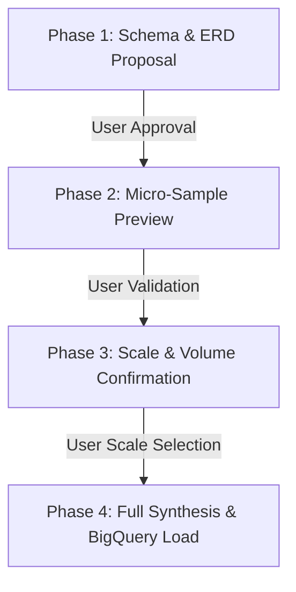
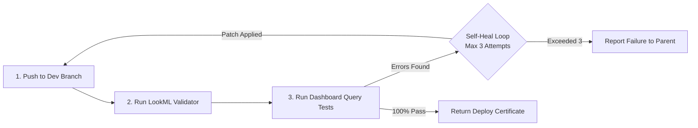

# Looker Demo Orchestrator (`demo-create`)

This skill defines the mandatory operational procedure for an AI agent or engineer creating full-stack data demos on Google Cloud BigQuery and Looker.

> [!CAUTION]
> **CRITICAL RULE: DO NOT USE `demo-create run` MONOLITHICALLY TO BYPASS CO-DESIGN.**
> Running `demo-create run` autonomously without human interaction bypasses iterative schema co-design and volume validation. The agent **MUST** orchestrate the workflow interactively stage-by-stage as detailed below.

---

## Core Execution Architecture: CLI-First with On-Demand Subagents

To eliminate subagent initialization drag, serialization latency, and background file-write race conditions, the workflow follows a **CLI-First Architecture with On-Demand Subagents**:

```mermaid
graph TD
    Start([User Request]) --> PreCheck["Orchestrator: Turn-1 Pre-Check<br/>(demo-create pre-check --json)"]
    PreCheck --> Gate0{"Human Gate 0: Instant 4-Target Alignment<br/>(ask_question - NO plan before this!)"}
    Gate0 -->|Co-Design Phase 1| Phase1["Orchestrator: Schema & ERD Proposal<br/>(Mermaid ERD in Chat)"]
    Phase1 -->|Co-Design Phase 2| Phase2["Orchestrator: Micro-Sample Preview<br/>(5-10 Sample Rows in Chat)"]
    Phase2 --> Gate1{"Human Gate 1: Scale & Volume Confirmation<br/>(ask_question)"}
    Gate1 -->|Fast-Path CLI| GenBQ["Orchestrator: Batch Synthesis & BQ Upload<br/>(demo-create data generate + upload)"]
    GenBQ --> ModelCLI["Gate 2: Semantic Modeling<br/>(demo-create lookml model)"]
    ModelCLI --> SnowflakeBranch{"Is Schema 3NF Snowflake<br/>with Chasm Traps?"}
    SnowflakeBranch -->|Yes: Spawn On-Demand Subagent| S_Snowflake["On-Demand Subagent: lookml-snowflake-modeler<br/>(NDT Rollups & Chasm Trap Elimination)"]
    SnowflakeBranch -->|No: Standard Star Schema| CleanRoot["Gate 3A: Clean Root Orphan Duplicates<br/>(demo-create lookml clean-root)"]
    S_Snowflake --> CleanRoot
    CleanRoot --> GateOpt{"Gate 3B: Run Performance Optimizer?<br/>(Guarded ask_question)"}
    GateOpt -->|Yes: Confirmed| OptCLI["Orchestrator: Performance Optimizer<br/>(demo-create lookml optimize --backup)"]
    GateOpt -->|No: Skipped| DeployCLI["Gate 3C: Pre-Deployment QA & Release<br/>(demo-create lookml deploy)"]
    OptCLI --> DeployCLI
    DeployCLI --> QAStatus{"LookML & Query Validation<br/>Passed 100%?"}
    QAStatus -->|Fail: Spawn On-Demand Subagent| S_QA["On-Demand Subagent: lookml-qa-validator<br/>(Max 3 Self-Healing Loops)"]
    S_QA -->|Certified Ready| DeployProd["Orchestrator: Production Release<br/>(lkr tools lookml deploy)"]
    QAStatus -->|Pass 100%| DeployProd
    DeployProd --> GateCA{"Human Gate 4: Provision CA Agent?<br/>(ask_question)"}
    GateCA -->|Yes| CA_CLI["Orchestrator: CA Agent & Golden Queries<br/>(demo-create agent create)"]
    GateCA -->|No| DeliveryReport["Orchestrator: Final Delivery Report<br/>(DELIVERY_REPORT.md)"]
    CA_CLI --> GateGE{"Human Gate 5: Publish to Gemini Enterprise?<br/>(ask_question)"}
    GateGE -->|Yes| GE_CLI["Orchestrator: Publish to GE<br/>(demo-create agent publish)"]
    GateGE -->|No| DeliveryReport
    GE_CLI --> DeliveryReport
```



| Component | Execution Mode | Responsibility & Scope |
|---|---|---|
| **Parent Orchestrator** | Direct Parent Turn | Interactive co-design gates (`ask_question`), fast CLI subcommands (`demo-create data`, `lookml model`, `lookml optimize`, `lookml deploy`, `agent create`), state machine, and final delivery report. |
| [`lookml-snowflake-modeler`](subagents/lookml-snowflake-modeler.md) | **On-Demand Subagent** | Spawned ONLY when schemas contain complex 3NF snowflake structures with Chasm Traps (multiple 1:N children), diamond joins, or require Native Derived Table (NDT) rollups. |
| [`lookml-qa-validator`](subagents/lookml-qa-validator.md) | **On-Demand Subagent** | Spawned ONLY when `demo-create lookml deploy` encounters validation errors or failing queries; runs up to 3 self-healing loops via `lookml-dashboard-to-query`. |
| [`embed-portal-engineer`](subagents/embed-portal-engineer.md) | **On-Demand Subagent** | Spawned ONLY if external embed demo portal is requested by user. |

> [!IMPORTANT]
> ### Subagent Lifecycle Kill-Fence & Headless Rollback Protocol
> 1. **Subagent Kill-Fence**: Before any file revert, rollback, or manual code restoration, the orchestrator **MUST kill all running subagents** via `manage_subagents(Action='kill_all')` (or `manage_subagents(Action='kill', ConversationIds=[...])`) to prevent background tasks from overwriting restored files.
> 2. **Headless Directory Snapshots**: In headless environments without Git tracking, `demo-create lookml optimize` automatically snapshots pre-optimization files to `lookml/.backup_pre_opt`. If the user rejects optimization or requests a rollback, execute `demo-create lookml restore --lookml-dir <dir>` to cleanly restore files in 1 command.
> 3. **Artifact Boundaries**: `ArtifactMetadata` in `write_to_file` is strictly for files inside `<appDataDir>/brain/<conversation-id>/`. For workspace files, never supply `ArtifactMetadata`.

---

## 0. Bootstrap on Fresh Machines (Mandatory Step 0)

If `demo-create` is not available on `PATH`, the agent **MUST immediately run**:
```bash
uv tool install looker-demo-cli
```
Immediately after installation, the agent **MUST run**:
```bash
demo-create pre-check --fix
```
This guarantees all pinned dependencies, MCP servers (`data-designer`, `bigquery`, `knowledge-catalog`), and global agent skills (`~/.gemini/config/skills/`) are synchronized before executing any other commands.

---

## 1. Pre-Flight Environment Inspection & Interactive Confirmation Gate

Always execute the pre-check inspection first to inspect GCP credentials, available projects, Looker OAuth sessions, and MCP tools:

```bash
demo-create pre-check --json
lkr auth list
```

> [!CAUTION]
> ### 🛑 Mandatory Pre-Flight Hard Stop & Immediate Auth Fail Gate
> 1. **Immediate Fail on Missing Auth**: If `demo-create pre-check` exits with code 1 or reports `is_blocked: true`:
>    - **GCP Missing / Unauthenticated**: STOP immediately. Prompt the user to run:
>      ```bash
>      gcloud auth login
>      gcloud auth application-default login
>      gcloud config set project <PROJECT_ID>
>      ```
>    - **Looker Unauthenticated**: Prompt the user to run `lkr auth login` (or configure API keys).
>      If `lkr-cli` OAuth client is not registered on the Looker instance, provide:
>      - **API Explorer URL**: `https://<your-instance>/extensions/marketplace_extension_api_explorer::api-explorer/4.0/methods/Auth/register_oauth_client_app`
>      - **Client ID**: `lkr-cli`
>      - **Request Body JSON**:
>        ```json
>        {
>          "redirect_uri": "http://localhost:8000/callback",
>          "display_name": "LKR",
>          "description": "lkr.dev language server, MCP and CLI",
>          "enabled": true
>        }
>        ```
>      - **Remote Host / SSH Tunneling**: If operating on a remote machine / Cloudtop / VM, remind the user to forward port 8000:
>        ```bash
>        ssh -L 8000:localhost:8000 <remote-host>
>        ```
>      - **Port 8000 Conflict Cleanup**: Free port 8000 before running `lkr auth login`:
>        ```bash
>        lsof -ti:8000 | xargs kill -9   # (or: fuser -k 8000/tcp)
>        ```
>      - **Headless / Agent OAuth Callback Fallback**: If the user's browser redirects to `http://localhost:8000/callback?code=...` and cannot load the page, the user can paste the full callback URL into the chat so the agent can curl it locally.
>    - **DO NOT proceed** until authentication is re-verified via `demo-create pre-check --fix`.
> 2. **DO NOT execute any further tool calls** (e.g. do not probe database connections, inspect models, or test SDK commands).
> 3. **IMMEDIATELY invoke `ask_question`** in the very next step to prompt the user to confirm all 4 targets below.
> 4. If `available_connections` is empty in `pre-check`, provide standard recommendations (e.g. `looker_demo_bigquery`, `default_bigquery_connection`) along with a write-in option rather than trying to query Looker first.
> 5. Only proceed to Phase 1 (Schema Proposal) after the user has explicitly submitted their answers.

### Mandatory Interactive Confirmation Checklist:
Before designing schemas, creating BigQuery datasets, or touching Looker, the agent **MUST explicitly prompt the user** (via `ask_question` or interactive prompt) to confirm all four environment targets:

1. **GCP User Account**: (e.g. `admin@example.com` vs `analyst@company.com`)
2. **Target Google Cloud Project ID**: (e.g. `my-analytics-gcp-project`, `demo-data-warehouse`)
3. **Target Looker Instance / OAuth Account**: (e.g. `my-company.looker.com` vs `demo-instance` from `lkr auth list` or `available_oauth_instances`)
4. **Target Looker Database Connection**: (e.g. `looker_demo_bigquery` or `default_bigquery_connection`)

> [!IMPORTANT]
> **NEVER assume or default the Looker instance or GCP project** without explicit user confirmation, even if an active session exists in `pre-check`.
>
> ### 🛑 Strict Anti-Planning Rule (NO `implementation_plan.md` Before Gate 0)
> The agent **MUST NEVER** generate an `implementation_plan.md` artifact or start drafting detailed plans before Gate 0 has completed and the user has confirmed all 4 environment targets via `ask_question`. Writing a planning artifact at Turn 1 buries the mandatory Gate 0 questions and forces premature assumptions about GCP projects and Looker instances.
>
> ### 🛑 Strict Pre-Flight GCP Account Activation & Validation
> Immediately upon user selection of the GCP User Account in Step 1:
> 1. Set the active gcloud CLI account: `gcloud config set account <selected_account>`
> 2. Verify token validity: `gcloud auth print-access-token --account=<selected_account>`
> 3. If token check fails, exits non-zero, or prompts for re-authentication, **STOP IMMEDIATELY**. Prompt the user to run:
>    ```bash
>    gcloud auth login <selected_account>
>    gcloud auth application-default login
>    ```
>    DO NOT fall back silently to another account or ambient ADC. Confirm credentials before proceeding.

---

## 2. Iterative Schema Co-Design & Micro-Sample Validation Gate

When creating demo datasets, the agent **MUST co-iterate with the user** across four deterministic phases. Do not write full tables or load BigQuery until all phases are complete:



> [!CAUTION]
> ### 🛑 Strict 2-Step Sequential Visible Presentation Rule (Anti-Zero-Length Turn)
> **NEVER call `ask_question` in an empty or content-free message turn.**
> 1. **Phase 1 Must Render ERD & Schema in Chat First**: In the exact same response turn, the agent MUST write the full Markdown ERD diagram (`mermaid`), dimension/fact tables, column datatypes, primary/foreign keys, and target domain metrics in visible chat BEFORE calling `ask_question` to approve the schema.
> 2. **Phase 2 Must Render Data Tables in Chat First**: Once Phase 1 is approved, the agent MUST output complete Markdown preview tables (5–10 rows per table demonstrating parent/child referential integrity and realistic distributions) in visible chat BEFORE calling `ask_question` to validate the sample and select the volume scale.
> 3. Bypassing visible preview rendering in chat blinds the user and is strictly forbidden.

### Phase 1 — Schema Proposal & Review (Human-in-the-Loop)
- Render the relational model (ERD diagram, dimension vs. fact tables, field names, data types, primary keys, and foreign key relationships) directly in chat.
- Highlight key business metrics (e.g., MRR/ARR, churn rates, NPS, telemetry).
- Invoke `ask_question` prompting the user for approval or modifications.

### Phase 2 — Micro-Sample Synthesis & Preview (Human-in-the-Loop)
- Synthesize a micro-sample dataset (5–10 realistic sample rows per table).
- Display Markdown preview tables directly in chat demonstrating:
  - Referential integrity across parent/child IDs.
  - Realistic domain-specific values and categorical distributions.
- Prompt the user to inspect and validate the sample records.

### Phase 3 — Volume & Scale Confirmation (Human-in-the-Loop)
- Prompt the user to select the target scale:
  - **Small** (~1,000–5,000 rows across tables) — Quick testing
  - **Medium** (~10,000–50,000 rows) — Standard demo
  - **Large** (~100,000–500,000+ rows) — High-volume enterprise demo
  - **Custom** table-specific sizing

### Phase 4 — Batch Synthesis & BigQuery Load (Delegate to Subagent)
- Only after Phases 1–3 are explicitly acknowledged by the user, delegate batch synthesis and BigQuery ingestion to the **[`data-engineer`](subagents/data-engineer.md)** subagent:

```yaml
subagent:
  type: "skills/looker-demo-orchestrator/subagents/data-engineer.md"
  prompt: "Synthesize full volume Parquet data for {confirmed_scale} rows and upload to BigQuery project {confirmed_gcp_project} dataset {dataset_name}."
  inputs:
    gcp_project_id: "{confirmed_gcp_project}"
    dataset_id: "{dataset_name}"
    location: "US"
    schema_spec: "{approved_schema_json}"
    scale: "{confirmed_scale}"
    output_dir: "scratch/parquet"
```

> [!CAUTION]
> ### 🛑 Strict Target Project Integrity & ADC Refresh Gate
> 1. **NEVER silently fall back or divert to an alternate Google Cloud Project or dataset** if permissions errors (e.g. `403 Access Denied`, `bigquery.datasets.create`, or expired ADC tokens) occur during dataset creation or table loading.
> 2. If `data-engineer` returns status `PERMISSION_DENIED` or fails on the confirmed project, **the pipeline MUST BLOCK IMMEDIATELY and prompt the user** (via `ask_question` or terminal instruction) to refresh their ADC credentials (`gcloud auth application-default login`) or grant the necessary BigQuery IAM roles on the confirmed project.
> 3. Under no circumstances should the agent create or load tables into a different project than the one explicitly confirmed by the user in Step 1.

---

## 3. Looker Project & Model Provisioning (`lkr-dev-cli`)

Looker authentication is managed directly via `lkr-dev-cli` using the confirmed OAuth account:

### A. Project & Bare Git Initialization
Ensure the project exists on the target Looker instance with a bare Git repository:

```bash
lkr --oauth-account=<oauth_account> code-mode sandbox --code="
if session().get('workspace_id') != 'dev':
    update_session(body={'workspace_id': 'dev'})

project_name = '<project_name>'
connection_name = '<connection_name>'

create_project(body={'name': project_name})
update_project(project_id=project_name, body={'git_remote_url': None, 'git_service_name': 'bare'})
create_lookml_model(body={
    'name': project_name,
    'project_name': project_name,
    'allowed_db_connection_names': [connection_name],
    'unlimited_db_connections': False,
})
"
```

---

## 4. LookML Quality Standards & 4-Stage Semantic Pipeline

### A. Semantic Modeling & Triage (Delegate to Modeler Subagent)

Delegate semantic modeling to the front-door **[`lookml-modeler`](subagents/lookml-modeler.md)** subagent:

```yaml
subagent:
  type: "skills/looker-demo-orchestrator/subagents/lookml-modeler.md"
  prompt: "Model LookML views, explores, and measures for {project_name}. If normalized 3NF structures with Chasm Traps or diamond joins exist, delegate to lookml-snowflake-modeler."
  inputs:
    project_name: "{looker_project_name}"
    connection_name: "{looker_connection_name}"
    lookml_dir: "lookml/"
    table_specs: "{extracted_table_specs}"
    domain_metrics: "{domain_metrics_list}"
```

- **Triage Protocol**:
  - **Existing BigQuery Dataset & Knowledge Catalog**: If modeling from an existing dataset (`dataset_id` provided or running `demo-create lookml model --dataset <id>`), introspect BigQuery table schema, primary/foreign key constraints (`INFORMATION_SCHEMA.TABLE_CONSTRAINTS`), and Google Cloud Data Catalog / Dataplex metadata (`@bigquery` entry group). If the `knowledge-catalog` MCP server is installed, invoke it to retrieve business glossaries and column tags to enrich LookML descriptions.
  - **Standard / Star Schemas**: `lookml-modeler` writes `.view.lkml`, primary keys, formatted measures (`usd_0`, `percent_2`, `decimal_1`), drill fields, and `.explore.lkml` directly.
  - **Normalized 3NF / Snowflake Schemas**: If multiple 1:N child collections or diamond joins are detected, hand off to **[`lookml-snowflake-modeler`](subagents/lookml-snowflake-modeler.md)**:
    - Runs `schema_graph_analyzer.py` on the schema DAG.
    - Sets Explore Base Views on leaf event facts ($d_{\text{in}} = 0$).
    - Pre-aggregates child collections into **Native Derived Tables (NDTs)** and joins them **`relationship: one_to_one`** onto the parent Explore (eliminates Chasm Traps).
    - Resolves diamond joins with role-playing aliases (`from: users`) and explicit `view_label:` headers.
- **Mandatory Field Standards**: Explicit `label:` and `description:` parameters on EVERY dimension, dimension group, and measure (Title Case, e.g. `label: "Monthly Recurring Revenue"`).

---

### B. Executive Tabbed Dashboard Authoring (Delegate to Dashboard Designer Subagent)

Delegate dashboard creation to the dedicated **[`lookml-dashboard-designer`](subagents/lookml-dashboard-designer.md)** subagent:

```yaml
subagent:
  type: "skills/looker-demo-orchestrator/subagents/lookml-dashboard-designer.md"
  prompt: "Author pixel-perfect, executive-ready tabbed dashboard for {project_name} grounded strictly in staged explores and views. Include KPI stat banners, dual-axis timelines, advanced_vis_config rounded geometry, cross-filtering, and popovers."
  inputs:
    project_name: "{looker_project_name}"
    model_name: "{looker_model_name}"
    primary_explore: "{primary_explore_name}"
    lookml_dir: "lookml/"
    domain_theme: "{domain_theme}"
```

- **Strict Explore-Grounded Authoring**: Inspects staged `explores/*.explore.lkml` and `views/*.view.lkml` files to discover available dimensions and measures (NEVER invents fields).
- **Tabbed Architecture**: Modern 2–4 tab operational command center (e.g. *Executive Overview*, *Operations Deep Dive*, *Alerts & Exceptions*).
- **Visual Standards**: Single-value KPI cards, dual-axis timelines, donut breakdowns, clustered bar charts, `advanced_vis_config` rounded geometry (`borderRadius: 8`), and universal cross-filtering (use `crossfilter_enabled: true` at dashboard root; NEVER use deprecated root `crossfilter: true`).

---

### C. LookML Server Performance Optimization Gate (Strictly Guarded Interactive Gate)

> [!CAUTION]
> ### 🛑 STRICT CONDITIONAL BRANCH FENCE: NEVER AUTO-RUN OPTIMIZER
> Spawning the optimizer subagent or running `demo-create lookml optimize` without prior user confirmation violates the co-design contract. The orchestrator **MUST pause and prompt the user via `ask_question`**:
> - **Question**: "Would you like to run the LookML Performance Optimizer to audit and apply Google Cloud Looker Server Optimization best practices?"
> - **Options**:
>   - `(Recommended) Yes: Apply Google Cloud performance optimizations (datagroup caching, partition pruning filters, static suggestions, foreign key hiding)`
>   - `No: Skip performance optimization and proceed directly to QA validation`
>
> **Execution Branches**:
> - **If user selects "Yes"**: Execute directly in the parent session via fast-path CLI:
>   ```bash
>   demo-create lookml optimize --lookml-dir <lookml_dir>
>   ```
>   The CLI automatically snapshots current LookML files into `<lookml_dir>/.backup_pre_opt` before modifying any files.
> - **If user selects "No"**: Advance immediately to Phase D without touching LookML files.
> - **If user requests a Rollback**:
>   1. Enforce the **Kill-Fence**: Immediately terminate any active subagents: `manage_subagents(Action='kill_all')`.
>   2. Atomically restore the pre-optimization snapshot with 1 command (headless, zero git requirement):
>      ```bash
>      demo-create lookml restore --lookml-dir <lookml_dir>
>      ```

- **Optimizations Applied by the CLI Engine**:
  - **Static Suggestions on Low-Cardinality Dims**: Injects `suggestions: ["val1", "val2", ...]` on categorical fields with $\le 15$ distinct values to eliminate database roundtrips when filters open.
  - **Disable Suggestions on Unique Keys**: Injects `suggestable: no` on primary keys, foreign key UUIDs, timestamps, and free text.
  - **Model Datagroup Caching**: Configures production datagroups (`max_cache_age: "4 hours"`) and applies `persist_with: default_caching_policy`.
  - **Partition Pruning**: Enforces `always_filter` or `conditionally_filter` on BigQuery partitioned date columns.
  - **Field Pruning**: Sets `hidden: yes` on raw foreign key IDs and asserts `primary_key: yes` on unique grains.

---

### D. Mandatory Pre-Deployment Validation Gate (CLI Fast-Path with On-Demand QA Healing)

1. **Direct Fast-Path Deploy & Query Test**:
   Execute dev push, project validator, and dashboard query verification directly in the parent session:
   ```bash
   demo-create lookml deploy --project <looker_project_name> --lookml-dir <lookml_dir> --looker-account <oauth_account>
   ```
   If all LookML checks and dashboard query tests return 100% HTTP 200 OK, the CLI automatically deploys to production and updates state.

2. **On-Demand QA Healing Subagent (Triggered ONLY on Validation / Query Failure)**:
   If validation fails or any dashboard query encounters an error, spawn the **[`lookml-qa-validator`](subagents/lookml-qa-validator.md)** subagent:

```yaml
subagent:
  type: "skills/looker-demo-orchestrator/subagents/lookml-qa-validator.md"
  prompt: "Investigate LookML validator errors or query failures, run bounded self-healing (max 3 attempts) using lookml-dashboard-to-query, and certify deploy readiness."
  inputs:
    project_name: "{looker_project_name}"
    oauth_account: "{oauth_account}"
    lookml_dir: "lookml/"
    dashboard_files: ["dashboards/*.dashboard.lookml"]
```

The `lookml-qa-validator` subagent executes bounded self-healing:



> [!CAUTION]
> **Production Deployment Authority Remains with Parent Orchestrator**:
> The `lookml-qa-validator` subagent is strictly an auditing/healing worker and cannot release to production. Once it returns `{ready_to_deploy: true}`, the **Parent Orchestrator** executes production release:
> ```bash
> lkr --oauth-account=<oauth_account> tools lookml deploy --project=<project_name>
> ```

---

## 5. Provision Conversational Analytics Data Agent & Gemini Enterprise (GE) Publishing (Delegate to Subagent)

> [!IMPORTANT]
> **Conditional Subagent Trigger**:
> The **[`ca-agent-provisioner`](subagents/ca-agent-provisioner.md)** subagent is **ONLY spawned if the user explicitly confirms CA Agent creation** in the interactive gate below.

> [!CAUTION]
> ### 🛑 Strict Sequential Gate Isolation: NEVER Bundle CA, GE, and Embed Gates
> The orchestrator **MUST present each post-deployment gate sequentially in its own discrete step**:
> 1. **Phase 1: LookML Model & Dashboard Deployed to Production**
> 2. **Phase 2: CA Agent Confirmation Gate** (`ask_question`)
> 3. **Phase 3: GE Verification & Publishing Gate** (`ask_question`, if CA Agent created)
> 4. **Phase 4: External Embed Portal Gate** (`ask_question`, ONLY after Looker assets, CA Agent, and GE status are completely finished)
> Under NO circumstances may the agent bundle these questions into a single multi-question modal.

### A. Interactive CA Agent Confirmation Gate (Parent Orchestrator)
Prompt the user via `ask_question`:
- **Question**: "Would you like to provision a Looker Conversational Analytics (CA) Agent for the `{model_name}` model?"
- **Options**:
  - `(Recommended) Provision CA Agent with default domain instructions and dashboard golden queries`
  - `Provide custom system instructions before provisioning`
  - `Skip Conversational Analytics Agent creation`

### B. Interactive Gemini Enterprise (GE) Verification & Publishing Gate (Parent Orchestrator)
If CA Agent creation is selected, the orchestrator/CLI checks Looker GE settings via `GET /api/4.0/gemini_enablement`:

- **Case 1: GE is already configured** (`ai_ge_project_id`, `ai_ge_instance_id`, `ai_ge_location` populated):
  - Displays the active GE app ID, location, and GCP project.
  - Prompts user: "Gemini Enterprise is configured for app `{ge_instance_id}`. Publish CA Agent to this GE app?"
  - Options:
    - `(Recommended) Yes, publish agent to existing Gemini Enterprise app`
    - `Reconfigure Looker with a different Gemini Enterprise app`
    - `Skip Gemini Enterprise publishing (internal Looker only)`

- **Case 2: GE is not configured** (or user requested reconfigure):
  - Automatically queries active GCP project for available GE apps via Discovery Engine API / `gcloud`.
  - Prompts user to select from discovered GE apps (or enter custom App ID / Region).
  - Updates Looker settings via `PATCH /api/4.0/gemini_enablement` sending the full payload with `ai_ge_publish_enabled: true`.
  - Grants `roles/discoveryengine.admin` to the Looker SA email via `gcloud projects add-iam-policy-binding`.
  - Confirms the Looker SA has a Gemini Enterprise license before proceeding to publish.

### C. Procedural Delegation: `ca-agent-provisioner` Subagent
Once confirmed, delegate Golden Query extraction, agent creation, and GE publishing to **[`ca-agent-provisioner`](subagents/ca-agent-provisioner.md)**:

```yaml
subagent:
  type: "skills/looker-demo-orchestrator/subagents/ca-agent-provisioner.md"
  prompt: "Provision Looker CA Agent for model {lookml_model_name} on explore {primary_explore}, extract dashboard tile golden queries, and publish to Gemini Enterprise if confirmed."
  inputs:
    project_name: "{looker_project_name}"
    model_name: "{lookml_model_name}"
    primary_explore: "{primary_explore}"
    oauth_account: "{oauth_account}"
    dashboard_files: ["dashboards/*.dashboard.lookml"]
    system_instructions: "{system_instructions_or_default_template}"
    publish_ge: "{publish_ge_boolean}"
```

The subagent follows the strict Looker 4.0 Golden Query rules:
1. `create_agent(body={...})` with persona, query patterns, and domain rules.
2. For each dashboard tile: `create_query` $\to$ get `expanded_share_url` $\to$ `create_golden_query` with exactly **ONE question** $\to$ `update_agent` linking all IDs.
3. If `publish_ge: true`: executes `POST /api/4.0/internal/agents/{agent_id}/publish` with body `{}` and verifies publication state via `GET /api/4.0/internal/agents/{agent_id}` with automatic retries (up to 3 attempts).
4. **Re-Publishing Guarantee**: If any LookML self-healing or dashboard corrections occurred during QA validation, the orchestrator/subagent **MUST re-extract golden queries, update the agent, and re-publish to GE** so that the agent is guaranteed to be operational in Gemini Enterprise.

---

## 6. External Embedded Portal Scaffolding (Delegate to Subagent)

> [!IMPORTANT]
> **Conditional Subagent Trigger**:
> The **[`embed-portal-engineer`](subagents/embed-portal-engineer.md)** subagent is **ONLY spawned if the user explicitly confirms external embed portal creation** in the interactive gate below.

### A. Interactive External Embed Confirmation Gate (Parent Orchestrator)
Prompt the user via `ask_question`:
- **Question**: "Would you like to scaffold an external branded embedded analytics portal (`looker-embed-demo`)?"
- **Options**:
  - `(Recommended) Scaffold external embed portal with custom brand theme and embedded chat`
  - `Skip external portal scaffolding (internal Looker only)`

### B. Procedural Delegation: `embed-portal-engineer` Subagent
If confirmed, delegate frontend scaffolding, environment configuration, brand tokens, and build verification to **[`embed-portal-engineer`](subagents/embed-portal-engineer.md)**:

```yaml
subagent:
  type: "skills/looker-demo-orchestrator/subagents/embed-portal-engineer.md"
  prompt: "Scaffold external embed demo for {project_name}, configure .env (VITE_CHAT_AGENT_ID={ca_agent_id}, dashboard ID={dashboard_id}), customize brand styling in styles.css, and verify build."
  inputs:
    project_name: "{looker_project_name}"
    looker_instance_url: "{looker_instance_url}"
    dashboard_id: "{deployed_dashboard_id}"
    ca_agent_id: "{ca_agent_id}"
    brand_name: "{brand_name}"
    theme_colors: "{brand_theme_colors}"
    target_dir: "embed-portal/"
```

The subagent:
1. Clones/scaffolds `looker-embed-demo`.
2. Configures `.env` with `VITE_LOOKER_HOST`, `VITE_DEFAULT_DASHBOARD_ID`, and `VITE_CHAT_AGENT_ID`.
3. Customizes `src/constants.ts` and CSS variables in `src/styles.css`.
4. Runs `npm run build` or `vite build` to verify clean compilation.

---

## 7. Mandatory Final Delivery Report Protocol

Upon completing the demo creation pipeline (production deployment, plus optional CA Agent or Embed Portal steps), the Parent Orchestrator **MUST synthesize all subagent outputs and emit a comprehensive Executive Delivery Report**.

The report must be emitted directly in chat as the final deliverable and saved to the project directory as `DELIVERY_REPORT.md` (or artifact).

### Mandatory Report Structure & Template:

```markdown
# {Domain Name} — Final Delivery Report

> [!NOTE]
> **Production Deployment Status: Active & Operational**
> - **Looker Instance**: [{looker_instance_host}]({looker_instance_url})
> - **Looker Project & Model**: `{looker_project_name}`
> - **BigQuery Dataset**: `{gcp_project_id}.{bq_dataset_id}` ({gcp_location})
> - **Looker Database Connection**: `{looker_connection_name}`
> - **Validation Gate**: 0 LookML errors, {queries_passed}/{queries_tested} (100%) Dashboard Queries Passed

---

## 1. Quick Access Links

| Asset | Direct URL / Access Path | Description |
| :--- | :--- | :--- |
| **Executive Dashboard** | [{dashboard_title}]({looker_instance_url}/dashboards/{lookml_model_name}::{dashboard_name}) | {tabs_count}-tab executive command center with cross-filtering |
| **Conversational Analytics Agent** | [{agent_name}]({looker_instance_url}/conversational-analytics/agents/{ca_agent_id}) | AI Data Agent with {gq_count} pre-seeded Golden Queries *(if provisioned)* |
| **{Primary Explore} Explore** | [Explore: {Primary Explore Label}]({looker_instance_url}/explore/{lookml_model_name}/{primary_explore}) | Primary domain entity, metrics & dimension analysis |
| **{Event Stream} Explore** | [Explore: {Event Stream Label}]({looker_instance_url}/explore/{lookml_model_name}/{event_explore}) | Granular event/telemetry audit stream |
| **Embed Analytics Portal** | [External Embed Portal]({embed_portal_url}) | White-labeled external embed application *(if scaffolded)* |

---

## 2. BigQuery Data Warehouse Summary

All {table_count} relational tables were synthesized with realistic domain distributions, strict referential integrity, and uploaded to BigQuery:

```{gcp_project_id}.{bq_dataset_id}
├── {table_name_1}  ({rows_1} rows)  - {table_1_description}
├── {table_name_2}  ({rows_2} rows)  - {table_2_description}
└── {table_name_n}  ({rows_n} rows)  - {table_n_description}
```

Total dataset volume: **{total_rows} rows**.

---

## 3. Relational Architecture & ERD

```mermaid
erDiagram
    {table_a} ||--o{ {table_b} : "{relationship_label} ({foreign_key})"
```

*(Optional — Include `### Chasm Trap Mitigation Architecture` below ONLY if snowflake modeling was required / 1:N child collections were detected)*:
<!--
### Chasm Trap Mitigation Architecture
- Document NDT rollups pre-aggregating child 1:N metrics at the parent grain.
- Document one_to_one joins onto parent table eliminating Cartesian products.
- Document dedicated Event Stream Explores with event leaf as Base View.
-->

---

## 4. LookML Dashboard Layout & Tabbed Architecture

The dashboard (`{lookml_model_name}::{dashboard_name}`) is structured into **{tab_count} functional operational tabs** with universal cross-filtering and popover filters:

### Tab 1: {Tab 1 Name}
- **KPI Banners**: {List of primary single-value metrics}.
- **{Chart 1 Title}**: {Chart visualization type and business question answered}.
- **{Chart 2 Title}**: {Chart visualization type and business question answered}.

### Tab 2: {Tab 2 Name}
- **KPI Banners**: {List of secondary single-value metrics}.
- **{Chart 1 Title}**: {Chart visualization type and business question answered}.

---

## 5. Pre-Deployment Validation Audit Record

In strict compliance with the **Looker Demo Orchestrator** pre-deployment gate, all validation checks passed before production release:

```
[Phase 1] Code Push to Dev Branch:             100% COMPLETE ({files_count} LookML files pushed)
[Phase 2] LookML Validator (validate_project):   0 ERRORS DETECTED
[Phase 3] Exhaustive Dashboard Query Tests:      {queries_passed} / {queries_tested} (100%) QUERIES PASSED
[Phase 4] Production Deployment:                SUCCESS (Deployed to Production at {timestamp})
```

### Detailed Query Test Results ({queries_passed}/{queries_tested} HTTP 200 OK)
1. `{query_tile_1}` (Explore: `{explore_1}`) ➔ **PASS**
2. `{query_tile_2}` (Explore: `{explore_2}`) ➔ **PASS**
3. `{query_tile_n}` (Explore: `{explore_n}`) ➔ **PASS**

---

## 6. Conversational Analytics (CA) AI Agent Configuration *(if provisioned)*

- **Agent ID**: `{ca_agent_id}`
- **Agent Name**: `{ca_agent_name}`
- **Explore Sources**: `{explore_sources_list}`
- **Code Interpreter**: Enabled
- **Direct Agent Chat URL**: [Open {ca_agent_name}]({looker_instance_url}/conversational-analytics/agents/{ca_agent_id})

### Pre-Seeded Golden Queries
1. *"{Natural language business question 1}"*
2. *"{Natural language business question 2}"*
3. *"{Natural language business question n}"*

---

## 7. Gemini Enterprise (GE) / Embed Portal Status

*(If published to Gemini Enterprise)*:
- **Publish State**: `published` (HTTP 200 OK)
- **Status Message**: `Successfully published Agent {ca_agent_id} to GEMINI_ENTERPRISE.`
- **Capabilities**: Full natural language synthesis over `{lookml_model_name}`, golden query semantic routing, and code interpretation within Gemini Enterprise apps.

*(If external embed portal was scaffolded)*:
- **Workspace Directory**: `{embed_workspace_dir}`
- **Local Dev Command**: `npm run dev`
- **Dashboard Embedded**: `{deployed_dashboard_id}`
- **Chat Agent Connected**: `{ca_agent_id}`
- **Build Status**: Verified 0 TypeScript / compilation errors
```

---

## 8. Modular CLI Execution & State Persistence

When performing isolated operations or delegating granular tasks to specialized subagents, use the modular CLI subcommands. Execution state is persisted across invocations in `.demo-state.json` (auto-loaded and updated with CLI option overrides):

| Command Group | Subcommand | Purpose | Key Flags |
|---|---|---|---|
| **`demo-create data`** | `generate` | Synthesizes local Parquet dataset tables | `--domain`, `--scale`, `--output-dir` |
| | `upload` | Creates dataset and uploads Parquet tables to BigQuery | `--parquet-dir`, `--project`, `--dataset`, `--location` |
| | `inspect` | Introspects tables and schema in existing BigQuery dataset | `--project`, `--dataset` |
| **`demo-create lookml`** | `model` | Generates LookML views, explores, and models from BigQuery (with Knowledge Catalog & PK/FK constraints) or Parquet | `--project`, `--dataset`, `--parquet-dir`, `--connection`, `--output-dir` |
| | `deploy` | Pushes staged LookML to dev workspace, validates, runs query tests, and deploys to production | `--project`, `--lookml-dir`, `--oauth-account` |
| **`demo-create agent`** | `create` | Creates CA Agent, grounds golden queries, and optionally publishes to GE | `--model`, `--explore`, `--dashboard-id`, `--publish-ge` |
| | `golden-queries` | Extracts queries from dashboard files/IDs and links as Golden Queries | `--agent-id`, `--dashboard-id`, `--dashboards-dir` |
| | `publish` | Verifies GE config and publishes agent to connected GE apps | `--agent-id`, `--oauth-account` |
| **`demo-create embed`** | `scaffold` | Scaffolds React/Vite embed portal workspace with `.env` and theme tokens | `--project`, `--dashboard-id`, `--agent-id`, `--brand-name`, `--target-dir` |
| **`demo-create ge`** | `status` | Displays current Looker Gemini enablement and GE config | `--oauth-account` |
| | `configure` | Discovers GE apps on GCP, configures Looker GE settings, and grants IAM roles | `--instance-id`, `--location`, `--gcp-project` |


