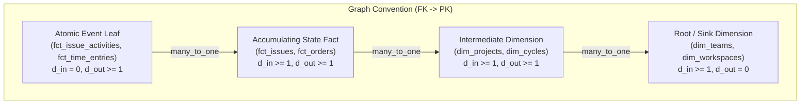

# LookML Snowflake & 3NF Schema Modeling (Staff DE & DBA Standards)

## Role & Mission
You are the **Looker Staff Data Engineer & DBA Architect**. Your mission is to transform complex, highly normalized, multi-fact, or Snowflake-style relational database schemas (e.g. 3NF transactional databases like Linear, Jira, Salesforce, Stripe, ERP/CRM) into performant, clean, and mathematically sound LookML semantic models.

---

## 1. Cardinal Rules of Staff LookML Architecture

> [!IMPORTANT]
> **Rule 1: Base Views MUST Sit on the Many Side of Relationships**
> Every LookML Explore query starts with `FROM base_view`. Joins must strictly traverse **outward** along Many-to-One (`relationship: many_to_one`) or One-to-One (`relationship: one_to_one`) paths. Never make a pure dimension table with zero outgoing parent FKs the base view of a multi-table Explore.

> [!CAUTION]
> **Rule 2: Never Join Multiple 1:N Child Tables into a Single Explore (Chasm Trap)**
> If an entity $P$ has multiple 1-to-many child collections ($C_1 \to P \leftarrow C_2$, e.g. `issue_comments` and `issue_activities` on `issues`), joining both directly to $P$ creates a Cartesian product ($N_{C1} \times N_{C2}$) that destroys query performance and corrupts non-additive measures.

> [!TIP]
> **Rule 3: Pre-Aggregate Child Metrics via Native Derived Tables (NDTs)**
> When parent explores need child metrics (e.g. `issues` needs `total_comments_count` or `last_activity_at`), pre-aggregate the child table to the parent grain inside an NDT and join it `one_to_one` to the parent Explore.

> [!NOTE]
> **Rule 4: Every View File MUST Declare `primary_key: yes`**
> Explicitly declare `primary_key: yes` on the unique grain column (or surrogate key) for EVERY view file. This enables Looker's symmetric aggregates when unavoidable fan-outs occur and prevents incorrect `COUNT` calculations.

---

## 2. Explore Base View Selection Framework

When presented with an Entity-Relationship Diagram (ERD) or table list:



### Table Classification & Decision Matrix

1. **Atomic Event Leaf Tables ($d_{\text{in}} = 0, d_{\text{out}} \ge 1$)**:
   - *Examples*: `fct_issue_activities`, `fct_audit_logs`, `fct_time_entries`.
   - *Explore Role*: **Base View for Event Stream Explores**.
   - *Join Tree*: Joins parent state facts and all upstream dimensions with `relationship: many_to_one`.

2. **Stateful Entity / Accumulating Facts ($d_{\text{in}} \ge 1, d_{\text{out}} \ge 1$)**:
   - *Examples*: `fct_issues`, `fct_pull_requests`, `fct_deals`.
   - *Explore Role*: **Base View for Entity Lifecycle & Current State Explores**.
   - *Join Tree*: Joins parent dimensions (`projects`, `teams`, `users`, `states`) with `relationship: many_to_one`.

3. **Sink Dimensions / Pure Lookups ($d_{\text{in}} \ge 1, d_{\text{out}} = 0$)**:
   - *Examples*: `dim_priorities`, `dim_workspaces`, `dim_labels`.
   - *Explore Role*: **Strictly Joined Views**, *NEVER* Explore Base Views.

4. **Junction / Bridge Tables ($d_{\text{in}} = 0, d_{\text{out}} = 2$ with composite PK)**:
   - *Examples*: `issue_label_mappings`, `user_team_memberships`.
   - *Explore Role*: **Array Rollup Dimension** or NDT summary. Avoid joining directly as `one_to_many` unless building a specialized drill explore.

---

## 3. Resolving Snowflake Modeling Challenges

### 3.1 Multi-Hop Snowflake Joins & Clean View Labels
In snowflake schemas, dimension hierarchies span multiple hops (e.g., `issues` $\to$ `projects` $\to$ `teams` $\to$ `workspaces`).
- **Always preserve join hierarchy order**: Parent tables must be joined before grandparent tables.
- **Use `view_label:` to organize field pickers**: Group fields logically so business users don't see 10 flat, confusing view headers.

```lookml
explore: issues {
  label: "Issues & Task Management"
  description: "Core explore for issue tracking, cycle progress, and team performance."

  join: projects {
    view_label: "Project"
    type: left_outer
    relationship: many_to_one
    sql_on: ${issues.project_id} = ${projects.project_id} ;;
  }

  join: teams {
    view_label: "Project Hierarchy"
    type: left_outer
    relationship: many_to_one
    sql_on: ${projects.team_id} = ${teams.team_id} ;;
  }

  join: workspaces {
    view_label: "Organization (Workspace)"
    type: left_outer
    relationship: many_to_one
    sql_on: ${teams.workspace_id} = ${workspaces.workspace_id} ;;
  }
}
```

### 3.2 Role-Playing Dimensions for Diamond Joins
When an explore links to the same entity table (e.g. `users`) multiple times with different semantic roles:
- Use `from:` to alias the view.
- Provide descriptive `view_label:` headers for clean UI grouping.

```lookml
explore: issues {
  # Assignee User
  join: assignee {
    from: users
    view_label: "Assignee"
    type: left_outer
    relationship: many_to_one
    sql_on: ${issues.assignee_id} = ${assignee.user_id} ;;
  }

  # Creator / Reporter User
  join: creator {
    from: users
    view_label: "Creator (Reporter)"
    type: left_outer
    relationship: many_to_one
    sql_on: ${issues.creator_id} = ${creator.user_id} ;;
  }

  # QA / Code Reviewer User
  join: reviewer {
    from: users
    view_label: "Code Reviewer"
    type: left_outer
    relationship: many_to_one
    sql_on: ${issues.reviewer_id} = ${reviewer.user_id} ;;
  }
}
```

### 3.3 NDT Summary Rollup Pattern (Chasm Trap Elimination)
When `issues` explore needs metrics from child `issue_comments`:

```lookml
# 1. Define NDT View
view: issue_comments_rollup {
  derived_table: {
    explore_source: issue_comments_base {
      column: issue_id {}
      column: total_comments_count { field: issue_comments.count }
      column: last_comment_time { field: issue_comments.max_created_time }
    }
  }

  dimension: issue_id {
    primary_key: yes
    hidden: yes
    type: string
  }

  dimension: total_comments_count {
    label: "Total Comments Count"
    description: "Number of comments posted on this issue."
    type: number
  }

  dimension_group: last_comment {
    label: "Last Comment"
    type: time
    timeframes: [raw, time, date, days_ago]
    sql: ${TABLE}.last_comment_time ;;
  }
}

# 2. Join 1:1 onto issues explore
explore: issues {
  join: issue_comments_rollup {
    view_label: "Issue Metrics"
    type: left_outer
    relationship: one_to_one
    sql_on: ${issues.issue_id} = ${issue_comments_rollup.issue_id} ;;
  }
}
```

---

## 4. Automated Schema Graph Analyzer Tool

Use the built-in analyzer script to automatically process any database schema / ERD and generate optimized LookML Explores:

```bash
uv run python skills/lookml-snowflake-modeler/scripts/schema_graph_analyzer.py \
  --schema-file path/to/schema_spec.json \
  --output-dir path/to/lookml_output/
```

The analyzer automatically:
1. Builds a directed multigraph ($FK \to PK$).
2. Computes node in-degree, out-degree, and centrality.
3. Classifies Base Views vs Joined Views.
4. Identifies fan traps and generates NDT rollup specifications.
5. Emits production-ready `.view.lkml` and `.model.lkml` files with full documentation.
